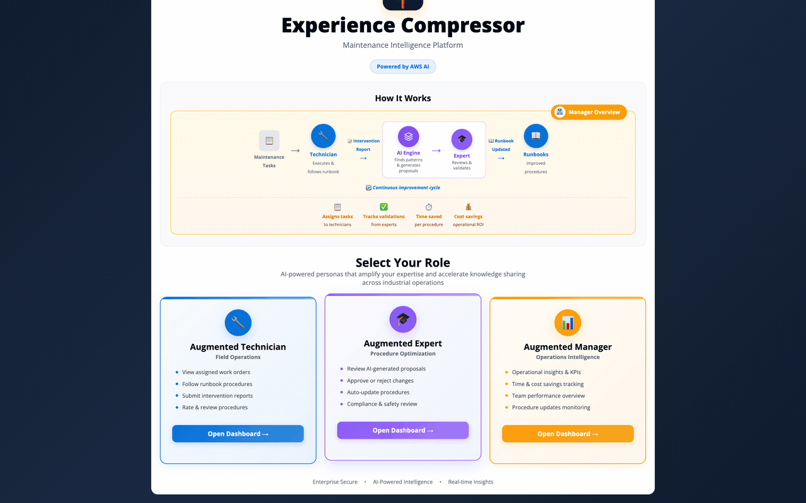
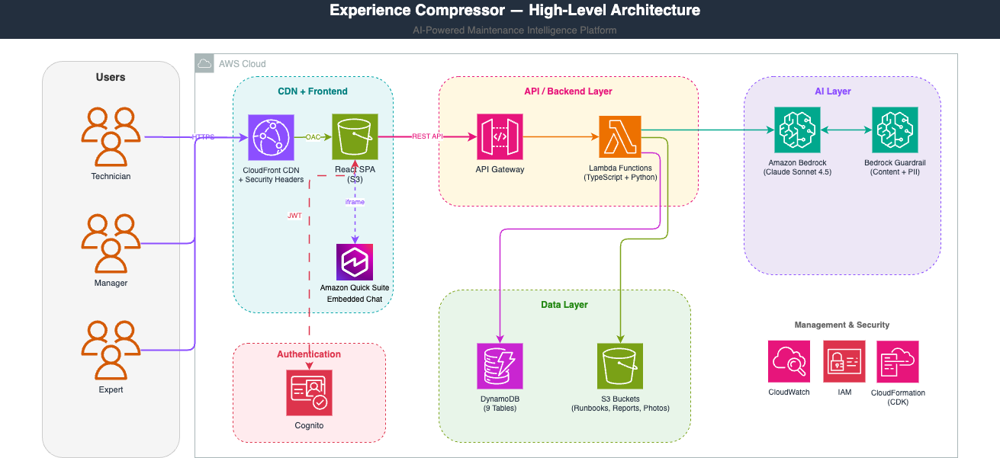

<p align="center">
  
</p>

# Experience Compressor

AI-powered maintenance intelligence platform that captures field technician experience and democratizes knowledge across industrial organizations.

> **Important:** This is sample code for demonstration and educational purposes only, not for production use. You should work with your own security and legal teams to meet your organizational security, regulatory, and compliance requirements before any deployment. Deploying this sample may incur AWS charges.

### UI/UX Demo Experience



## Quick Start

### Prerequisites

- Node.js 22+, Python 3.13+, AWS CLI v2, AWS CDK v2
- AWS CLI profile configured with an AWS account
- **Region:** Defaults to `us-east-1`. Set `AWS_DEFAULT_REGION` to deploy elsewhere (requires [Bedrock model access](https://docs.aws.amazon.com/bedrock/latest/userguide/models-regions.html) in the target region)

### Deploy from Scratch

```bash
# 1. Install dependencies
npm install
python3 -m venv .venv && source .venv/bin/activate
pip install -r scripts/requirements.txt

# 2. Build all packages
npm run build

# 3. Bootstrap CDK (first time per account only)
ACCOUNT=$(aws sts get-caller-identity --profile <YOUR_AWS_PROFILE> --query Account --output text)
cd infrastructure && npx cdk bootstrap aws://$ACCOUNT/us-east-1 --profile <YOUR_AWS_PROFILE>

# 4. Deploy all 9 CDK stacks (Cognito, DynamoDB, S3, Guardrail, Web, Technician API, Expert, Manager, unified API Gateway)
npx cdk deploy --all --require-approval never --profile <YOUR_AWS_PROFILE>

# 5. Seed demo data (Cognito users, synthetic reports, runbooks, photos, Bedrock analysis)
cd .. && python3 scripts/setup-from-scratch.py <YOUR_AWS_PROFILE>

# 6. Build frontend with stack outputs and deploy to S3 + invalidate CloudFront
cd packages/web
VITE_USER_POOL_ID=<UserPoolId> \
VITE_CLIENT_ID=<AppClientId> \
VITE_AWS_REGION=us-east-1 \
VITE_API_URL=<ApiUrl> \
npm run build
aws s3 sync dist/ s3://<WEBSITE_BUCKET_NAME> --delete --profile <YOUR_AWS_PROFILE>
aws cloudfront create-invalidation --distribution-id <DISTRIBUTION_ID> --paths "/*" --profile <YOUR_AWS_PROFILE>
```

> Bucket name and distribution ID are in CloudFormation stack outputs after step 4.

### Cleanup

```bash
python3 scripts/cleanup-all.py <YOUR_AWS_PROFILE>  # Wipe data only (keep stacks)
python3 scripts/teardown.py <YOUR_AWS_PROFILE>      # Full teardown (stacks + orphaned resources)
```

## Architecture



**Architecture:** Monorepo with role-based microservices
**Tech Stack:** React + TypeScript, Node.js, Python, AWS CDK, DynamoDB, S3, Bedrock AI

> Detailed architecture diagram: [`docs/generated-diagrams/experience-compressor-architecture.png`](docs/generated-diagrams/experience-compressor-architecture.png)


### Key Roles
1. **Technician** _(Field Technician)_ - Single-page hub with modals: view work orders, follow runbooks (split-view with report form), submit intervention reports with ratings/photos
2. **Expert** _(Process Expert)_ - Single-page hub with modal: review AI-generated runbook proposals, approve/reject with comments, auto-update procedures
3. **Manager** _(Field Manager)_ - Full analytics dashboard: Runbook Metrics KPIs, Estimated Savings panels, Operations Analytics (ComposedChart, BarChart), Operations Health, Monthly Planning calendar, Team Performance table, Insights with filters and pagination

## Security

- No public S3 buckets (`BLOCK_ALL` + `enforceSSL`)
- CloudFront with security headers (HSTS, CSP, X-Frame-Options, X-Content-Type-Options)
- Cognito self-signup disabled (`AdminCreateUserOnly`)
- All API routes protected with Cognito JWT authorizers
- Role-based access control (Technician, Expert, Manager, Admin)
- Bedrock Guardrails enabled (content filters, prompt injection detection, PII anonymization)
- Presigned URLs with expiry for S3 uploads
- CORS restricted to CloudFront distribution + localhost
- Least-privilege IAM policies (specific actions + resource ARNs)
- SHA-256 for ID generation (no MD5)
- Cryptographic password generation (`secrets` module)
- All data is 100% synthetic (AWS Fictitious Content Library compliant)

See [CONTRIBUTING](CONTRIBUTING.md#security-issue-notifications) for more information.

## License

This library is licensed under the MIT-0 License. See the [LICENSE](LICENSE) file.
