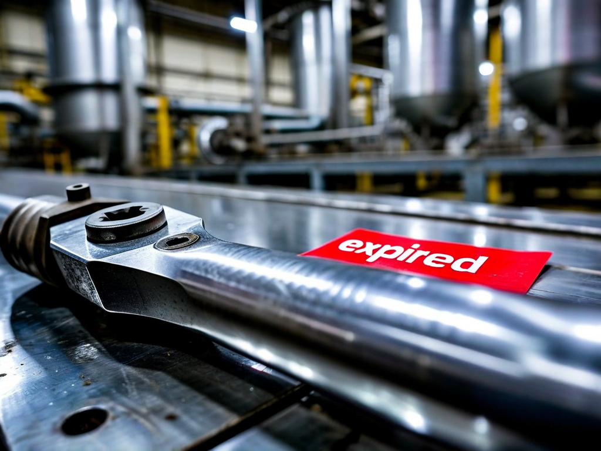
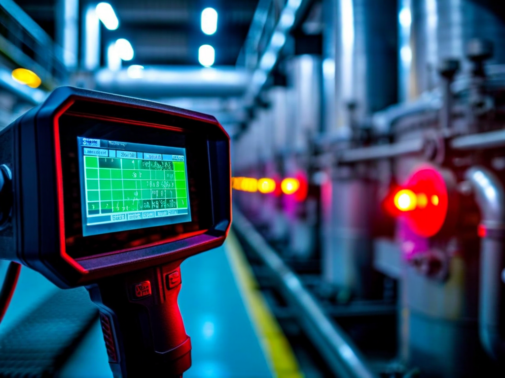
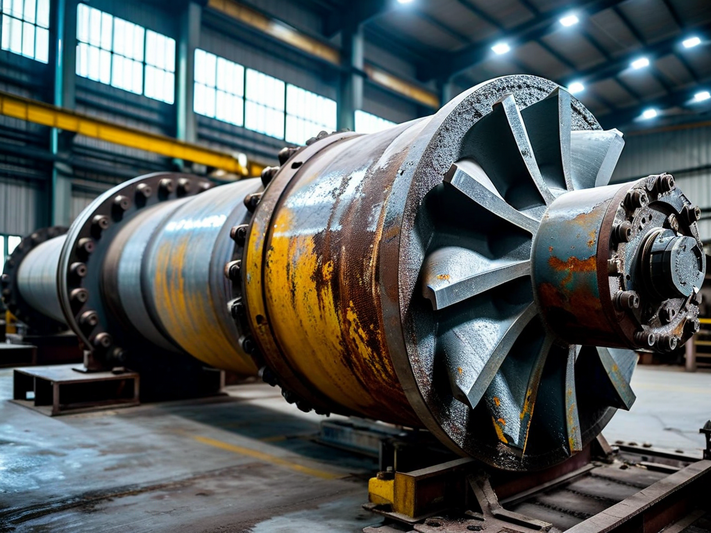

# Field Report: report-rcp-a

**Report ID:** report-rcp-a  
**Task ID:** task-20260115-001  
**Technician:** Mike Johnson (tech-4521)  
**Runbook:** RB-001 v3.2  
**Location:** Reactor Building, Primary Circuit Room  
**Date:** 2026-01-15

## Timing
- Started: 08:30
- Completed: 14:15
- Duration: 345 minutes (estimated: 240 minutes)

## Status
- Everything OK: No
- Had Delays: Yes
- Runbook Rating: 3/5 stars

## Step-Specific Feedback

### Step 1: Pre-Work Verification
- Issue: Torque wrench DYN-250 calibration expired (dated 2024-09-12, due 2025-09-12)
- Suggestion: Step 1 checklist says "verify calibrated" but I didn't check until Step 7 when I needed it
- Time Impact: +45 minutes (had to get TW-0923 from Tool Crib TC-2)
- Safety Critical: Yes

**What Happened:**
Grabbed DYN-250 from tool crib without checking calibration sticker. Only noticed expired date when starting Step 7 torquing. Had to walk to TC-2 to get TW-0923 which was calibrated. Lost 45 minutes.

### Step 2: Electrical Isolation
- Issue: FLIR E8 thermal camera battery dead when checking cooldown temperature
- Suggestion: Add to Step 1 checklist: "☐ Thermal camera battery >50%"
- Time Impact: +20 minutes (charging time)
- Safety Critical: No

### Step 5: Impeller Extraction
- Issue: Impeller stuck on shaft, procedure mentions this but technique unclear
- Suggestion: Current note is good but could be more specific on mallet technique
- Time Impact: +30 minutes (had to call senior tech for help)
- Safety Critical: Yes (risk of impeller damage if forced)

**What Happened:**
Impeller wouldn't budge. Applied penetrating oil as procedure says, waited 10 minutes. Still stuck. Called senior tech who showed me proper mallet technique - tap around circumference while pulling, not just one spot. This should be in the procedure.

## Comments

**Positive:**
- New impeller extraction note in Step 5 is helpful (wasn't in older versions)
- Torque sequence diagram clear

**Issues:**
- Should have checked torque wrench calibration in Step 1
- Thermal camera battery check not in pre-work checklist
- Mallet technique for impeller needs more detail

**Results:**
- All bearings in excellent condition
- Leak test passed first time
- Vibrations: 2.3 mm/s RMS (well within spec)
- Flow rate: 348 m³/h (within tolerance)

## Photos

