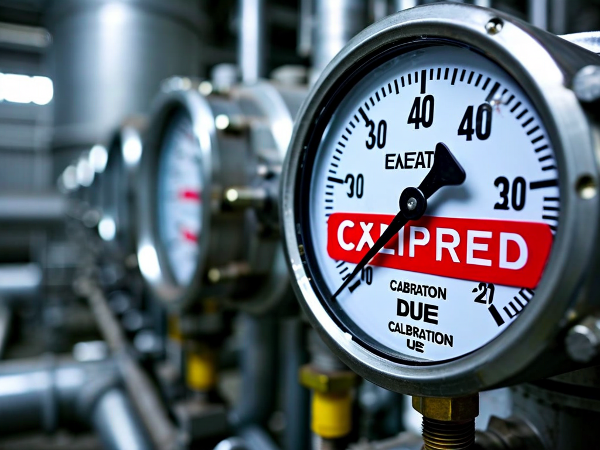

# Field Report: report-cont-test

**Report ID:** report-cont-test  
**Task ID:** task-20260118-002  
**Technician:** Robert Kim (tech-2847)  
**Runbook:** RB-015 v2.1  
**Location:** Containment Building Unit 1  
**Date:** 2026-01-18

## Timing
- Started: 06:00
- Completed: 13:15
- Duration: 435 minutes (estimated: 360 minutes)

## Status
- Everything OK: Yes (test passed)
- Had Delays: Yes
- Runbook Rating: 3/5 stars

## Step-Specific Feedback

### Step 3.1: Equipment Setup - Pressure Gauges
- Issue: Both primary and secondary pressure gauges calibration expired (due 2025-10-15, expired 3 months)
- Suggestion: Add to section 3: "Verify gauge calibration valid (within 6 months) before connecting to test rig"
- Time Impact: +40 minutes
- Safety Critical: Yes (regulatory requirement)

### Step 4.2: Pressurization - Data Logger
- Issue: Data logger DL-2000 wouldn't connect to laptop, no setup instructions in procedure
- Suggestion: Add appendix with data logger setup: software version, COM port config, sampling rate
- Time Impact: +25 minutes
- Safety Critical: No

### Step 4.5: Depressurization - Temperature Correction
- Issue: Procedure mentions "temperature-corrected leak rate" but no formula provided
- Suggestion: Add formula to section 5: "Corrected Rate = Measured Rate × (T_initial / T_final)"
- Time Impact: +15 minutes
- Safety Critical: Yes (acceptance criteria calculation)

## Comments
Test passed all acceptance criteria. Small leak detected at equipment hatch seal but within limits. Weather conditions perfect for testing.

Test Results:
- Initial: 15.02 psig at 68°F
- Final: 14.58 psig at 71°F (4 hours)
- Corrected decay: 0.41 psi (PASS < 0.5 psi)

## Photos

