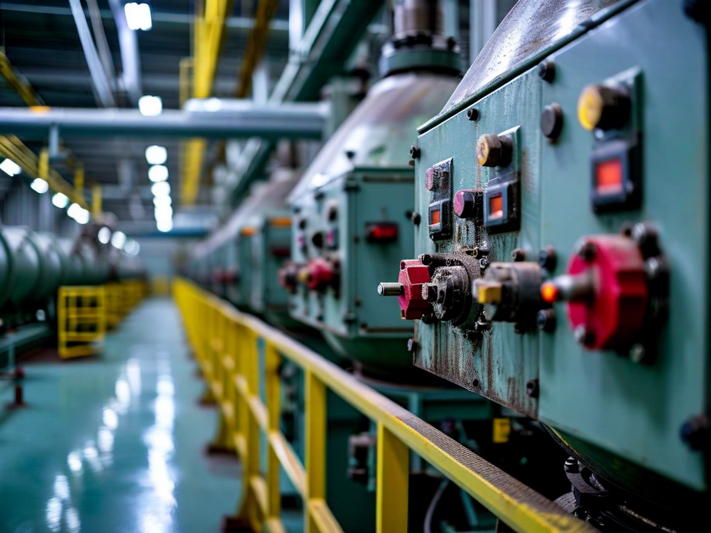
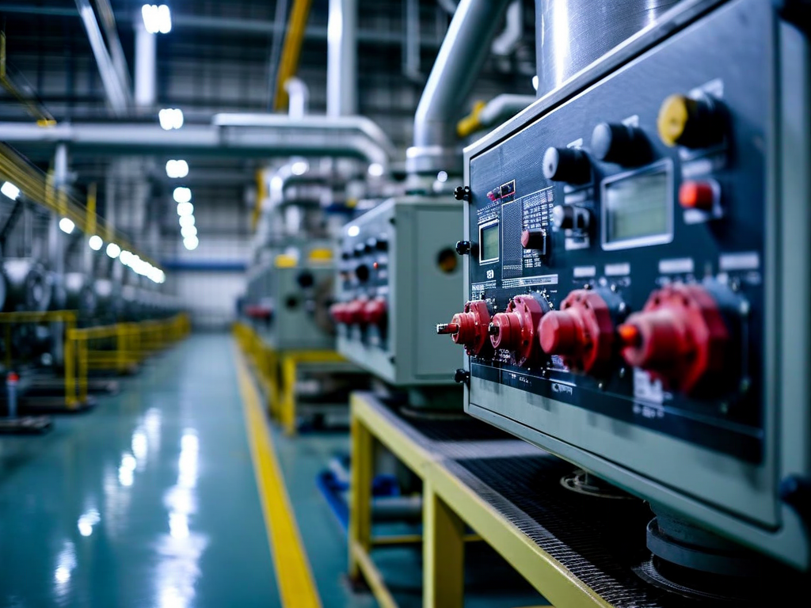
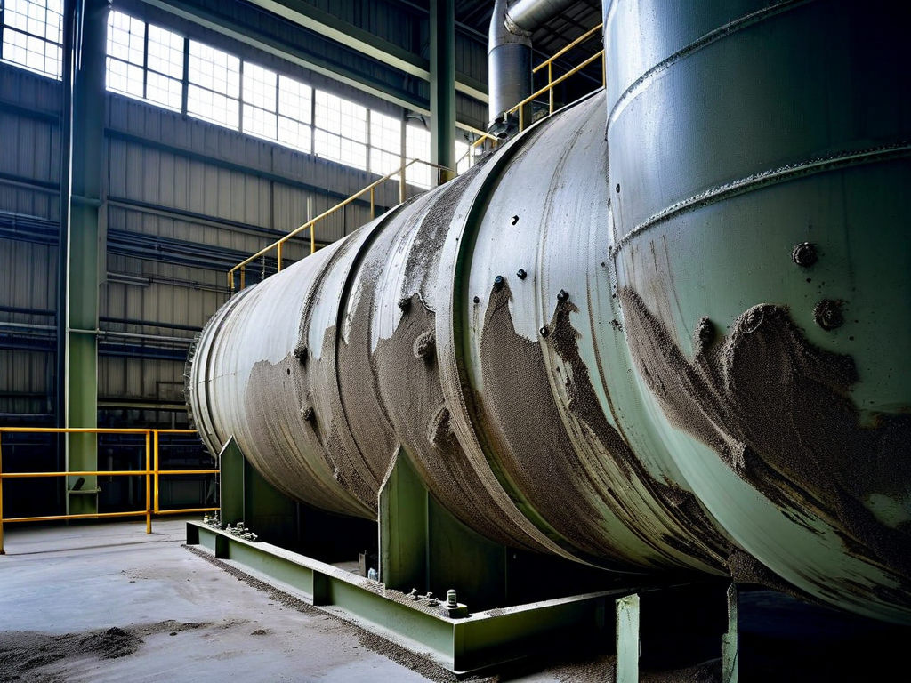

# Field Report: report-sg-001

**Report ID:** report-sg-001
**Task ID:** task-20260120-002
**Technician:** Robert Kim (tech-2156)
**Runbook:** RB-002 v2.1
**Location:** Reactor Building, Steam Generator A
**Date:** 2026-01-20

## Timing
- Started: 06:00
- Completed: 15:45
- Duration: 585 minutes (estimated: 480 minutes)

## Status
- Everything OK: No
- Had Delays: Yes
- Runbook Rating: 3/5 stars

## Step-Specific Feedback

### Step 1: Pre-Work Authorization
- Issue: Radiation work permit processing delayed
- Suggestion: Start permit paperwork 24 hours in advance, not morning of
- Time Impact: +30 minutes
- Safety Critical: Yes

### Step 4: Eddy Current Probe Setup
- Issue: Probe calibration drift detected during pre-check
- Suggestion: Add explicit calibration verification step with test block before entering SG
- Time Impact: +45 minutes (had to recalibrate probe, repeat verification)
- Safety Critical: Yes

**What Happened:**
Set up eddy current probe per procedure. Did routine check with calibration block before entry. Probe readings off by 15% on test defects. This would have caused false positives/negatives during inspection. Had to recalibrate probe completely using manufacturer procedure. Verified three times before proceeding. Procedure should require calibration verification as mandatory step, not optional check.

### Step 6: Eddy Current Inspection
- Issue: Contamination levels higher than expected (0.5 mSv/h vs expected 0.2 mSv/h)
- Suggestion: Add contingency for high contamination: "If readings >0.4 mSv/h, reduce inspection time per section, increase crew rotation"
- Time Impact: +20 minutes (extra decon breaks, crew rotation)
- Safety Critical: Yes

### Step 7: Data Analysis
- Issue: Probe calibration drift caused questionable data in early scans
- Suggestion: Real-time calibration monitoring during inspection, not just pre-check
- Time Impact: +10 minutes (had to review and validate early scan data)
- Safety Critical: Yes

## Comments

**Probe Reliability:**
Eddy current probe calibration drift is a recurring issue on this equipment (Olympus model EC-601). Temperature change from ambient to SG environment (20°C to 45°C) affects probe response. Calibration done at room temperature doesn't hold inside hot SG environment.

**Contamination:**
Contamination higher than last inspection (6 months ago). Indicates possible small leak or deposit buildup. Flagged for chemistry review. This affected work pace - had to take more frequent breaks for dose management.

**Positive:**
- Scaffold access was excellent (recent redesign worked well)
- Manway opening/closing procedures clear
- Data acquisition system worked flawlessly

**Results:**
- 3,890 tubes inspected (full SG-A tube bundle)
- 12 tubes flagged for potential degradation (need follow-up UT inspection)
- 2 tubes with confirmed wall thinning >20% (plugging recommended)
- All data logged in CMMS system
- Radiation dose: 2.1 mSv (within limits, but higher than expected due to contamination)

**Recommendation:**
1. Add mandatory probe calibration verification to Step 4 (not optional)
2. Consider temperature-compensated probe or in-situ calibration checks
3. Review contamination trends - may indicate chemistry control issue

## Photos

