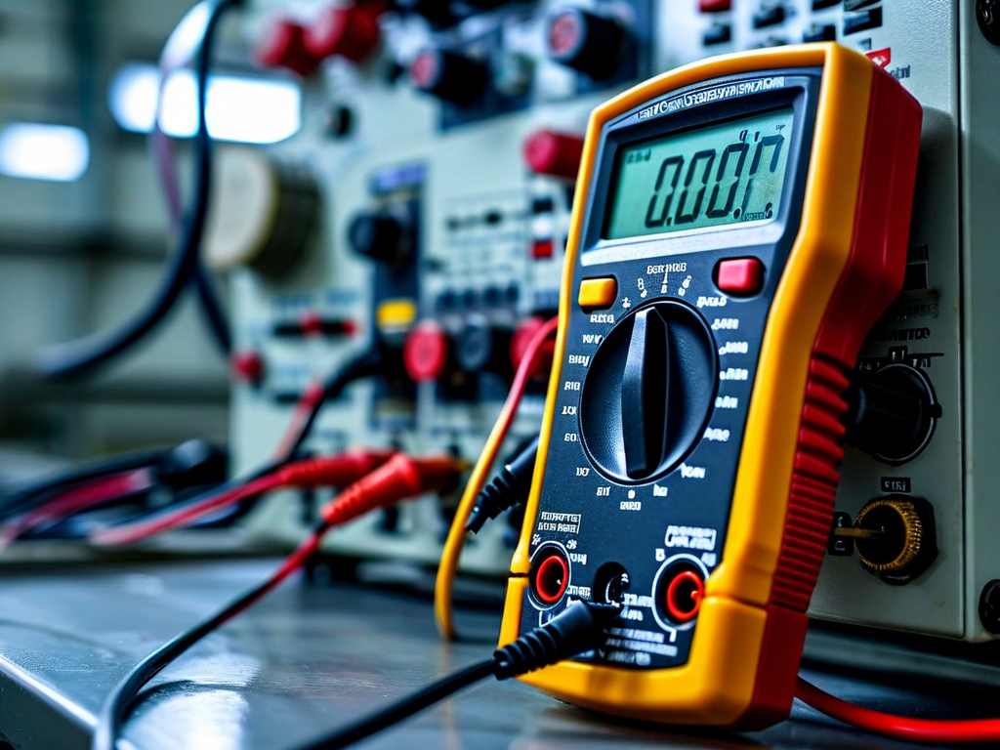
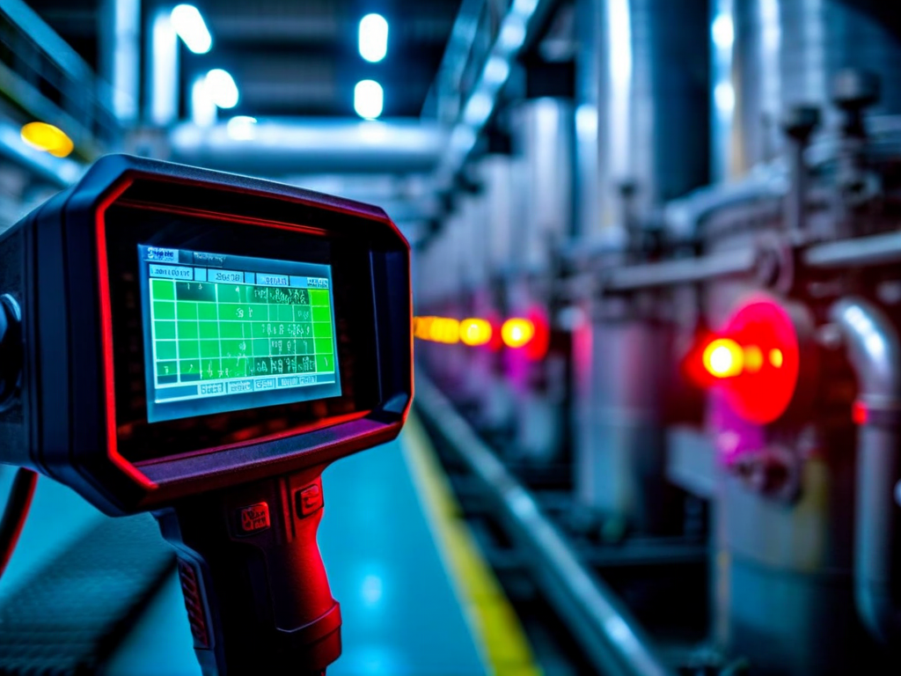
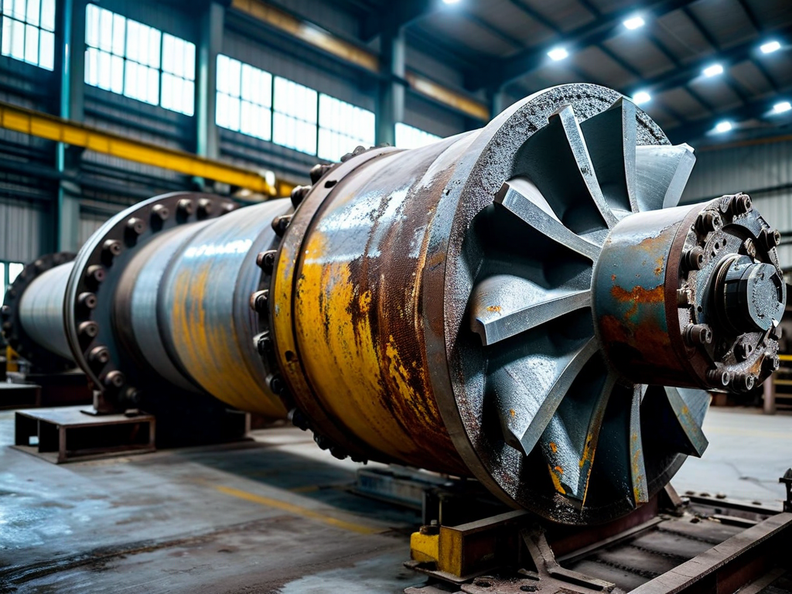

# Field Report: report-rcp-b

**Report ID:** report-rcp-b  
**Task ID:** task-20260122-003  
**Technician:** Sarah Chen (tech-3892)  
**Runbook:** RB-001 v3.2  
**Location:** Reactor Building, Primary Circuit Room  
**Date:** 2026-01-22

## Timing
- Started: 09:00
- Completed: 14:20
- Duration: 320 minutes (estimated: 240 minutes)

## Status
- Everything OK: No
- Had Delays: Yes
- Runbook Rating: 3/5 stars

## Step-Specific Feedback

### Step 1: Pre-Work Verification
- Issue: Multimeter calibration expired (due 2025-12-15, expired 1 month)
- Suggestion: Add explicit line to Step 1 checklist: "☐ Multimeter calibration valid (<6 months)"
- Time Impact: +35 minutes (had to get calibrated unit from TC-1)
- Safety Critical: Yes

**What Happened:**
Same issue as Mike's report from last week. Grabbed multimeter without checking calibration. Only noticed when doing voltage verification in Step 2. This keeps happening.

### Step 2: Electrical Isolation
- Issue: Thermal camera battery at 15% - barely enough to complete temperature checks
- Suggestion: Add to Step 1: "☐ Thermal camera battery >50%"
- Time Impact: +15 minutes (had to charge partially during cooldown wait)
- Safety Critical: No

### Step 5: Impeller Extraction
- Issue: Impeller stuck as expected - used Mike's technique from his report
- Suggestion: Add specific mallet technique: "Tap around circumference while pulling, not just one spot"
- Time Impact: +40 minutes (still learning the technique)
- Safety Critical: Yes

**What Happened:**
Read Mike's report before starting. Knew impeller would stick. Applied penetrating oil immediately, waited 10 minutes. Used mallet technique he described. Still took 40 minutes because I'm not as experienced. Procedure should document this clearly.

## Comments

**Positive:**
- Mike's report was super helpful - saved me from some mistakes
- Impeller extraction note in procedure is good start

**Issues (Same as Mike's):**
- Tool calibration checks need to be explicit in Step 1 checklist
- Thermal camera battery check missing from Step 1
- Mallet technique needs more detail in Step 5

**Pattern:**
This is the second RCP maintenance this month with calibration issues. We need better pre-work checklists.

**Results:**
- Bearings excellent condition
- Leak test passed
- Vibrations: 2.8 mm/s RMS (within spec)
- Flow rate: 351 m³/h (within tolerance)

## Photos

