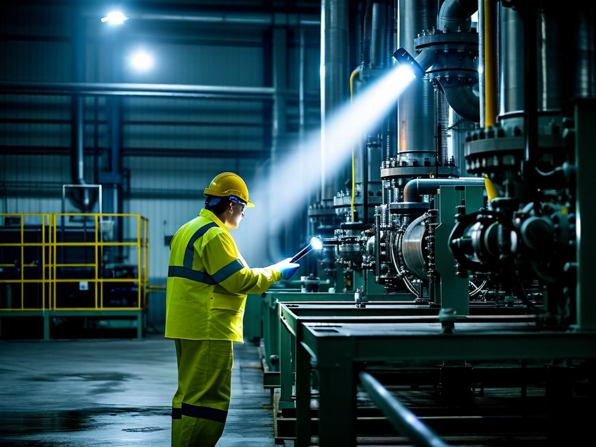
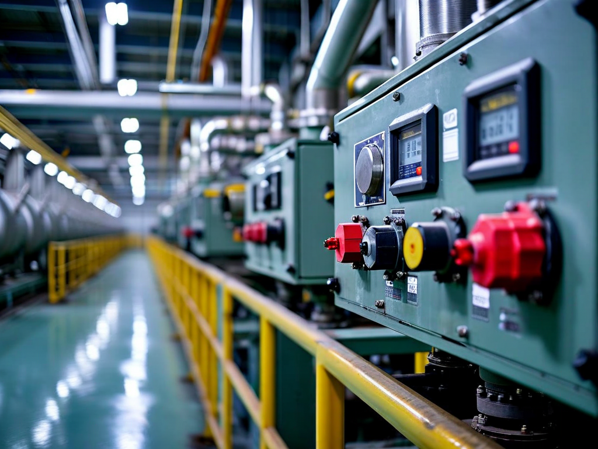

# Field Report: report-turb-001

**Report ID:** report-turb-001
**Task ID:** task-20260125-004
**Technician:** David Martinez (tech-5103)
**Runbook:** RB-003 v4.0
**Location:** Turbine Building, HP Turbine Section
**Date:** 2026-01-25

## Timing
- Started: 08:00
- Completed: 16:30
- Duration: 510 minutes (estimated: 360 minutes)

## Status
- Everything OK: No
- Had Delays: Yes
- Runbook Rating: 3/5 stars

## Step-Specific Feedback

### Step 2: Casing Opening
- Issue: Casing bolts severely corroded - 6 of 24 bolts required heat and penetrating oil
- Suggestion: Add note: "Inspect bolt condition before removal. If corrosion visible, apply penetrating oil 30 min before removal attempt"
- Time Impact: +90 minutes (slow bolt removal, one bolt head rounded, had to use bolt extractor)
- Safety Critical: No

**What Happened:**
Started casing opening at 08:15. First 4 bolts came out normally. Bolt #5 seized - wouldn't turn with impact wrench at 400 Nm. Corroded threads binding in casing. Applied penetrating oil, waited 15 minutes, still stuck. Applied heat gun for 10 minutes to expand metal, finally broke free. Same issue on 5 more bolts. One bolt head rounded during removal - had to use left-hand drill bit and bolt extractor. This added huge time delay.

Corrosion pattern suggests moisture ingress during storage or operation. All affected bolts on bottom half of casing (condensation zone).

### Step 3: Blade Visual Inspection
- Issue: Lighting inadequate for crack detection on blade roots
- Suggestion: Add to required equipment: "LED work light 1000+ lumens with articulating head"
- Time Impact: +20 minutes (had to get better lighting from another crew)
- Safety Critical: Yes

**What Happened:**
Procedure specifies "adequate lighting" but doesn't define what that means. Standard work lights (500 lumens) not enough to see blade root details clearly. Dark shadows in blade attachment area where cracks typically form. Had to borrow high-intensity LED work light from another maintenance crew. Much better visibility with 1200-lumen articulated light.

### Step 4: PT/MT Inspection
- Issue: PT solution temperature at 12°C (below optimal 15-30°C range)
- Suggestion: Add temperature check: "Verify PT solution temperature 15-30°C before application"
- Time Impact: +15 minutes (waited for solution to warm in inspection area)
- Safety Critical: Yes

**What Happened:**
PT solution stored in cold storage room. Applied first blade section before realizing solution was too cold (12°C). PT sensitivity decreases significantly below 15°C. Stopped, moved PT kit to warmer area, waited 15 minutes for solution to reach 18°C. Had to redo first blade section.

## Comments

**Bolt Corrosion:**
This is a significant issue. Casing bolts are supposed to be stainless steel (SS316) but corrosion pattern suggests carbon steel contamination or wrong material supplied. Needs metallurgy review. If we don't address this, next inspection will be even worse - may need to cut bolts out.

**Inspection Quality:**
Lighting and PT temperature issues both affect inspection reliability. These are basic quality requirements that should be explicit in procedure, not assumed as "common knowledge."

**Positive:**
- Blade condition overall excellent (no cracks found)
- Dimensional checks all within tolerance
- Casing alignment verified successfully
- Torque sequence diagram very clear

**Results:**
- All 48 blades inspected (HP turbine first stage)
- Zero cracks detected (PT/MT inspection clean)
- Blade tip clearance: 0.85 mm (spec 0.8-1.2 mm, acceptable)
- All dimensional checks within tolerance
- Casing realigned and closed successfully

**Recommendations:**
1. Investigate casing bolt material (metallurgy review)
2. Consider protective coating or material upgrade for replacement bolts
3. Specify lighting requirements explicitly (lumens + type)
4. Add PT solution temperature verification to procedure

## Photos

