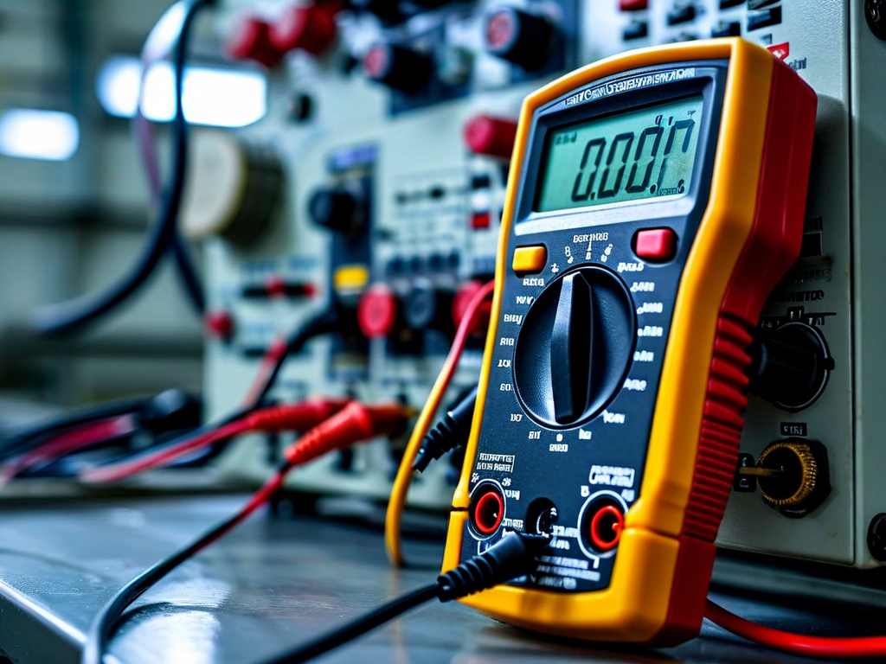
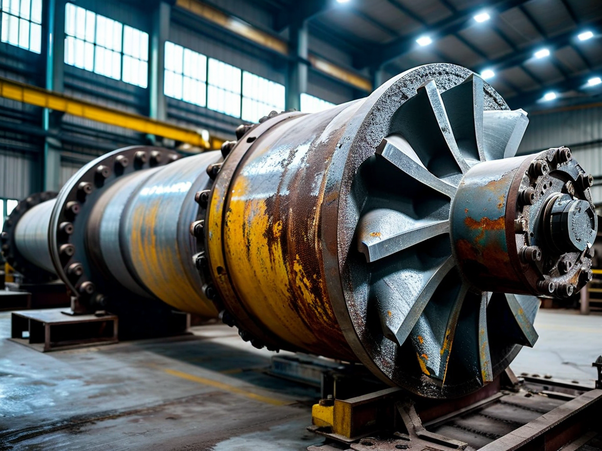

# Field Report: report-rcp-c

**Report ID:** report-rcp-c  
**Task ID:** task-20260128-007  
**Technician:** David Martinez (tech-5103)  
**Runbook:** RB-001 v3.2  
**Location:** Reactor Building, Primary Circuit Room  
**Date:** 2026-01-28

## Timing
- Started: 08:00
- Completed: 12:50
- Duration: 290 minutes (estimated: 240 minutes)

## Status
- Everything OK: No
- Had Delays: Yes
- Runbook Rating: 4/5 stars

## Step-Specific Feedback

### Step 1: Pre-Work Verification
- Issue: Multimeter calibration expired (due 2025-12-15) - caught BEFORE starting thanks to previous reports
- Suggestion: Add explicit line to Step 1 checklist: "☐ Multimeter calibration valid (<6 months)"
- Time Impact: +5 minutes (minimal because caught early)
- Safety Critical: Yes

**What Happened:**
Read Mike and Sarah's reports before starting. Both had calibration issues. Checked multimeter FIRST - expired. Got calibrated unit immediately. Only lost 5 minutes instead of 35-45 minutes. Reading reports saved me 30-40 minutes!

### Step 5: Impeller Extraction
- Issue: Impeller stuck as expected, applied penetrating oil immediately
- Suggestion: Add specific mallet technique to Step 5: "Tap around circumference in 4-6 spots while pulling with hoist, not just one spot. Rotate and repeat if needed."
- Time Impact: +25 minutes
- Safety Critical: Yes

**What Happened:**
Prepared for impeller seizure thanks to Mike and Sarah's reports. Applied penetrating oil right away, waited 10 minutes. Used mallet technique - tapped around circumference like Sarah described. Still took 25 minutes but much better than Mike's 30 minutes or Sarah's 40 minutes.

### Step 7: Reassembly
- Issue: Bolt torque sequence diagram helpful but which bolt is #1 on actual flange?
- Suggestion: Paint reference mark at 12 o'clock position on flanges, or add photo showing bolt #1 location
- Time Impact: +10 minutes (had to ask supervisor)
- Safety Critical: Yes (incorrect sequence = uneven torque = leak risk)

## Comments

**Positive:**
- Reading previous reports saved me 30-40 minutes
- Impeller extraction note in procedure is helpful
- Torque sequence diagram clear once I knew where to start

**Issues:**
- Tool calibration checks still not explicit in Step 1 checklist (but I caught it thanks to reports)
- Bolt #1 position unclear on actual flange
- Mallet technique needs more specific detail

**Pattern Recognition:**
This is the THIRD RCP maintenance this month with same issues:
1. Mike (Jan 15): Torque wrench calibration +45 min, impeller +30 min
2. Sarah (Jan 22): Multimeter calibration +35 min, impeller +40 min
3. Me (Jan 28): Caught calibration early +5 min, impeller +25 min

**Learning curve visible:** Each tech learns from previous reports. If these fixes get into the runbook, future techs will save even more time.

**Results:**
- All bearings excellent condition
- Vibrations: 2.1 mm/s RMS (well within spec)
- Flow rate: 349 m³/h (within tolerance)
- Leak test passed first time

## Photos

