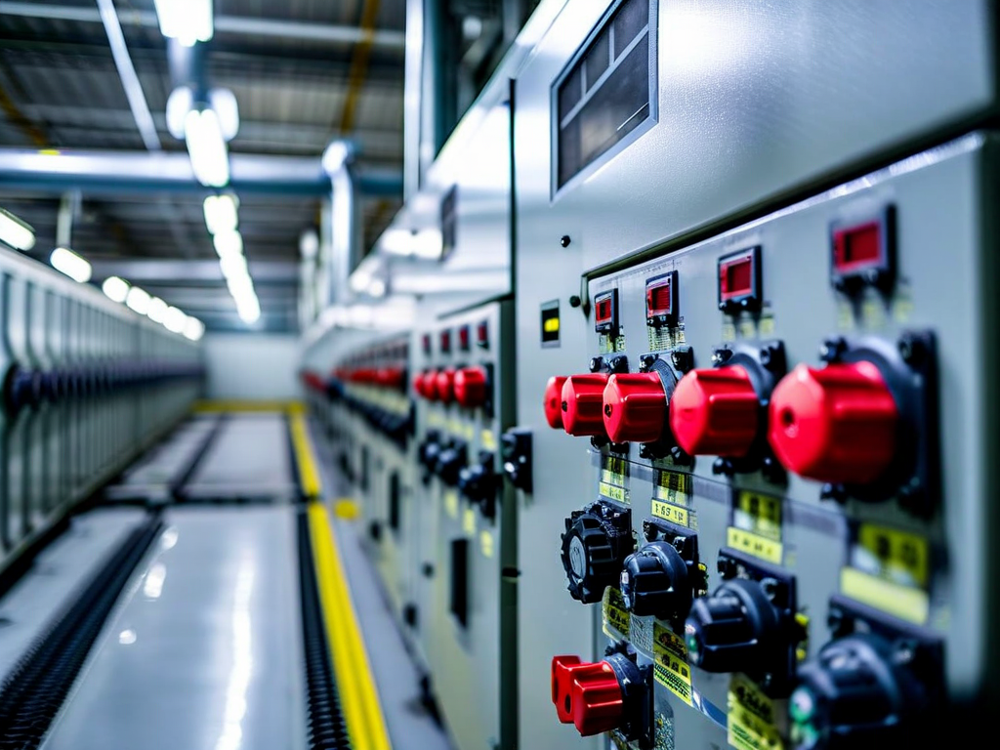
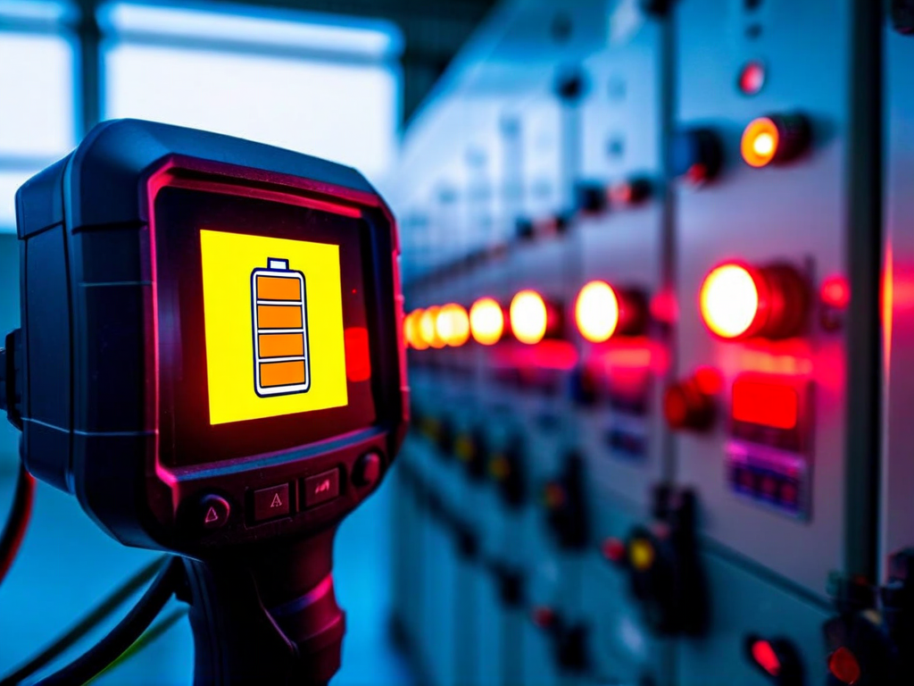
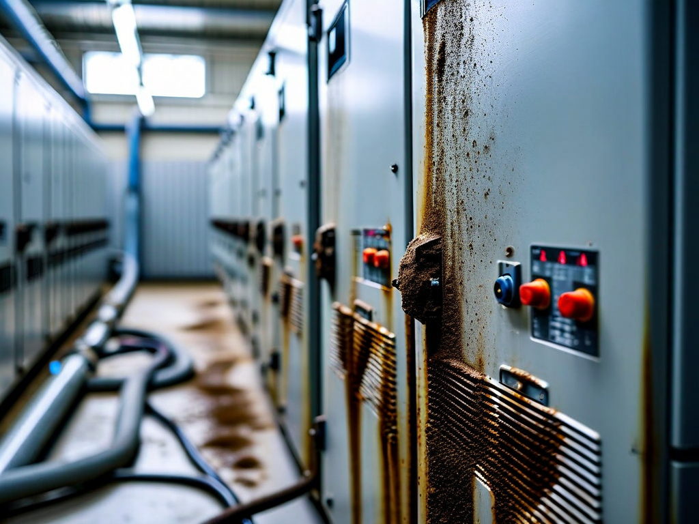

# Field Report: report-solar-001

**Report ID:** report-solar-001
**Task ID:** task-20260128-008
**Technician:** Ahmed Tahir (tech-5445)
**Runbook:** RB-SOLAR-001 v1.5
**Location:** Solar Farm Central Inverter Station, INV-03
**Date:** 2026-01-28

## Timing
- Started: 09:00
- Completed: 13:45
- Duration: 285 minutes (estimated: 180 minutes)

## Status
- Everything OK: No
- Had Delays: Yes
- Runbook Rating: 2/5 stars

## Step-Specific Feedback

### Step 1: Inverter Shutdown Sequence
- Issue: None - shutdown sequence worked perfectly
- Time Impact: 0 minutes
- Safety Critical: N/A

### Step 3: Cooling System Check
- Issue: Thermal camera battery completely dead when needed for hotspot check
- Suggestion: Add to Step 1 checklist: "☐ Thermal camera battery charged >50%"
- Time Impact: +45 minutes (had to charge battery, camera requires 40 min for 50% charge)
- Safety Critical: No

**What Happened:**
Step 3 requires thermal imaging of IGBT modules before disassembly. Got thermal camera FLIR E8 from tool room. Battery indicator showed 0%. Cannot use camera while charging (safety feature). Had to charge 40 minutes to get 50% capacity. Should have checked battery at start of shift.

### Step 5: IGBT Module Cleaning
- Issue: Dust accumulation far worse than procedure describes - procedure says "vacuum clean" but dust was caked solid
- Suggestion: Update procedure: "Severe dust accumulation may require compressed air (max 30 PSI) followed by vacuum. Use ESD-safe equipment only."
- Time Impact: +40 minutes (vacuum alone ineffective, had to use compressed air carefully)
- Safety Critical: Yes

**What Happened:**
Opened inverter cabinet expecting light dust. Found 3-5mm thick dust cake on IGBT modules, cooling fins completely clogged. Procedure says "use ESD-safe vacuum cleaner to remove dust." Tried vacuum - barely touched the compacted dust. Needed compressed air to break up dust first.

Used shop compressed air at 30 PSI (carefully, wearing ESD wrist strap). Dust came off well but created huge dust cloud. After compressed air, used vacuum to collect debris. This approach worked but procedure doesn't mention it. Also, ESD risk with compressed air not addressed in procedure.

Result: IGBT modules cleaned effectively, cooling fins clear, but procedure needs update for realistic conditions.

### Step 7: Insulation Resistance Test
- Issue: Thermal camera low battery warning during final hotspot check (battery at 15%)
- Suggestion: Battery management critical for this procedure - should require fully charged battery at start
- Time Impact: +15 minutes (rushed final inspection before battery died)
- Safety Critical: No

## Comments

**Thermal Camera Battery:**
This is second time I've had thermal camera battery issues on solar inverters. Previous job (INV-05 in December) had same problem. Camera sits in tool room for weeks unused, battery self-discharges. By the time we need it, battery dead. Need better battery management system - either charge cameras weekly or replace batteries with fresh ones.

**Dust Reality:**
Procedure written assuming clean environment. Solar farm in agricultural area = massive dust exposure (harvest season especially bad). Inverters filter air but over 6 months, dust accumulation is severe. Simple vacuum cleaning not adequate for caked dust. Need realistic cleaning procedure that addresses actual field conditions.

**ESD Risk:**
Using compressed air creates ESD risk on sensitive electronics. Did it carefully with wrist strap but procedure should address this risk formally. Either approve compressed air with ESD precautions, or specify different cleaning method.

**Positive:**
- Firmware update went smoothly (v4.2.1 installed, no issues)
- Insulation resistance test excellent (>200 MΩ, well above 10 MΩ minimum)
- Startup sequence clear and comprehensive

**Results:**
- Inverter INV-03 cleaned and tested successfully
- IGBT modules clear of dust (cooling efficiency restored)
- Capacitor bank inspection: all units within spec
- Firmware updated to v4.2.1
- Insulation resistance: 245 MΩ (excellent)
- Inverter returned to service, generating 500 kW (full capacity for current sunlight)

**Recommendations:**
1. Tool room: implement battery charging schedule for thermal cameras (weekly check/charge)
2. Update Step 5 to address severe dust accumulation scenarios
3. Add ESD risk assessment for compressed air cleaning
4. Consider specifying inverter maintenance during low-dust season when possible

## Photos

