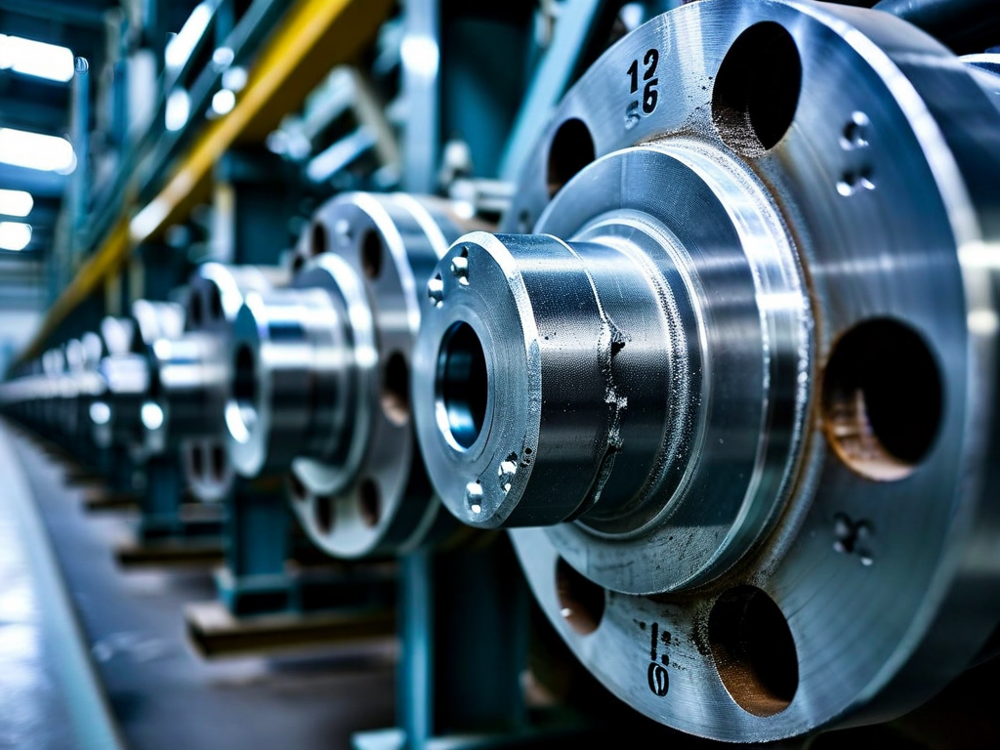
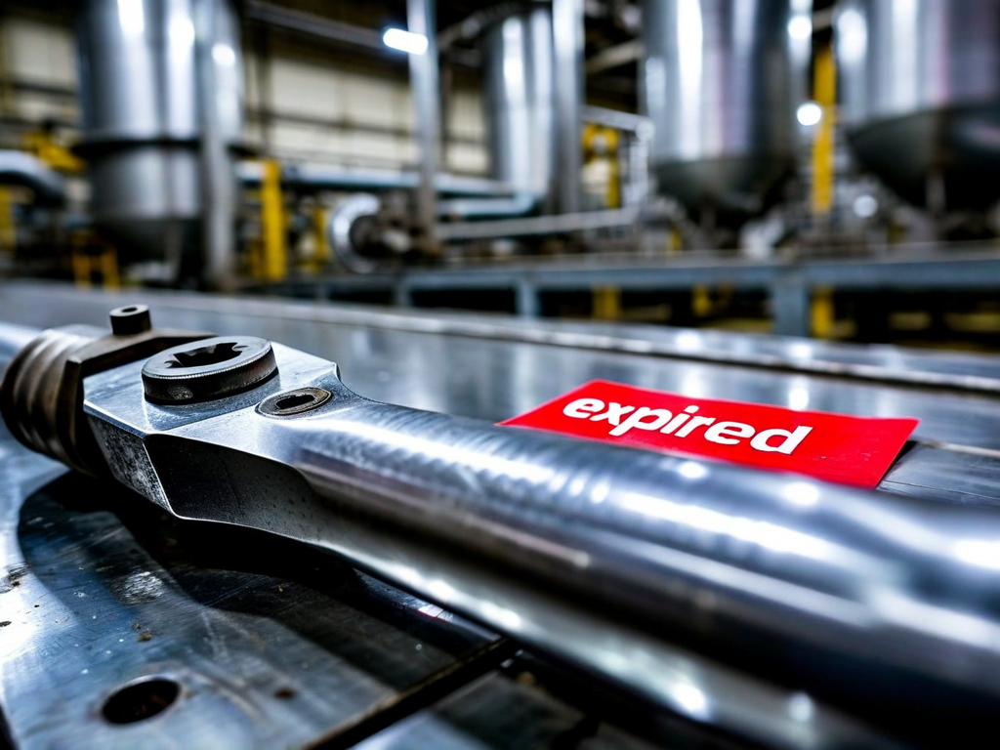

# Field Report: report-vlv-003

**Report ID:** report-vlv-003  
**Task ID:** task-20260128-015  
**Technician:** Akua Mansa (tech-2891)  
**Runbook:** RB-VLV-003 v3.2  
**Location:** Building A, Primary Circuit Room 102  
**Date:** 2026-01-28

## Timing
- Started: 08:15
- Completed: 13:30
- Duration: 315 minutes (estimated: 240 minutes)

## Status
- Everything OK: No
- Had Delays: Yes
- Runbook Rating: 4/5 stars

## Step-Specific Feedback

### Step 2: Depressurization Verification
- Issue: Primary gauge PG-302 showed 0 bar but when we started bolt removal, residual pressure caused small fluid spray
- Suggestion: The new secondary verification step (added in v3.2) is EXCELLENT - caught the issue before injury
- Time Impact: +10 minutes (waiting for true zero pressure)
- Safety Critical: Yes

**What Happened:**
Primary gauge read 0 bar immediately, but secondary indicator PI-302 showed 0.3 bar residual pressure. Waited 5 minutes as procedure now requires. Secondary gauge finally confirmed true 0 bar. This new step prevented what could have been a serious incident.

### Step 3: Flange Bolt Removal
- Issue: Bolt removal sequence diagram is helpful but bolt numbering unclear in field
- Suggestion: Add physical marking on flange (paint dots) showing "Start here" at 12 o'clock position
- Time Impact: +5 minutes (had to ask supervisor which bolt is #1)
- Safety Critical: No

### Step 7: Bolt Torquing
- Issue: Torque wrench TW-0847 calibration expired (due 2025-06-15, expired 7 months)
- Suggestion: Step 7 says "verify calibration" but should be in Step 1 pre-work verification
- Time Impact: +45 minutes (had to retrieve TW-0923 from Tool Crib TC-2)
- Safety Critical: Yes

**What Happened:**
Didn't check torque wrench calibration until Step 7. Sticker showed expired date. Had to walk to TC-2 to get TW-0923 which was calibrated. Lost 45 minutes. Should have caught this in Step 1 tool verification.

### Step 8: Pressure Test
- Issue: Leak detection spray LDS-001 can was empty
- Suggestion: Add to Step 1 checklist: "Verify leak detection spray can has fluid (shake to test)"
- Time Impact: +15 minutes
- Safety Critical: No

## Comments

**Positive:**
- New secondary pressure verification in Step 2 is EXCELLENT - prevented injury
- Bolt torque diagram very helpful
- Star pattern sequence clear

**Issues:**
- Torque wrench calibration should be checked in Step 1, not Step 7
- Leak spray can was empty - wasted time getting new one
- Bolt numbering on actual flange not clear (no reference marks)

**Suggestions:**
1. Move all tool calibration checks to Step 1 (including torque wrench)
2. Add leak spray fluid check to Step 1
3. Paint reference mark on flange at 12 o'clock position

**Results:**
- Pressure test passed first time (no leaks at 1.5 bar or 3.0 bar)
- Flow rate: 348 m³/h (within spec 350 ±5%)
- New valve serial number: VLV-2026-0847
- All forms completed (PVF-001, BTF-001, LOTO-CC-001)

## Photos

