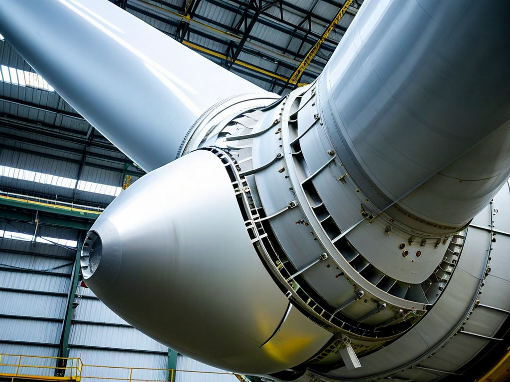
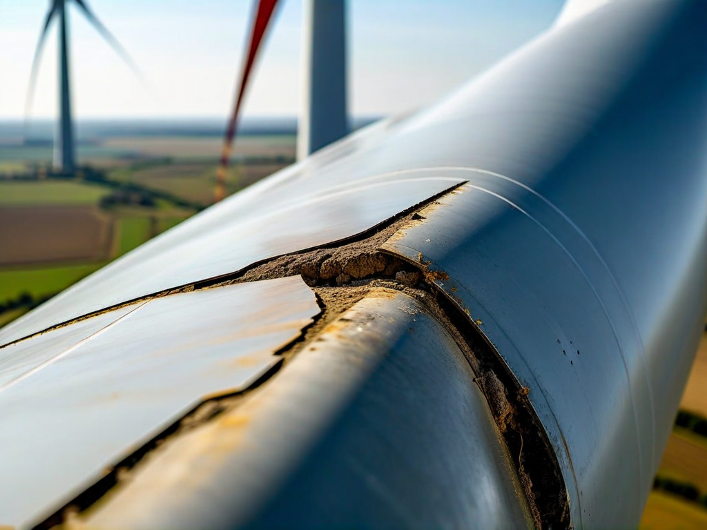
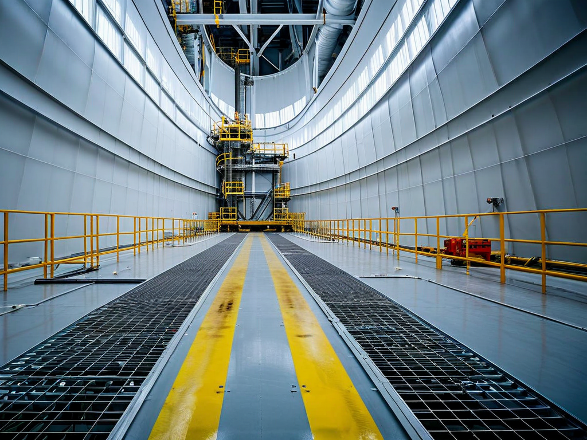

# Field Report: report-wind-blade-001

**Report ID:** report-wind-blade-001
**Task ID:** task-20260130-005
**Technician:** Mark Stevens (tech-4887)
**Runbook:** RB-WIND-002 v2.3
**Location:** Wind Farm Site 2, Turbine WT-07, Blade B
**Date:** 2026-01-30

## Timing
- Started: 08:00
- Completed: 14:30
- Duration: 390 minutes (estimated: 240 minutes per blade)

## Status
- Everything OK: No
- Had Delays: Yes
- Runbook Rating: 2/5 stars

## Step-Specific Feedback

### Step 1: Blade Positioning
- Issue: None - blade positioned to 3 o'clock perfectly
- Time Impact: 0 minutes
- Safety Critical: N/A

### Step 2: Leading Edge Inspection
- Issue: Erosion extent severely underestimated by visual inspection from ground
- Suggestion: Add UT thickness inspection to Step 2 before estimating repair scope
- Time Impact: +60 minutes (had to reassess, get additional epoxy material)
- Safety Critical: No

**What Happened:**
Ground-based visual inspection (binoculars) showed leading edge erosion over approximately 40 cm section. Procedure based repair plan on this assessment - brought 500g epoxy kit (sufficient for 40 cm repair).

Reached blade at 08:15 using rope access. Close inspection revealed erosion extends 65 cm, not 40 cm. Much worse than visible from ground. Leading edge gouged deeply in some areas (up to 8mm deep). Surface preparation and epoxy application will take much longer than planned.

Also discovered subsurface delamination adjacent to visible erosion (detected by tapping with coin - hollow sound). This extends repair area to approximately 80 cm total.

Had to descend, get additional epoxy (another 500g kit), return to blade position. Lost 45 minutes on material retrieval alone, plus replanning repair approach (+15 min).

**Root Cause:**
Visual inspection from ground inadequate for accurate erosion assessment. Binocular inspection misses depth and subsurface damage. Need ultrasonic thickness gauge or close-up inspection before finalizing repair scope.

### Step 3: Surface Preparation
- Issue: Repair area 2x larger than planned (80 cm vs 40 cm expected)
- Suggestion: Add safety margin to material estimates: "Bring 50% extra epoxy beyond visual assessment"
- Time Impact: +35 minutes (larger area = more grinding time)
- Safety Critical: No

### Step 4: Epoxy Application
- Issue: Had barely enough epoxy (1000g total for 80 cm repair) - used every gram
- Suggestion: Update material planning to account for subsurface damage not visible from ground
- Time Impact: +20 minutes (careful material management, no margin for error)
- Safety Critical: No

**What Happened:**
Applied epoxy in 3 layers per procedure. First layer fills deep gouges, second layer builds profile, third layer final contour. With 80 cm repair instead of 40 cm, material was very tight. No epoxy left over for touch-ups or errors. Had to be extremely precise with application. High stress situation.

If I had dropped any epoxy or made application error, would have had to descend again for more material. This would add another 60+ minutes.

### Step 5: Curing Time
- Issue: Ambient temperature 8°C - epoxy cure time extended
- Suggestion: Add temperature guidance: "Below 10°C, increase cure time by 50%. Consider heated blanket."
- Time Impact: +30 minutes (waited for proper cure, epoxy slower at cold temps)
- Safety Critical: Yes

## Comments

**Inspection Inadequacy:**
This is a major procedure gap. Ground-based visual inspection cannot accurately assess blade erosion extent or depth. Results in:
1. Insufficient material brought to job
2. Underestimated time
3. Risk of incomplete repair

**Suggestion:** Add ultrasonic thickness inspection in Step 2, or require close-up inspection before material/time planning. Alternative: always bring 2x material based on ground assessment.

**Subsurface Delamination:**
Found delamination adjacent to visible erosion in 3 locations (coin tap test - hollow sound). Procedure doesn't mention checking for this. Delamination will progress if not repaired. Added these areas to repair scope (correct decision but added time/material).

**Weather Impact:**
Temperature 8°C affected epoxy cure rate. Procedure assumes 15-25°C. Cold weather cure time much longer. Should specify temperature-dependent cure times or recommend heated curing blankets for cold weather work.

**Positive:**
- Rope access setup worked well
- Surface preparation technique clear
- Epoxy application process well documented
- Final inspection showed good repair quality

**Results:**
- Leading edge erosion repaired (80 cm section)
- 3 subsurface delamination areas addressed
- Final profile smooth and aerodynamic
- Blade returned to service
- Repair quality verified by lead tech

**Safety Note:**
Working at height with limited material margin is stressful. Better planning needed to reduce this risk. Descending/ascending repeatedly for material adds fatigue and fall risk.

**Recommendations:**
1. Add UT thickness inspection to Step 2 (or close-up inspection with camera)
2. Update material planning: "Bring 2x epoxy based on ground assessment"
3. Add subsurface delamination check (coin tap test) to Step 2
4. Temperature-dependent cure time table in Step 5
5. Consider heated curing blankets for cold weather operations

## Photos

