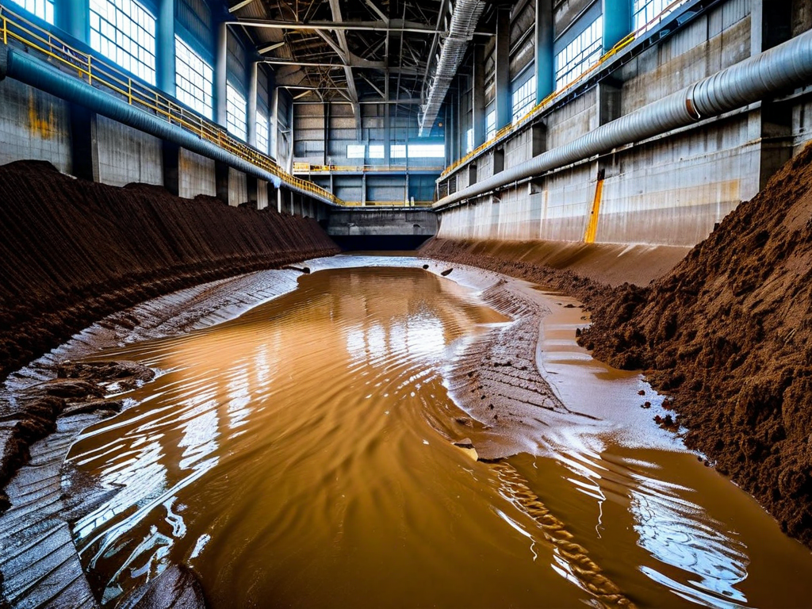
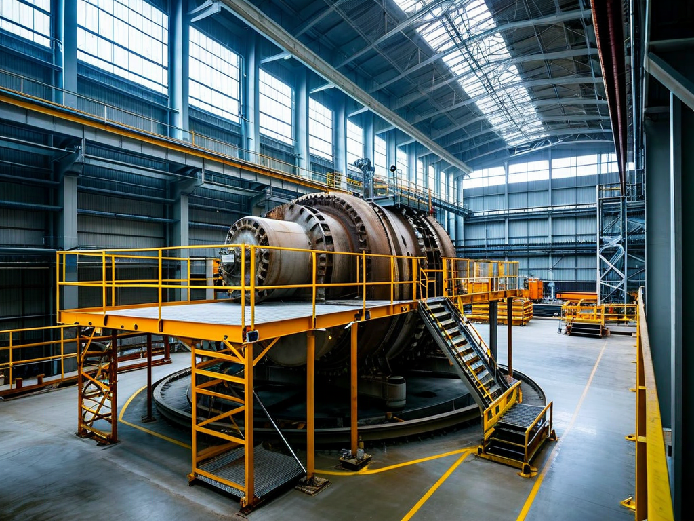
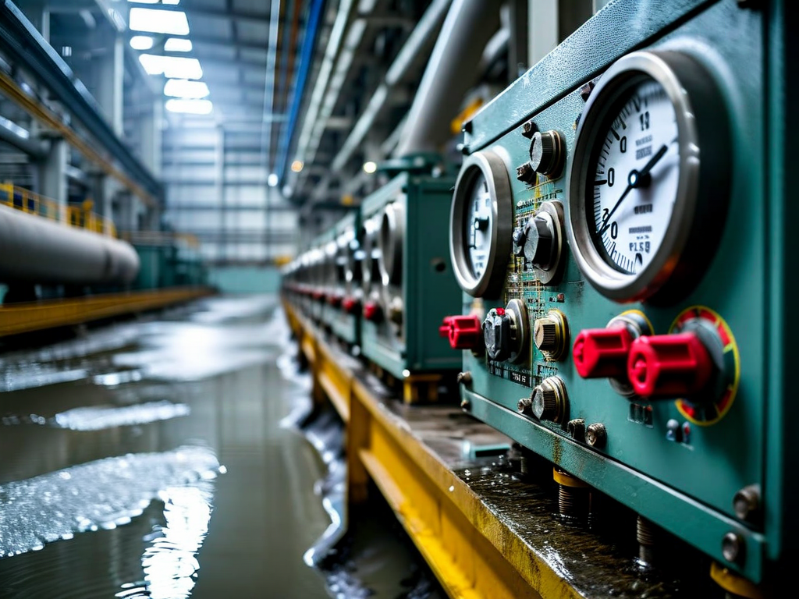

# Field Report: report-hydro-001

**Report ID:** report-hydro-001
**Task ID:** task-20260201-001
**Technician:** Arnav Desai (tech-3456)
**Runbook:** RB-HYDRO-001 v3.1
**Location:** Hydro Station 5, Kaplan Turbine Unit 2
**Date:** 2026-02-01

## Timing
- Started: 06:00
- Completed: 18:30
- Duration: 750 minutes (estimated: 600 minutes)

## Status
- Everything OK: No
- Had Delays: Yes
- Runbook Rating: 3/5 stars

## Step-Specific Feedback

### Step 1: Dewatering and Cofferdam
- Issue: Silt accumulation far worse than expected - clogged dewatering pumps repeatedly
- Suggestion: Add pre-assessment: "Inspect silt accumulation before dewatering. If >30 cm silt visible, plan pre-cleaning with eductor pumps"
- Time Impact: +140 minutes (pump clogging, cleaning, restart cycles)
- Safety Critical: No

**What Happened:**
Started dewatering at 06:00 using two 6-inch pumps per procedure. Water level dropped normally for first 45 minutes (from +3m to +1.5m). At +1.5m level, pumps started sucking silt-laden water. Pump #1 clogged at 07:00, pump #2 clogged at 07:15.

Stopped dewatering, pulled pumps, cleaned strainers (30 min per pump). Restarted dewatering at 08:15. Pumps clogged again at 09:00 (same silt issue).

Problem: Turbine pit has approximately 50 cm of silt accumulation (seasonal sediment from upstream erosion). Procedure assumes clean pit or minimal silt (<10 cm). Standard pumps not designed for heavy silt loads.

Solution: Called superintendent who approved eductor pump rental. Eductor pumps handle silt better (no moving parts to clog). Eductor pump arrived at 10:30, finished dewatering by 11:45. Lost nearly 6 hours vs. planned 2 hours for dewatering.

**Root Cause:**
Procedure doesn't account for silt accumulation variability. Upstream watershed has erosion issues - turbine pits accumulate 40-60 cm silt between inspections (18-month cycle). Need silt pre-assessment and appropriate pump selection.

### Step 2: Runner Access
- Issue: Access ladder rungs covered in slippery silt/algae
- Suggestion: Add safety note: "Clean ladder rungs with pressure washer before descent"
- Time Impact: +15 minutes (cleaned ladder for safety)
- Safety Critical: Yes

### Step 4: UT Thickness Measurement
- Issue: UT gauge calibration drifted in wet conditions (moisture affecting electronics)
- Suggestion: Use moisture-resistant UT gauge or verify calibration every 30 minutes in wet environment
- Time Impact: +20 minutes (recalibration mid-inspection after questionable readings)
- Safety Critical: Yes

**What Happened:**
Using Olympus 38DL Plus UT thickness gauge. Calibrated on test block before descent (correct reading: 25.4 mm). After 90 minutes of measurements in damp turbine pit (humidity ~90%, water dripping), checked calibration again. Test block now reading 26.8 mm (5% error).

Gauge electronics affected by moisture despite protective case. Had to dry gauge, recalibrate, repeat last 30 minutes of measurements (15 blade sections). This model not ideal for wet environment inspections.

### Step 5: Cavitation Damage Assessment
- Issue: Confined space ventilation inadequate - CO2 buildup from 2-person crew
- Suggestion: Add air quality monitoring requirement: "Check CO2 levels every 30 minutes in confined space"
- Time Impact: +25 minutes (extra ventilation breaks, fresh air cycles)
- Safety Critical: Yes

## Comments

**Silt Management:**
Major issue affecting all hydro turbine inspections at this site. Silt accumulation is increasing year over year (upstream watershed degradation). Standard dewatering pumps inadequate. Need either:
1. Pre-cleaning procedure with eductor pumps
2. Switch to submersible trash pumps for initial dewatering
3. More frequent turbine pit cleaning (currently done during inspection only)

This added 2+ hours to every hydro inspection. Across 8 units per year, that's 16+ hours of avoidable delays.

**Equipment Suitability:**
UT gauge moisture sensitivity is a known issue in wet environments. Olympus 38DL Plus is not rated for high-humidity use. Should specify moisture-resistant gauge (like Olympus 45MG) for hydro inspections. Additional cost ~$1500 but eliminates calibration drift issues.

**Confined Space Safety:**
Two-person crew in turbine pit (15m deep, limited ventilation) caused CO2 buildup. Had to cycle crew to surface every 60-90 minutes for fresh air. Procedure assumes adequate ventilation but doesn't specify air quality monitoring. Need either continuous ventilation upgrade or regular air sampling.

**Positive:**
- Runner condition overall good (minimal cavitation damage)
- Blade hub inspection thorough and clear
- Photo documentation checklist comprehensive
- Re-flooding procedure smooth

**Results:**
- All 6 Kaplan blades inspected thoroughly
- UT thickness measurements: average 23.8 mm (spec 22-26 mm, acceptable)
- Minor cavitation pitting on 2 blades (surface level, no structural concern)
- Blade hub keyways inspected: no cracks detected
- Runner approved for continued service
- Photo documentation complete (42 photos logged)

**Recommendations:**
1. Add silt pre-assessment to Step 1 (visual inspection or sonar survey)
2. Specify eductor pumps or trash pumps for high-silt conditions
3. Upgrade to moisture-resistant UT gauge (Olympus 45MG or equivalent)
4. Add air quality monitoring requirement for confined space work
5. Consider seasonal scheduling - winter has less silt than post-spring runoff

## Photos

