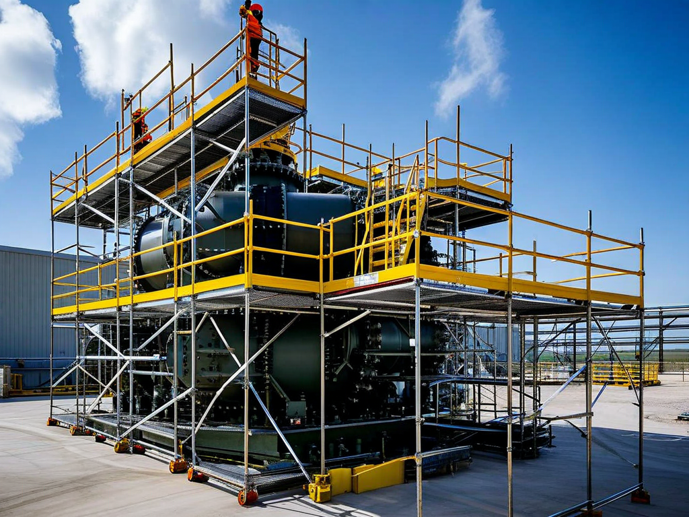
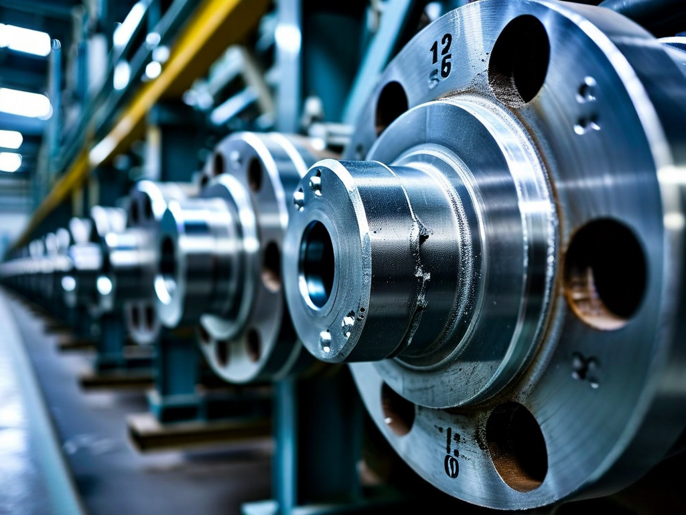
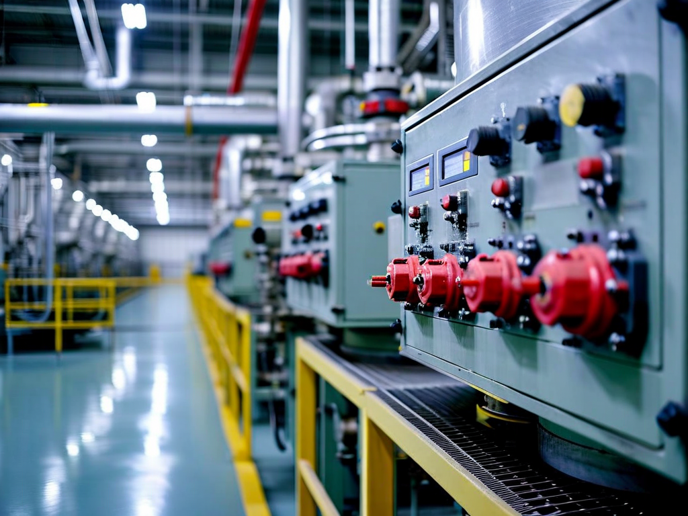

# Field Report: report-sg-002

**Report ID:** report-sg-002
**Task ID:** task-20260205-003
**Technician:** Sarah Chen (tech-3847)
**Runbook:** RB-002 v2.1
**Location:** Reactor Building, Steam Generator B
**Date:** 2026-02-05

## Timing
- Started: 06:00
- Completed: 15:15
- Duration: 555 minutes (estimated: 480 minutes)

## Status
- Everything OK: No
- Had Delays: Yes
- Runbook Rating: 3/5 stars

## Step-Specific Feedback

### Step 2: Scaffold Installation
- Issue: Scaffolding components delivered incomplete (missing 4 diagonal braces)
- Suggestion: Add scaffold component checklist verification before delivery to site
- Time Impact: +30 minutes (waiting for additional components)
- Safety Critical: Yes

### Step 3: Manway Access
- Issue: Boric acid deposits around manway flange - bolts extremely difficult to remove
- Suggestion: Add substep: "If boric acid deposits visible, apply hot water flush (60°C) for 15 minutes before bolt removal"
- Time Impact: +45 minutes (struggled with deposits, eventually used heat gun)
- Safety Critical: No

**What Happened:**
Manway flange covered in crystallized boric acid deposits (white crusty buildup, approximately 5mm thick). Deposits bonded to bolt threads and flange surface. First bolt took 20 minutes to remove using impact wrench + penetrating oil + heat gun.

This is same issue Mike reported on RCP pump maintenance (report-rcp-a, Jan 15). Boric acid crystallization is a site-wide problem affecting all primary circuit components. Penetrating oil alone doesn't work on crystallized deposits - needs heat or chemical dissolution.

Called experienced tech Marc who suggested hot water flush technique (not in procedure). Used hot water (60°C) from nearby auxiliary system, flushed manway area for 10 minutes. Dissolved enough deposits to proceed. Remaining 23 bolts came out much easier (average 3 minutes each vs. 20 minutes for first bolt).

**Field-Proven Technique:**
Hot water flush for boric acid deposits works much better than penetrating oil. Should be documented in procedure for all primary circuit work.

### Step 4: Eddy Current Probe Setup
- Issue: None - probe calibration verified successfully
- Time Impact: 0 minutes
- Safety Critical: N/A

**Note:** Read Robert's report (report-sg-001, Jan 20) about probe calibration drift. Verified calibration before entry AND every 60 minutes during inspection. No drift detected this time. May be temperature-dependent issue (SG-B cooler than SG-A was).

### Step 6: Eddy Current Inspection
- Issue: Contamination levels higher than expected (0.6 mSv/h vs. expected 0.2 mSv/h)
- Suggestion: Add contamination contingency: "If contamination >0.5 mSv/h, implement enhanced dose management (30 min work / 15 min break rotation)"
- Time Impact: +20 minutes (additional decon breaks and crew rotation)
- Safety Critical: Yes

**What Happened:**
Contamination inside SG-B significantly higher than expected. Radiation protection supervisor implemented enhanced dose management - 30 minutes work, 15 minutes break rotation (normally 60 min work / 10 min break).

Contamination caused by boric acid deposits with activated corrosion products. Same deposits that made manway removal difficult. These deposits accumulate over time and become radioactive from neutron activation.

Need chemistry review of primary circuit water quality. High boric acid carryover suggests chemistry control issues or leak in primary circuit.

### Step 8: Manway Closure
- Issue: New gasket installed but boric acid residue on flange seating surface
- Suggestion: Add cleaning verification: "Verify flange surfaces clean and smooth before gasket installation. Use solvent wipe if residue present."
- Time Impact: +15 minutes (cleaned flange surfaces thoroughly with solvent)
- Safety Critical: Yes

## Comments

**Boric Acid Deposits - Site-Wide Pattern:**
This is the third report this month mentioning boric acid deposit issues:
1. Mike (Jan 15, RCP pump): Impeller extraction difficult due to deposits
2. Robert (Jan 20, SG-A): Contamination higher than expected
3. This report (SG-B): Manway bolts seized by deposits, high contamination

Boric acid crystallization is affecting multiple primary circuit components. Root causes likely:
1. Primary circuit chemistry not optimized (too much boric acid carryover)
2. Temperature cycling causes precipitation
3. Long intervals between chemical cleaning (current schedule: 18 months)

**Recommendation:** Plant chemistry review needed. Consider more frequent chemical cleaning or chemistry control improvements. This issue costs 30-60 minutes per maintenance job across multiple procedures.

**Contamination Trend:**
SG-B contamination (0.6 mSv/h) even higher than SG-A (0.5 mSv/h from Robert's report). Trend is increasing. Needs investigation - possible small primary-to-secondary leak or deposit buildup.

**Positive:**
- Eddy current inspection went smoothly (no probe issues this time)
- Data analysis system worked well
- Scaffold access excellent after initial component delay
- Team coordination with radiation protection was professional

**Results:**
- 3,845 tubes inspected (full SG-B tube bundle)
- 15 tubes flagged for potential degradation (follow-up needed)
- 3 tubes with confirmed wall thinning >20% (plugging recommended)
- Boric acid deposits documented extensively (photos + chemistry samples)
- Radiation dose: 2.4 mSv (within limits but higher than planned due to contamination)

**Recommendations:**
1. Add hot water flush technique for boric acid deposits (document field-proven method)
2. Plant chemistry review - investigate high boric acid carryover
3. Consider reducing chemical cleaning interval from 18 months to 12 months
4. Add contamination contingency planning to procedure
5. Flange surface cleaning verification before gasket installation

## Photos

