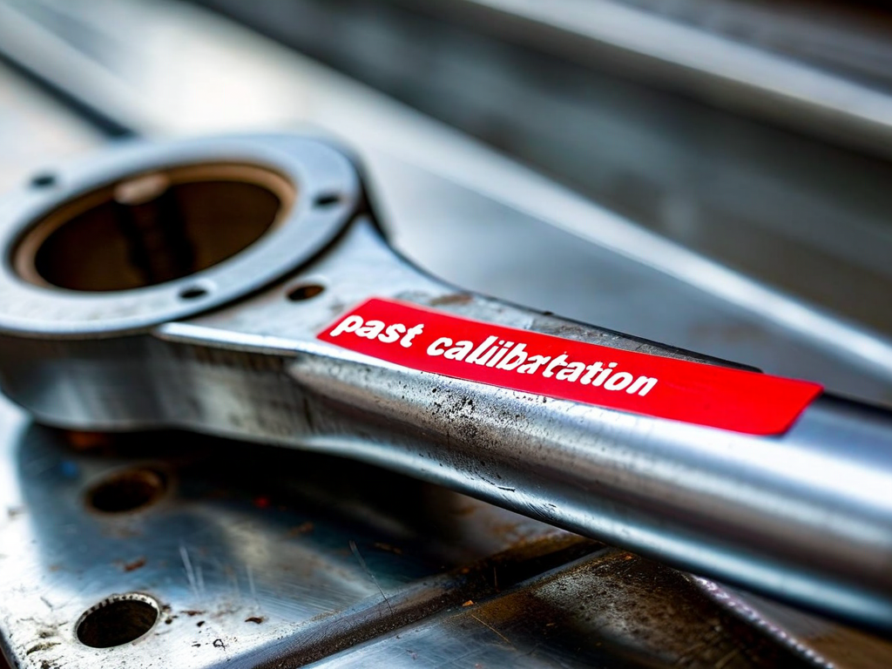

# Field Report: report-wind-gb-002

**Report ID:** report-wind-gb-002
**Task ID:** task-20260208-002
**Technician:** Mark Stevens (tech-4887)
**Runbook:** RB-WIND-001 v3.0
**Location:** Wind Farm Site 4, Turbine WT-22
**Date:** 2026-02-08

## Timing
- Started: 08:00
- Completed: 15:30
- Duration: 450 minutes (estimated: 300 minutes)

## Status
- Everything OK: No
- Had Delays: Yes
- Runbook Rating: 3/5 stars

## Step-Specific Feedback

### Step 1: Turbine Shutdown and LOTO
- Issue: LOTO sequence still unclear - same issue Jennifer reported (report-wind-gb-001, Jan 18)
- Suggestion: Add explicit sequence to procedure: "1. Electrical LOTO, 2. Hydraulic pressure release, 3. Mechanical brake, 4. Rotation lock. Verify each step before proceeding."
- Time Impact: +10 minutes (called supervisor for confirmation, same as Jennifer)
- Safety Critical: Yes

**What Happened:**
Read Jennifer's report from Jan 18 before starting. She had same LOTO confusion I remember from previous jobs. Called supervisor to confirm sequence before proceeding (electrical first, then hydraulics, then mechanical). Supervisor confirmed this is correct but said "everyone should know this."

Problem is: it's NOT documented in procedure. New techs or techs from other sectors don't "just know" this. Nearly cost Jennifer 15 minutes, cost me 10 minutes. Simple fix: add explicit sequence to Step 1.

### Step 4: Filter Replacement
- Issue: Filter housing severely seized - couldn't budge with standard filter wrench at 120 Nm
- Suggestion: Add note: "Filter housing may seize after 6+ months. If resistance >80 Nm, apply penetrating oil and wait 15 minutes. Maximum torque 150 Nm - beyond this, use gentle heat."
- Time Impact: +65 minutes (seized housing required heat application and careful extraction)
- Safety Critical: No

**What Happened:**
Filter housing wrench torque spec is 80 Nm for installation. Expected similar torque for removal. Applied 80 Nm - no movement. Increased to 100 Nm - still stuck. At 120 Nm, wrench started slipping on housing collar (risk of rounding collar).

Stopped, applied penetrating oil, waited 15 minutes. Tried again - still seized. Called lead tech who approved heat gun application. Applied heat to housing collar for 10 minutes (careful not to overheat O-rings inside). Housing finally broke free at approximately 140 Nm.

Inspection after removal: O-ring swollen and hardened (age degradation), bonded to housing bore. This caused seizure. O-ring should be replaced every filter change but techs often reuse if it looks OK. This one was 18 months old (3 filter changes) - too old.

**Root Cause:**
1. O-rings degrade over time (especially in hot nacelle environment, summer temps >40°C)
2. Procedure doesn't specify O-ring replacement frequency
3. Techs reuse O-rings to save time/cost
4. Result: O-ring swells, bonds to housing, seizes filter housing

**Recommendation:** Specify O-ring replacement: "Replace filter housing O-ring at every second filter change (12-month maximum service)."

### Step 5: Oil Fill and Circulation
- Issue: Torque wrench calibration expired - discovered when torquing fill plug
- Suggestion: Add to Step 1 checklist: "☐ Torque wrench calibration valid"
- Time Impact: +40 minutes (had to get calibrated torque wrench from site office, 15 km away)
- Safety Critical: Yes

**What Happened:**
Completed oil fill, ready to torque fill plug to 45 Nm. Checked torque wrench - calibration sticker dated 2024-02-15, due 2025-02-15. Expired 1 year ago! How did this pass tool crib inspection?

Cannot use expired torque wrench on critical fasteners (gearbox fill plug leaking = major oil loss risk). Nearest calibrated wrench at site office 15 km away. Sent helper to retrieve (30 min round trip). Lost 40 minutes total.

This is the same calibration issue seen in nuclear reports:
- Mike (Jan 15, RCP pump): Expired torque wrench +45 min
- David (Jan 28, RCP pump): Caught calibration issue early +5 min

Pattern across sectors: tool calibration checks not enforced at tool issue. Need systematic pre-work tool verification.

### Step 7: Return to Service
- Issue: None - return to service went smoothly
- Time Impact: 0 minutes
- Safety Critical: N/A

## Comments

**LOTO Consistency:**
Second wind technician reporting LOTO sequence confusion. This is a safety-critical issue. Procedure must be explicit about sequence when multiple energy sources present. Should not rely on "everyone knows" - new techs don't know, cross-trained techs don't know.

**Filter Housing Maintenance:**
Seized filter housing cost 65 minutes. Root cause is O-ring degradation (not specified for replacement in procedure). This will happen on every turbine eventually. Need preventive O-ring replacement schedule.

**Tool Calibration - Cross-Sector Pattern:**
Third report this month with expired tool calibration:
1. Mike (nuclear, Jan 15): Torque wrench expired +45 min
2. David (nuclear, Jan 28): Caught early +5 min
3. This report (wind, Feb 8): Torque wrench expired +40 min

Average delay: 30 minutes per occurrence. Across all sectors and procedures, this is costing significant time. Need tool room process improvement - automatic calibration verification at issue, or visual flag on expired tools (red tag?).

**Positive:**
- Oil drain went smoothly (no cold weather issues this time, temp 12°C)
- Vibration baseline measurement excellent (2.8 mm/s, within spec)
- Oil fill procedure clear and comprehensive

**Results:**
- Gearbox oil changed successfully (180 L)
- Filter replaced (old filter showed normal wear, minor metal particles within spec)
- Filter housing O-ring replaced (new O-ring installed preventively)
- Vibration: 2.8 mm/s (acceptable baseline)
- Turbine returned to service successfully

**Recommendations:**
1. Add explicit LOTO sequence to Step 1 (cross-reference all energy sources)
2. Specify filter housing O-ring replacement schedule (every 12 months maximum)
3. Implement tool room calibration verification at issue (prevent expired tools leaving crib)
4. Consider site-wide tool calibration audit
5. Add filter housing seizure guidance (penetrating oil, heat application limits)

## Photos

