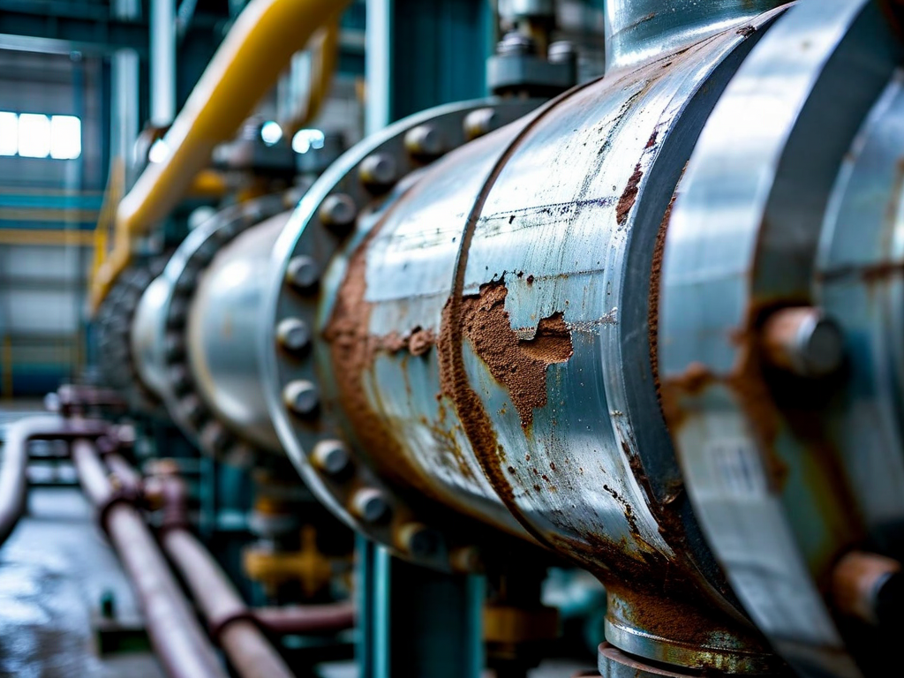
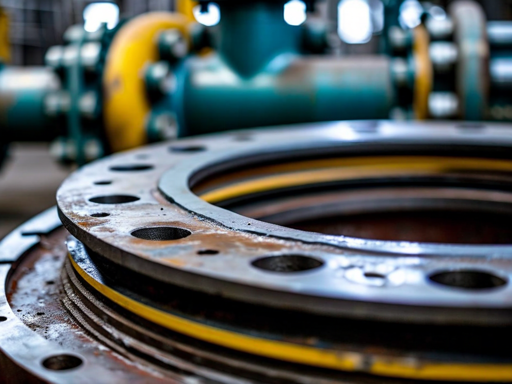
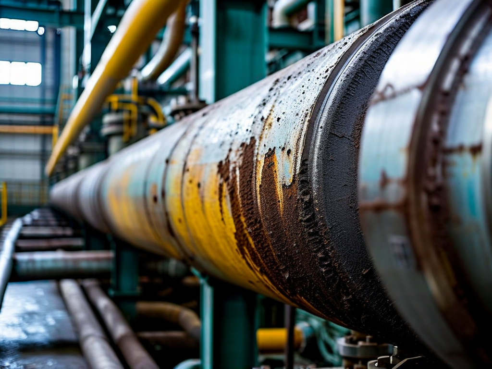

# Field Report: report-hx-001

**Report ID:** report-hx-001
**Task ID:** task-20260210-006
**Technician:** Robert Kim (tech-2156)
**Runbook:** RB-THERMAL-001 v2.0
**Location:** Thermal Plant Unit 3, Heat Exchanger HX-305
**Date:** 2026-02-10

## Timing
- Started: 08:00
- Completed: 16:45
- Duration: 525 minutes (estimated: 360 minutes)

## Status
- Everything OK: No
- Had Delays: Yes
- Runbook Rating: 2/5 stars

## Step-Specific Feedback

### Step 1: Isolation and Depressurization
- Issue: None - isolation sequence clear and effective
- Time Impact: 0 minutes
- Safety Critical: N/A

### Step 2: Header Removal
- Issue: Gasket wrong size delivered from warehouse (DN300 instead of DN350 specified)
- Suggestion: Add pre-work material verification: "Verify gasket size and material before starting maintenance. DN350, 3mm thick, fiber-reinforced."
- Time Impact: +120 minutes (waiting for correct gasket delivery from central warehouse)
- Safety Critical: No

**What Happened:**
Removed header bolts successfully. Lifted header to access tube bundle. Prepared to install new gasket for reassembly. Opened gasket package - immediately noticed gasket too small. Checked label: DN300, should be DN350.

Warehouse pulled wrong size gasket (50mm difference in diameter). Cannot use wrong size - will not seal, creates leak risk. Called warehouse at 09:30, requested DN350 gasket. Warehouse said: "DN350 not in stock, need to order from supplier."

Escalated to supervisor. Supervisor called supplier directly - rush delivery arranged. Gasket arrived at 11:30 (2 hours lost waiting). This is pure procurement/warehouse management failure.

**Root Cause:**
1. Maintenance planner ordered DN350 gasket (correct)
2. Warehouse pulled DN300 gasket (wrong - picking error)
3. Nobody verified size before delivery to job site
4. DN350 not stocked (only DN300 in inventory - wrong size for this HX)

**Impact:**
Lost 2 hours of crew time (2 techs x 2 hours = 4 man-hours). Heat exchanger out of service longer than planned. Unit 3 running at reduced capacity during repair.

### Step 3: Tube Bundle Extraction
- Issue: Tube fouling far worse than expected - cleaning took much longer
- Suggestion: Update procedure: "Heavy fouling may require extended chemical cleaning (3-4 hours vs. standard 2 hours). Inspect fouling severity before planning."
- Time Impact: +45 minutes (extended chemical cleaning time)
- Safety Critical: No

**What Happened:**
Extracted tube bundle per procedure. Inspection showed severe fouling inside tubes (hard scale deposits, approximately 2-3mm thick). Procedure assumes light-to-moderate fouling, plans 2 hours for chemical cleaning.

Started chemical cleaning with descaling solution (citric acid based). After 2 hours, significant scale remained. Continued cleaning for additional 45 minutes to achieve acceptable cleanliness. Total cleaning time: 2 hours 45 minutes vs. 2 hours planned.

**Root Cause:**
Cooling water quality degraded over past 6 months (water treatment system issues known to operations). Higher mineral content = accelerated scaling. This HX run for 9 months since last cleaning (normal interval is 6 months). Extended interval + poor water quality = severe fouling.

**Recommendation:** Return to 6-month cleaning interval until water treatment system repaired. Update procedure to account for fouling variability.

### Step 5: Tube Bundle Reinstallation
- Issue: None - installation smooth
- Time Impact: 0 minutes
- Safety Critical: N/A

### Step 6: Header Reassembly
- Issue: Correct gasket finally available, but installation revealed flange surface damage
- Suggestion: Add flange inspection step: "Inspect flange seating surfaces for damage, corrosion, or warping before gasket installation"
- Time Impact: +15 minutes (cleaned and dressed flange surface with file)
- Safety Critical: Yes

**What Happened:**
Installing correct DN350 gasket. Noticed flange seating surface had corrosion pitting (several pits 1-2mm deep). Gasket will not seal properly against pitted surface.

Used hand file to dress flange surface (remove corrosion, smooth surface). This is acceptable for minor pitting but flange condition is degrading. Next maintenance cycle may require flange machining or replacement.

### Step 7: Pressure Test
- Issue: First pressure test showed small leak at flange (despite surface dressing)
- Suggestion: Pressure test procedure adequate, but flange damage may require repeated tests
- Time Impact: +20 minutes (retorque bolts, repeat pressure test - second test passed)
- Safety Critical: Yes

## Comments

**Gasket Procurement Failure:**
Lost 2 hours due to wrong gasket size. This is warehouse picking error + inventory management failure (correct size not stocked). Unacceptable delay for basic maintenance consumable.

**Pattern:** Other reports mention procurement issues (Chinese bolt quality on nuclear, various material delays). Suggests site-wide procurement/warehouse quality issues.

**Recommendation:**
1. Implement verification at warehouse before material delivery (check size/part number)
2. Stock analysis - ensure common sizes available in inventory (DN350 is standard size for this unit)
3. Consider maintenance planner site visit to verify materials day before work

**Tube Fouling Severity:**
Cooling water quality issues are known problem (operations documented this). Continuing 9-month cleaning intervals with poor water quality causes excessive fouling. Results:
- Extended cleaning time (cost overrun)
- Reduced heat transfer efficiency between cleanings (unit performance degradation)
- Accelerated tube corrosion risk

**Recommendation:** Return to 6-month interval immediately. Long-term: fix water treatment system (operations responsibility).

**Flange Degradation:**
Flange seating surface showing corrosion pitting. Current condition manageable but degrading. Estimate 2-3 maintenance cycles remaining before flange requires machining or replacement. Should plan for flange refurbishment in future budget.

**Positive:**
- Tube bundle extraction/reinstallation procedures excellent
- Chemical cleaning effective (once extended time allowed)
- Pressure test protocol clear and thorough
- Team coordination good despite delays

**Results:**
- Heat exchanger HX-305 cleaned and reassembled successfully
- Tube bundle severely fouled but cleaned to acceptable condition
- Gasket replaced (correct size eventually installed)
- Flange surface dressed (acceptable for service)
- Pressure test passed (0 leaks at 18 bar test pressure)
- Heat exchanger returned to service

**Recommendations:**
1. Warehouse: implement material verification before delivery
2. Stock DN350 gaskets in inventory (standard size for Unit 3 HX equipment)
3. Reduce HX cleaning interval to 6 months (due to poor water quality)
4. Plan flange refurbishment in next major outage (18-24 months)
5. Add flange inspection to procedure (before gasket installation)

## Photos

