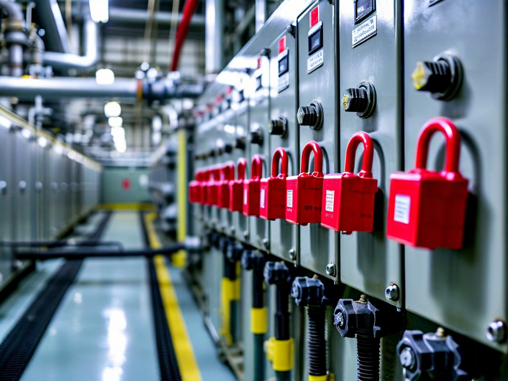
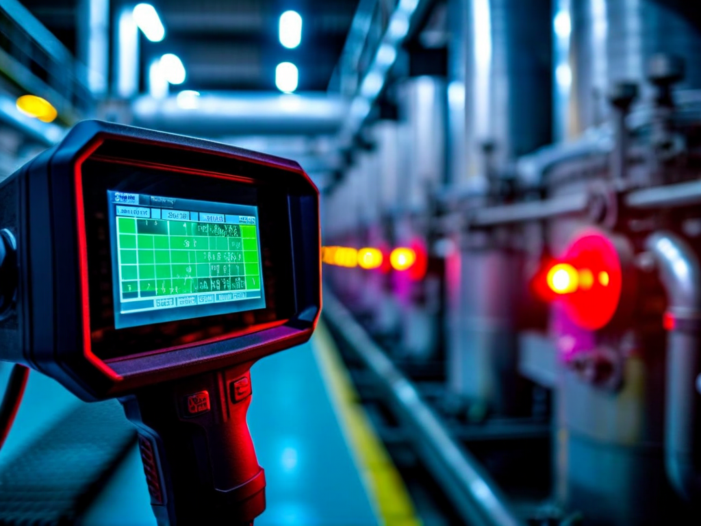
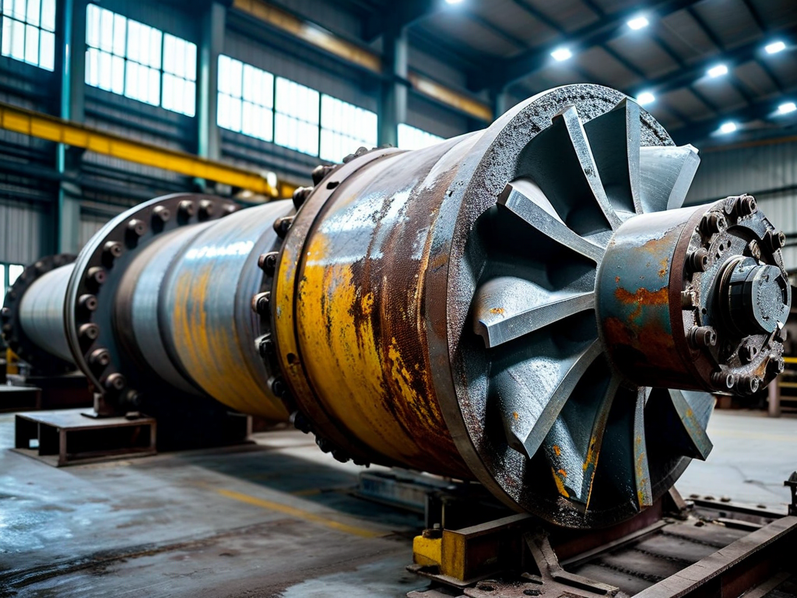

# Field Report: report-rcp-d

**Report ID:** report-rcp-d
**Task ID:** task-20260210-004
**Technician:** Mateo Jackson (tech-3312)
**Runbook:** RB-001 v3.2
**Location:** Reactor Building, Primary Circuit Room
**Date:** 2026-02-10

## Timing
- Started: 08:00
- Completed: 14:45
- Duration: 405 minutes (estimated: 240 minutes)

## Status
- Everything OK: No
- Had Delays: Yes
- Runbook Rating: 3/5 stars

## Step-Specific Feedback

### Step 1: Pre-Work Verification
- Issue: LOTO sequence ambiguous when multiple energy sources present (electrical + hydraulic + pneumatic)
- Suggestion: Add explicit LOTO checklist with sequence: "1. Electrical (breaker + disconnect), 2. Hydraulic accumulator depressurization, 3. Pneumatic isolation, 4. Mechanical rotation lock. Verify zero energy on all sources."
- Time Impact: +20 minutes (consulted with supervisor on correct sequence)
- Safety Critical: Yes

**What Happened:**
RCP pump has four energy sources to isolate:
1. Electrical (480V motor supply)
2. Hydraulic (seal injection system accumulator)
3. Pneumatic (actuator air supply for isolation valves)
4. Mechanical (shaft rotation potential)

Procedure says "apply LOTO per site procedure LOCK-001" but doesn't specify sequence when multiple energy sources present. Site procedure LOCK-001 is generic (doesn't cover this specific equipment).

I started with electrical (obvious first step), then wasn't sure: hydraulic or pneumatic next? Incorrect sequence could cause pressure release hazards. Called supervisor who confirmed: electrical → hydraulic → pneumatic → mechanical.

This is the same issue reported in wind sector (Jennifer and Mark on RB-WIND-001). LOTO sequence confusion appears across multiple procedures. Should be explicit in each equipment-specific procedure.

### Step 2: Electrical Isolation
- Issue: FLIR thermal camera battery dead (again)
- Suggestion: Add to Step 1 checklist: "☐ Thermal camera battery >50%" AND implement tool room battery charging schedule
- Time Impact: +35 minutes (charged battery to 50% minimum)
- Safety Critical: No

**What Happened:**
This is the FOURTH report with thermal camera battery issues:
1. Mike (Jan 15, RCP-A): Dead battery +20 min
2. Sarah (Jan 22, RCP-B): Low battery +15 min
3. Ahmed (Jan 28, Solar INV-03): Dead battery +45 min
4. This report: Dead battery +35 min

FLIR E8 thermal cameras have known battery self-discharge issue. Cameras sit unused in tool crib for weeks, batteries drain to zero. By the time techs need them, batteries dead.

This is not a procedure issue - this is a tool management issue. Tool room needs battery maintenance schedule: charge all thermal cameras weekly, or install fresh batteries before issue.

Average delay per incident: 29 minutes. Four incidents = 115 minutes total wasted across site this month. Unacceptable.

### Step 5: Impeller Extraction
- Issue: Impeller stuck due to boric acid deposits (expected based on previous reports)
- Suggestion: Add documented technique to procedure: "For crystallized boric acid deposits: Apply hot water flush (60°C) for 10 minutes to dissolve deposits before extraction attempt"
- Time Impact: +40 minutes (used hot water flush technique from Sarah's report)
- Safety Critical: Yes

**What Happened:**
Read previous RCP reports before starting:
- Mike (Jan 15): Impeller stuck, used heat gun + mallet technique
- Sarah (Jan 22): Similar, learned from Mike
- David (Jan 28): Caught calibration early, impeller still stuck +25 min
- Sarah's SG report (Feb 5): Hot water flush technique for boric acid

Impeller stuck as expected (site-wide boric acid deposit problem). Applied hot water flush technique Sarah documented in SG-B report. Flushed impeller area with 60°C water for 10 minutes. Dissolved enough deposits to proceed with extraction. Still required mallet technique but much easier than previous reports describe.

Hot water flush is superior to penetrating oil for boric acid deposits. Should be documented as primary technique, not word-of-mouth.

### Step 7: Reassembly + Torquing
- Issue: Torque wrench calibration valid but wrench design issue (weak click feedback above 150 Nm)
- Suggestion: Replace DYN-250 model torque wrenches with model that has clear click feedback at all torque ranges
- Time Impact: +15 minutes (verification torquing multiple times due to uncertain click)
- Safety Critical: Yes

**What Happened:**
Torque wrench DYN-250 calibrated (checked sticker first - learned from previous reports). Torquing impeller bolts to 180 Nm. Wrench has weak click feedback above 150 Nm - click is barely audible/feelable.

Torqued first bolt, thought I heard click at 180 Nm but not certain. Torqued second bolt, same weak click. Asked helper if he heard click - he wasn't sure either. Backed off torque, re-torqued both bolts to be certain. Lost 15 minutes on verification.

This wrench model (DYN-250) is mentioned in David's detailed report from Feb 20 (different runbook, same issue). Quote: "old model with weak click above 150 Nm."

Need better torque wrench model. Safety-critical fasteners require clear, unambiguous torque confirmation. Weak click = uncertainty = risk of under-torque (leaks) or over-torque (bolt failure).

## Comments

**LOTO Sequence - Safety Critical:**
Third report mentioning LOTO sequence ambiguity (previous: Jennifer and Mark on wind). This affects multiple sectors and procedures. When equipment has multiple energy sources, sequence matters for safety. Should not require supervisor consultation every time.

**Recommendation:** Create site-wide LOTO sequence standard by equipment type (rotating equipment, pressure vessels, etc.), or add explicit sequence to each equipment-specific procedure.

**Thermal Camera Battery - Tool Management:**
Pattern is clear: thermal cameras are unreliable due to battery management. Four incidents, 115 minutes lost. This is operational inefficiency, not procedure issue.

**Recommendation:** Tool room manager should implement battery maintenance schedule immediately. This is low-hanging fruit - easy fix, significant time savings.

**Boric Acid Deposits - Site-Wide Issue:**
Multiple reports document boric acid deposit problems across primary circuit equipment:
- RCP pumps (4 reports)
- Steam generators (2 reports)

Hot water flush technique (Sarah's discovery on SG-B) works better than penetrating oil or heat gun. Should be standardized across all primary circuit procedures.

**Long-Term Solution:** Plant chemistry review needed. Boric acid carryover is too high (indicates chemistry control issues or primary circuit leaks). Fixing root cause would eliminate this recurring problem.

**Positive:**
- Learning from previous reports saved time (knew what to expect)
- Hot water flush technique worked well
- Bearing inspection smooth (all within spec)
- Leak test passed first time
- Vibration baseline excellent (2.4 mm/s)

**Results:**
- RCP pump D maintenance completed successfully
- All bearings excellent condition
- Impeller extraction completed using hot water flush + mallet technique
- Torquing completed (verified multiple times due to weak wrench feedback)
- Leak test passed
- Vibration: 2.4 mm/s (well within spec)
- Flow rate: 347 m³/h (within tolerance)

**Recommendations:**
1. Add explicit LOTO sequence checklist to Step 1 (equipment-specific)
2. Tool room: implement thermal camera battery charging schedule (weekly minimum)
3. Document hot water flush technique for boric acid deposits (field-proven method)
4. Replace DYN-250 torque wrenches with model having clear click feedback
5. Plant chemistry review for boric acid carryover reduction

## Photos

