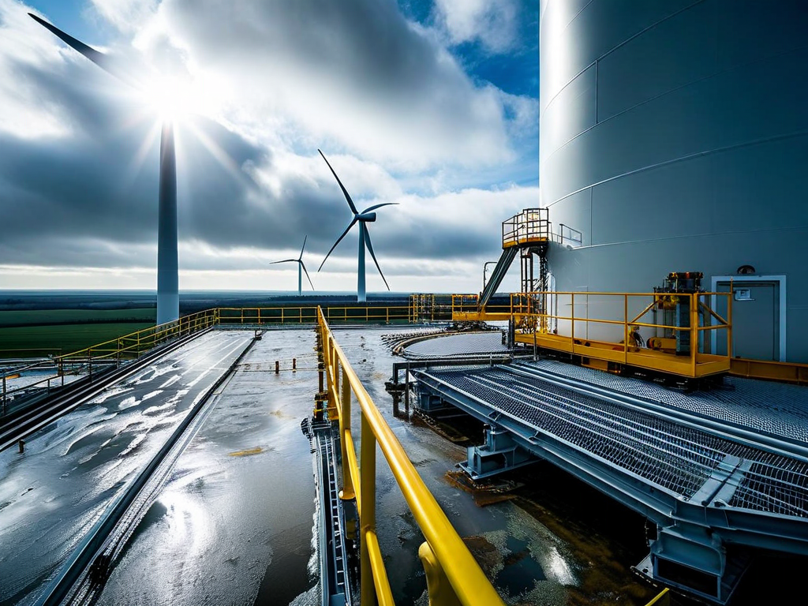
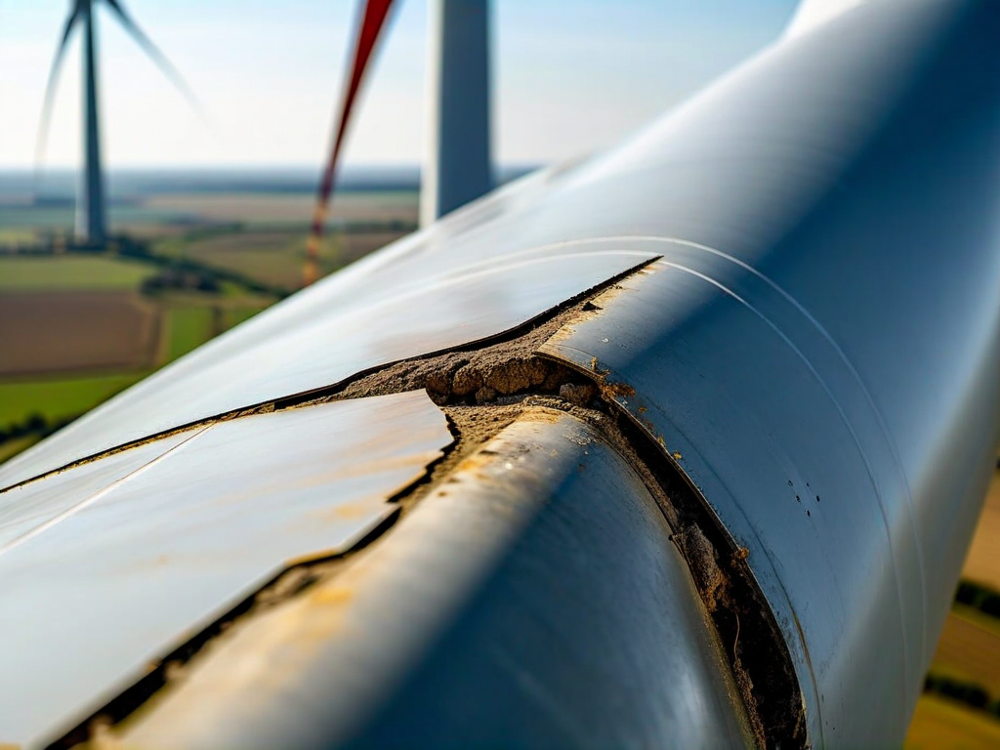
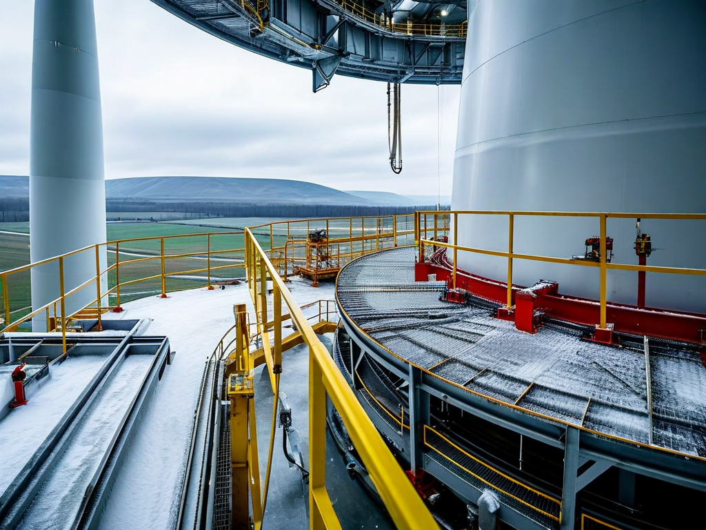

# Field Report: report-wind-blade-002

**Report ID:** report-wind-blade-002
**Task ID:** task-20260215-007
**Technician:** Jennifer Walsh (tech-5023)
**Runbook:** RB-WIND-002 v2.3
**Location:** Wind Farm Site 3, Turbine WT-18, Blade A
**Date:** 2026-02-15

## Timing
- Started: 08:00
- Completed: 16:45
- Duration: 525 minutes (estimated: 240 minutes per blade)

## Status
- Everything OK: No
- Had Delays: Yes
- Runbook Rating: 2/5 stars

## Step-Specific Feedback

### Step 1: Blade Positioning
- Issue: Weather conditions deteriorating (wind gusts increasing during morning)
- Suggestion: Add wind speed limits: "Do not begin blade work if wind speed >8 m/s or gusts >12 m/s. Monitor continuously."
- Time Impact: +45 minutes (waited for weather window)
- Safety Critical: Yes

**What Happened:**
Arrived at site 07:45, wind speed 6 m/s with gusts to 10 m/s (weather forecast said conditions improving). Started blade positioning at 08:00. By 08:30, wind gusts increased to 15 m/s (stronger than forecast).

At blade position on rope access (60m height), wind gusts are dangerous - swing hazard, loss of stability. Had to descend immediately for safety. Waited on ground for wind to decrease.

Wind speed moderated at 09:15 (gusts down to 8 m/s). Repositioned on blade, started work. Lost 45 minutes total due to weather delay.

**Issue:** Procedure doesn't specify wind speed limits for rope access work. This is critical safety parameter. Industry standard for rope access at height: max 8 m/s sustained wind, max 12 m/s gusts.

### Step 2: Leading Edge Inspection
- Issue: Erosion extent underestimated (same issue Mark reported on Jan 30)
- Suggestion: Add UT thickness inspection OR always bring 2x material based on ground assessment
- Time Impact: +30 minutes (reassessment and material planning)
- Safety Critical: No

**What Happened:**
Ground inspection estimated 35 cm erosion section. Mark's report (report-wind-blade-001, Jan 30) described same problem - erosion always worse than ground assessment. He suggested UT inspection or 2x material safety margin.

Brought 1.5x material based on Mark's experience (750g epoxy vs. 500g for 35 cm). Good decision - actual erosion extended 55 cm with subsurface delamination. Used 900g epoxy total (would have been short with standard 500g).

Mark's recommendation correct: ground visual inspection inadequate. Need better assessment method or larger material safety margin.

### Step 3: Surface Preparation
- Issue: None - surface preparation went smoothly
- Time Impact: 0 minutes
- Safety Critical: N/A

### Step 4: Epoxy Application
- Issue: Weather changed - rain started during epoxy application
- Suggestion: Add weather contingency: "Monitor weather continuously. If rain expected within cure time, delay application or use heated curing blanket."
- Time Impact: +90 minutes (partial application, sheltered with tarp, waited for rain to pass, completed application)
- Safety Critical: Yes

**What Happened:**
Started epoxy application at 11:30 (weather appeared stable). Applied first layer successfully (30 min). Starting second layer at 12:00, rain began (light drizzle).

Epoxy cannot cure properly in rain (water contamination causes poor adhesion, cloudy finish, reduced strength). Had to stop application immediately. Partially-applied epoxy still workable but rain accelerating.

Deployed emergency tarp over blade leading edge to shelter work area. Tarp deployment at height with wind is difficult and time-consuming (30 minutes to secure properly). Waited under tarp for rain to pass.

Rain stopped at 13:15 (45 min rain delay). Removed tarp, inspected partially-applied epoxy - still workable but surface wet. Dried surface with compressed air and rags (15 min). Completed second and third epoxy layers.

**Total weather delay:** 90 minutes (tarp deployment 30 min + rain wait 45 min + drying 15 min).

**Issue:** Procedure doesn't address weather contingencies during epoxy application. Winter weather is unpredictable. Need contingency plan: shelter system, heated curing option, or work rescheduling criteria.

### Step 5: Curing Time
- Issue: Temperature 7°C - epoxy cure time significantly extended
- Suggestion: Add temperature-dependent cure time table: "10-15°C: +50% cure time, 5-10°C: +100% cure time, <5°C: do not apply"
- Time Impact: +60 minutes (extended cure time due to cold temperature + weather delay)
- Safety Critical: Yes

**What Happened:**
Epoxy manufacturer spec: cure time 60 minutes at 20°C. Ambient temperature 7°C (cold February day). Epoxy cures much slower at low temperature.

Applied epoxy finish layer at 14:00. Waited 90 minutes before tap test (vs. 60 min specified). Epoxy still slightly soft at 90 min. Waited additional 30 minutes (total 120 min = double normal cure time). Final tap test acceptable.

Cold temperature cure time is not documented in procedure. Mark's report (Jan 30) mentioned same issue - had to wait extended time at 8°C.

**Recommendation:** Add temperature-dependent cure time table. Consider heated curing blankets for cold weather work (electrically heated wrap around blade leading edge, maintains optimal cure temperature).

### Step 6: Final Inspection
- Issue: None - final inspection confirmed good repair quality despite weather challenges
- Time Impact: 0 minutes
- Safety Critical: N/A

## Comments

**Weather Impact - Major Factor:**
Total weather delays: 135 minutes (45 min wind + 90 min rain). Weather added 56% to estimated job time. Procedure doesn't address weather risks adequately.

Winter blade repair is challenging:
- Wind speed limits needed (safety)
- Rain contingency needed (quality)
- Temperature affects cure time (schedule)

**Recommendation:** Add comprehensive weather planning section:
- Wind limits: max 8 m/s sustained, 12 m/s gusts
- Rain: forecast check, shelter system available
- Temperature: cure time adjustments, heated blankets for <10°C

**Erosion Assessment - Recurring Issue:**
Second blade erosion report documenting underestimated extent:
- Mark (Jan 30): 40 cm estimated, 80 cm actual (2x worse)
- This report: 35 cm estimated, 55 cm actual (1.6x worse)

Ground visual inspection consistently underestimates erosion. Pattern established.

**Solutions:**
1. UT thickness inspection before repair planning (accurate but adds time)
2. Always bring 2x material safety margin (simple but wasteful if not needed)
3. Close-up inspection with drone camera before finalizing plan

**Positive:**
- Learning from Mark's report helped (brought extra material, avoided shortage)
- Emergency tarp deployment successful (prevented epoxy contamination)
- Repair quality good despite weather challenges
- Safety protocols followed (descended during high winds)

**Results:**
- Leading edge erosion repaired (55 cm section)
- Subsurface delamination addressed (3 areas)
- Repair completed despite weather delays
- Final profile smooth and aerodynamic
- Blade returned to service
- Quality verified by lead technician

**Recommendations:**
1. Add wind speed limits to procedure (8 m/s sustained, 12 m/s gusts maximum)
2. Weather monitoring requirement (continuous during rope access work)
3. Rain contingency planning (shelter system, work rescheduling criteria)
4. Temperature-dependent cure time table (or heated curing blanket specification)
5. Erosion assessment improvement (UT inspection or 2x material safety margin)
6. Consider seasonal scheduling (avoid winter blade repairs when possible)

## Photos

