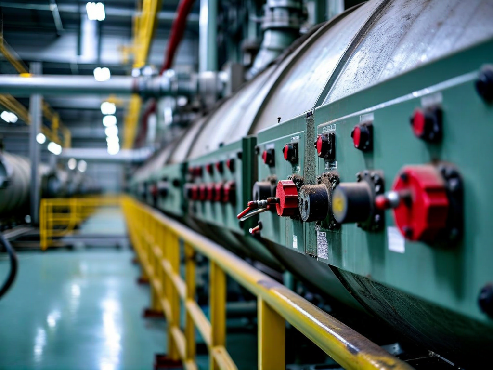
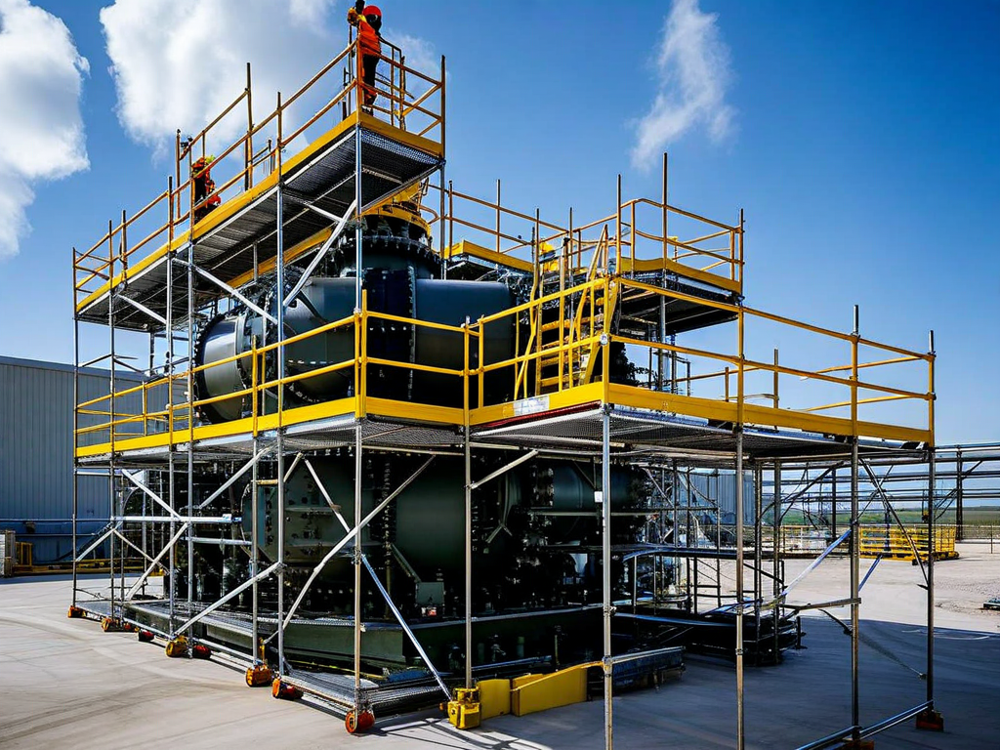
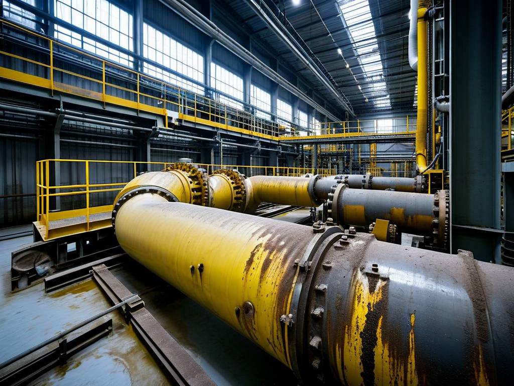

# Field Report: report-sg-003

**Report ID:** report-sg-003
**Task ID:** task-20260218-008
**Technician:** Mike Johnson (tech-4521)
**Runbook:** RB-002 v2.1
**Location:** Reactor Building, Steam Generator C
**Date:** 2026-02-18

## Timing
- Started: 06:00
- Completed: 15:45
- Duration: 585 minutes (estimated: 480 minutes)

## Status
- Everything OK: No
- Had Delays: Yes
- Runbook Rating: 3/5 stars

## Step-Specific Feedback

### Step 1: Pre-Work Authorization
- Issue: None - radiation work permit processed smoothly this time
- Time Impact: 0 minutes
- Safety Critical: N/A

### Step 2: Scaffold Installation
- Issue: Scaffold design inadequate for manway access - platform positioned too low
- Suggestion: Update scaffold specification: "Platform height must position manway at waist level (1.0-1.2m above platform). Verify before installation."
- Time Impact: +75 minutes (scaffold repositioning mid-job)
- Safety Critical: Yes

**What Happened:**
Scaffold installed per drawing SC-SG-2023-Rev2 (standard design for SG inspections). Scaffold crew completed installation by 07:00, left site.

Started manway opening work at 07:15. Immediately noticed problem: manway centerline is 45 cm above platform (shin height). This means working in awkward bent-over position for entire manway operation (removing 24 bolts, lifting heavy manway cover 85 kg).

Attempted to work in this position for 15 minutes - back strain, awkward wrench angles, safety risk if heavy manway cover slips. This is not acceptable working condition for multi-hour task.

Called scaffold crew back at 07:30. They arrived 08:00, added one more level to platform (raised by 60 cm). Manway now at waist level (much better ergonomics). Lost 75 minutes total.

**Root Cause:**
Scaffold drawing SC-SG-2023-Rev2 is generic design, doesn't account for specific manway height on SG-C (different from SG-A and SG-B due to 2022 modification). Drawing needs update, or procedure should require height verification before scaffold installation.

### Step 3: Manway Access
- Issue: Boric acid deposits around manway (same as Sarah's report on SG-B)
- Suggestion: Hot water flush technique should be standard for all SG manway work
- Time Impact: +20 minutes (applied hot water flush preventively based on previous reports)
- Safety Critical: No

**What Happened:**
Read Sarah's SG-B report (Feb 5) before starting. She documented hot water flush technique for boric acid deposits (much more effective than penetrating oil). SG-C manway had similar deposits (expected - same primary circuit chemistry issues).

Applied hot water flush preventively before attempting bolt removal (60°C water, 10 minutes). Dissolved most deposits. Bolts removed with moderate effort, no major delays.

Without Sarah's report, would have struggled with seized bolts like she did initially (lost 45 min). Learning from reports saved 25+ minutes.

### Step 4: Eddy Current Probe Setup
- Issue: Probe calibration verified successfully (no drift detected)
- Time Impact: 0 minutes
- Safety Critical: N/A

**Note:** Followed Robert's recommendation (report-sg-001, Jan 20) to verify calibration before entry AND periodically during inspection. Checked calibration every 60 minutes - all checks passed (no temperature-induced drift this time). SG-C environment cooler than SG-A was, may explain better probe stability.

### Step 6: Eddy Current Inspection
- Issue: Contamination levels elevated but manageable (0.4 mSv/h vs. expected 0.2 mSv/h)
- Suggestion: Contamination trend increasing across all SGs - chemistry review needed
- Time Impact: +15 minutes (extra decon breaks)
- Safety Critical: Yes

**What Happened:**
Contamination inside SG-C at 0.4 mSv/h. Lower than SG-B (0.6 mSv/h from Sarah's report) but still double the expected level. Pattern across all three inspected SGs:
- SG-A (Robert, Jan 20): 0.5 mSv/h
- SG-B (Sarah, Feb 5): 0.6 mSv/h
- SG-C (this report): 0.4 mSv/h

All significantly above expected 0.2 mSv/h. This indicates site-wide primary circuit contamination issue (likely boric acid deposits with activated corrosion products).

Implemented dose management per procedure (increased break frequency). Completed inspection successfully but accumulated higher dose than planned.

## Comments

**Scaffold Design Issue:**
Generic scaffold drawing doesn't work for SG-C (modified in 2022, different manway height). Ergonomics matter for long-duration tasks. Working bent-over at shin height for hours is:
- Safety risk (back strain, heavy lift risk)
- Quality risk (awkward positions = mistakes)
- Efficiency problem (slower work pace)

**Recommendation:** Update scaffold drawing for SG-C specifically, or add verification step: "Before scaffold installation, verify platform height will position manway at waist level (1.0-1.2m above platform)."

**Boric Acid Deposits - Standardize Hot Water Flush:**
Sarah's hot water flush technique (discovered on SG-B) worked well on SG-C. This should be standardized across all primary circuit procedures. Field-proven technique, better than penetrating oil, saves significant time.

Three SG reports now document boric acid issues:
- Robert (Jan 20, SG-A): Contamination higher than expected
- Sarah (Feb 5, SG-B): Boric acid on manway, hot water flush technique discovered
- This report (SG-C): Hot water flush used preventively, worked well

**Pattern established:** Boric acid deposits are site-wide issue affecting all SG inspections plus RCP maintenance. Root cause is primary circuit chemistry control.

**Contamination Trend - Chemistry Review Needed:**
All three SG inspections show elevated contamination (2-3x expected levels). This is not random variation - this is systematic problem. Contamination affects:
- Worker dose accumulation (approaching limits faster)
- Work pace (more frequent breaks)
- Inspection scheduling (may need more crew rotation)

**Recommendation:** Plant chemistry department should investigate:
1. Primary circuit water quality trends
2. Boric acid carryover rates
3. Corrosion product activation
4. Possible small primary-to-secondary leak

Long-term solution needed. Cannot continue accepting 2-3x contamination as "normal."

**Positive:**
- Eddy current probe performed well (no calibration drift)
- Data acquisition smooth
- Manway closure successful after scaffold fix
- Team coordination excellent

**Results:**
- 3,912 tubes inspected (full SG-C tube bundle)
- 10 tubes flagged for potential degradation (follow-up needed)
- 1 tube with confirmed wall thinning >20% (plugging recommended)
- Contamination documented and reported to radiation protection
- Radiation dose: 2.2 mSv (within limits, higher than planned)
- Scaffold issue documented for future jobs

**Recommendations:**
1. Update scaffold drawing for SG-C (account for 2022 modification height difference)
2. Add scaffold height verification step to procedure
3. Standardize hot water flush for boric acid deposits (all primary circuit work)
4. Chemistry department: investigate elevated contamination across all SGs
5. Consider periodic calibration verification during long inspections (60 min intervals)

## Photos

