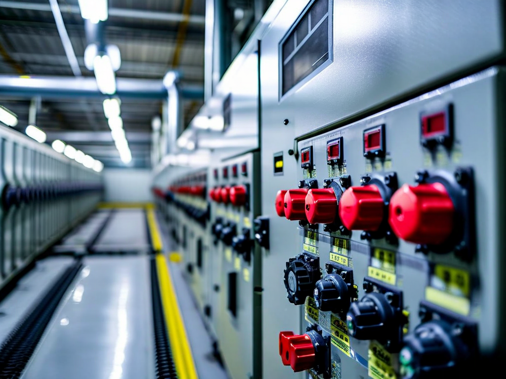
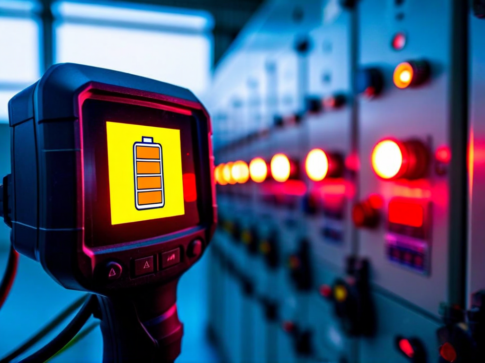
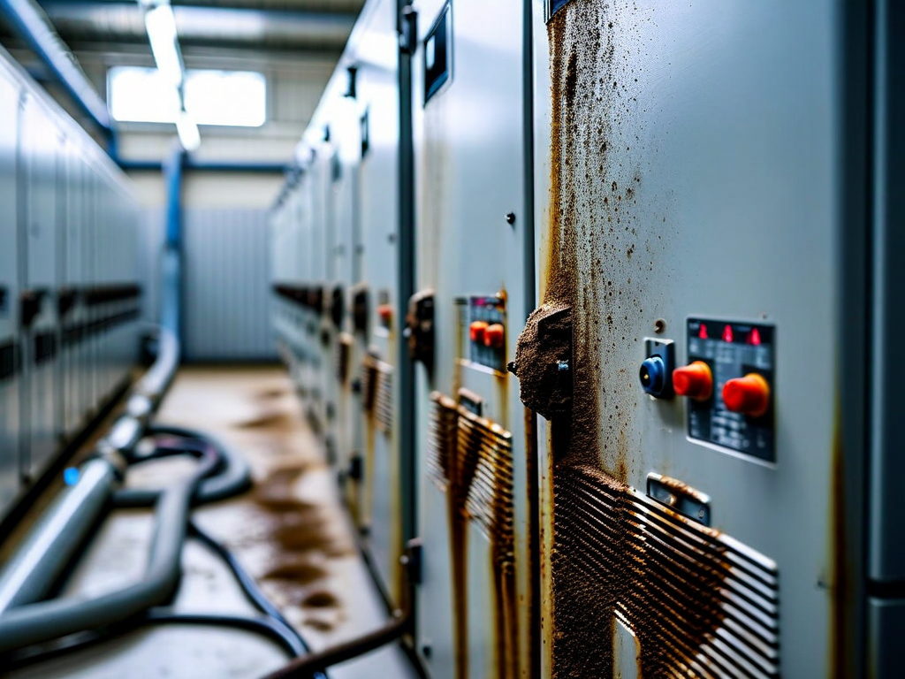

# Field Report: report-solar-002

**Report ID:** report-solar-002
**Task ID:** task-20260220-009
**Technician:** Sofia Martinez (tech-5332)
**Runbook:** RB-SOLAR-001 v1.5
**Location:** Solar Farm Central Inverter Station, INV-07
**Date:** 2026-02-20

## Timing
- Started: 09:00
- Completed: 14:30
- Duration: 330 minutes (estimated: 180 minutes)

## Status
- Everything OK: No
- Had Delays: Yes
- Runbook Rating: 3/5 stars

## Step-Specific Feedback

### Step 1: Inverter Shutdown Sequence
- Issue: None - shutdown sequence worked perfectly
- Time Impact: 0 minutes
- Safety Critical: N/A

### Step 3: Cooling System Check
- Issue: Thermal camera battery low (read Ahmed's report, checked battery first)
- Suggestion: Tool room battery management still not implemented
- Time Impact: +25 minutes (charged battery preventively before starting work)
- Safety Critical: No

**What Happened:**
Read Ahmed's report (report-solar-001, Jan 28) about dead thermal camera battery. Checked FLIR E8 battery before starting work - showed 30% (would die mid-job). Charged battery to 60% before beginning (25 minutes).

Small time investment prevented mid-job delay. But this is fifth thermal camera battery issue site-wide:
- Mike (Jan 15, nuclear RCP): Dead battery +20 min
- Sarah (Jan 22, nuclear RCP): Low battery +15 min
- Ahmed (Jan 28, solar INV-03): Dead battery +45 min
- Thomas (Feb 10, nuclear RCP): Dead battery +35 min
- This report: Low battery, charged preventively +25 min

Average delay: 28 minutes per incident. Tool room battery management still not fixed despite multiple reports.

### Step 5: IGBT Module Cleaning
- Issue: Dust accumulation severe (same as Ahmed's report) - vacuum alone inadequate
- Suggestion: Update procedure to approve compressed air cleaning with ESD precautions
- Time Impact: +50 minutes (cleaning with compressed air, careful ESD management)
- Safety Critical: Yes

**What Happened:**
Same dust problem Ahmed described on INV-03. Dust caked solid on IGBT modules (3-4mm thick). Procedure says "vacuum clean" - completely inadequate for this level of dust.

Ahmed used compressed air (30 PSI with ESD wrist strap) - worked well but noted ESD risk not addressed in procedure. Used same technique (learned from his report):
1. ESD wrist strap connected to chassis ground
2. Compressed air at 30 PSI (not higher - risk of component damage)
3. Blow dust off modules in ventilated area (dust cloud hazard)
4. Vacuum to collect loosened dust
5. Final wipe with ESD-safe cloth

This cleaning method effective but takes 50 minutes vs. 20 minutes in procedure (vacuum-only assumption). Procedure needs update to reflect real cleaning requirements.

**Dust Reality:**
Solar farm in agricultural area. Seasonal dust exposure (especially harvest periods) causes severe accumulation. Inverter filters catch some dust but not all. After 6 months, dust caking is standard condition, not exception.

Procedure written assuming light dust (easily vacuumed). Real condition is caked dust (requires compressed air). Disconnect between procedure assumptions and field reality.

### Step 6: Firmware Update
- Issue: Firmware compatibility problem - v4.3.0 not compatible with this inverter hardware revision
- Suggestion: Add hardware/firmware compatibility verification to procedure
- Time Impact: +60 minutes (troubleshooting, finding compatible firmware version)
- Safety Critical: No

**What Happened:**
Procedure specifies firmware update to v4.3.0 (latest version per manufacturer). Started firmware upload at 11:30. Upload completed but inverter would not restart - error code E-FW-INCOMP (firmware incompatible).

Inverter stuck in error state. Cannot proceed without firmware recovery. Called tech support hotline (manufacturer). Support said: "INV-07 has hardware revision H2.1, requires firmware branch 4.2.x, cannot use 4.3.x branch."

Tech support guided firmware recovery:
1. Enter maintenance mode (special button sequence)
2. Upload previous firmware v4.2.3 (had to download from manufacturer website)
3. Restart inverter
4. Verify functionality

Recovery took 60 minutes (troubleshooting + download + re-flash + verification). Nearly bricked inverter due to incompatible firmware.

**Root Cause:**
Procedure says "update to latest firmware v4.3.0" without checking hardware compatibility. Manufacturer has two hardware revisions in field:
- H2.1 (older units): requires firmware 4.2.x branch
- H3.0 (newer units): can use firmware 4.3.x branch

Procedure assumes all inverters compatible with latest firmware. Wrong assumption.

**Recommendation:** Add hardware revision check to Step 6: "Verify inverter hardware revision before firmware selection. H2.1: use firmware 4.2.x, H3.0: use firmware 4.3.x." Or create inverter-specific procedures by hardware revision.

### Step 7: Insulation Resistance Test
- Issue: None - insulation test excellent
- Time Impact: 0 minutes
- Safety Critical: N/A

## Comments

**Thermal Camera Battery - Still Not Fixed:**
Fifth site-wide report documenting thermal camera battery issues. Tool room management has not implemented battery charging schedule despite multiple reports. This is frustrating.

**Impact:** Average 28 minutes lost per incident. Five incidents = 140 minutes total across site (Jan-Feb). This is preventable waste.

**Recommendation:** Escalate to operations manager. Tool room supervisor needs to implement weekly battery charging schedule for all battery-powered tools (thermal cameras, power tools, test equipment).

**Dust Cleaning Reality:**
Second solar inverter report documenting severe dust beyond procedure assumptions. Ahmed (Jan 28) and this report both found:
- Dust caked solid (not light/loose as procedure assumes)
- Vacuum alone ineffective
- Compressed air required
- ESD risk not addressed in procedure

**Pattern established:** Procedure cleaning method inadequate for real field conditions.

**Recommendation:** Update Step 5:
- Acknowledge heavy dust accumulation as normal (not exception)
- Approve compressed air cleaning method with ESD precautions
- Specify max air pressure (30 PSI)
- Require ESD wrist strap and ventilation
- Adjust time estimate (50 min vs. 20 min for vacuum-only)

**Firmware Compatibility - Dangerous Gap:**
Firmware incompatibility issue nearly bricked inverter (would require manufacturer service visit, extended outage, significant cost). Procedure does not mention hardware revision compatibility.

This is documentation quality issue. Manufacturer has compatibility matrix but procedure doesn't reference it. Techs cannot know about hardware/firmware compatibility without external information.

**Positive:**
- Learning from Ahmed's report helped (checked battery preventively, used his cleaning technique)
- Tech support responsive (recovered firmware in reasonable time)
- Inverter returned to service successfully
- Insulation test results excellent

**Results:**
- Inverter INV-07 cleaned and tested (eventually successful)
- IGBT modules cleaned using compressed air + vacuum (effective)
- Firmware updated to correct version v4.2.3 (compatible with H2.1 hardware)
- Insulation resistance: 238 MΩ (excellent)
- Inverter returned to service, generating 500 kW (full capacity)

**Recommendations:**
1. Tool room: implement battery charging schedule (weekly minimum) - escalate to operations manager
2. Update Step 5: approve compressed air cleaning with ESD precautions (document field-proven method)
3. Add hardware revision check to Step 6 (firmware compatibility verification)
4. Consider creating hardware-specific procedure versions (H2.1 vs. H3.0)
5. Adjust time estimates for realistic dust cleaning conditions

## Photos

