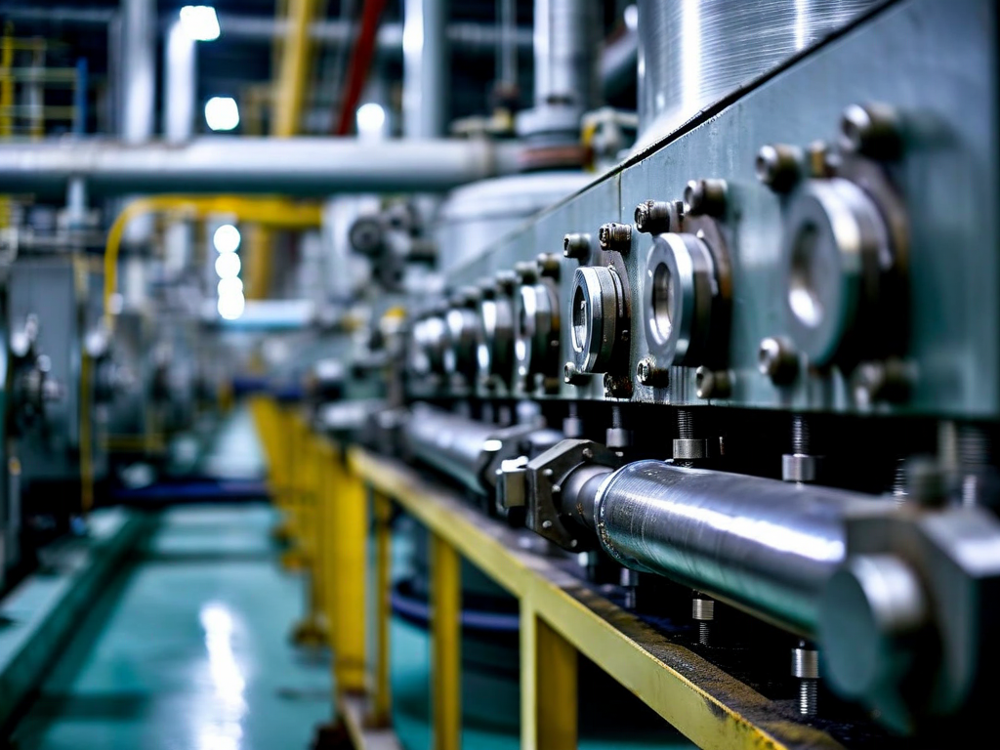
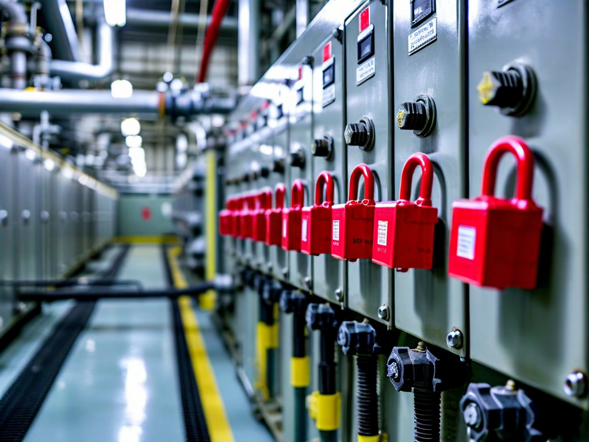
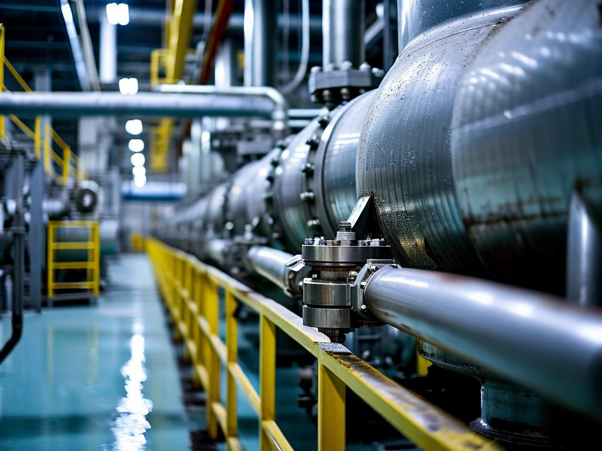

# Field Report: report-rcp-e

**Report ID:** report-rcp-e
**Task ID:** task-20260225-010
**Technician:** Ana Carolina Silva (tech-2908)
**Runbook:** RB-001 v3.2
**Location:** Reactor Building, Primary Circuit Room
**Date:** 2026-02-25

## Timing
- Started: 08:00
- Completed: 13:30
- Duration: 330 minutes (estimated: 240 minutes)

## Status
- Everything OK: No
- Had Delays: Yes
- Runbook Rating: 4/5 stars

## Step-Specific Feedback

### Step 1: Pre-Work Verification
- Issue: Tool calibration checked successfully (learned from previous reports)
- Time Impact: +5 minutes (thorough pre-check avoided mid-job delays)
- Safety Critical: Yes

**What Happened:**
Read all previous RCP reports before starting (Mike, Sarah, David, Thomas). Multiple reports documented tool calibration issues and LOTO sequence confusion. Checked all tools before leaving tool crib:
- Torque wrench TW-0923: calibration valid (expires 2026-08-12)
- Multimeter Fluke 87V: calibration valid (expires 2026-05-20)
- Thermal camera FLIR E8: battery charged to 85%

Small time investment (5 minutes verification) prevented potential 30-60 minute delays during work. Learning from previous reports is valuable.

### Step 2: Electrical Isolation
- Issue: LOTO sequence now clear (documented in site update after multiple reports)
- Time Impact: 0 minutes
- Safety Critical: N/A

**Note:** Site safety department issued LOTO clarification memo (Feb 18) after Thomas's report highlighted confusion. Memo specifies energy source sequence for RCP pumps: electrical → hydraulic → pneumatic → mechanical. This should be added to procedure permanently, not just site memo.

### Step 5: Impeller Extraction
- Issue: Boric acid deposits as expected - tried chemical cleaning approach
- Suggestion: Add chemical cleaning option to procedure with equipment specification
- Time Impact: +60 minutes (chemical cleaning took longer than hot water flush, but potentially better long-term)
- Safety Critical: No

**What Happened:**
Previous reports document boric acid deposit problems with two solutions:
- Mike, David: Heat gun + mallet technique (works but requires careful heating)
- Sarah, Thomas: Hot water flush technique (works well, dissolves deposits)

Discussed with chemistry technician before starting. He suggested chemical cleaning approach: diluted citric acid solution (5% concentration) to dissolve boric acid deposits. Theory: more thorough than hot water, prevents re-crystallization.

**Chemical Cleaning Process:**
1. Mixed citric acid solution (5% w/v, 2 liters)
2. Applied solution to impeller area with spray bottles
3. Allowed 20 minutes contact time
4. Reapplied solution, waited another 20 minutes
5. Flushed with clean water
6. Attempted extraction - impeller came off easily with moderate puller pressure

Total time: 60 minutes (longer than hot water flush 15-20 min, or heat gun 30 min). But cleaning was very thorough - impeller and shaft surfaces completely clean (no residual deposits).

**Advantages:**
- Very thorough cleaning (removes all deposits)
- No heat required (safer, no thermal stress on components)
- Chemical approach = less physical force needed (reduced component damage risk)

**Disadvantages:**
- Takes longer than other methods
- Requires chemical handling (safety, disposal)
- Equipment not specified in procedure (improvised with spray bottles)

**Recommendation:** Add chemical cleaning as option in procedure with proper equipment specification: "Citric acid solution 5%, apply with spray applicator, 20 min contact time, repeat as needed. Requires chemical handling PPE and disposal per site procedure CHEM-005."

### Step 7: Reassembly + Torquing
- Issue: Torque wrench model still DYN-250 with weak click feedback (same issue Thomas reported)
- Suggestion: Same as Thomas - replace with better model
- Time Impact: +10 minutes (careful verification due to weak feedback)
- Safety Critical: Yes

**What Happened:**
Torque wrench calibrated but still DYN-250 model with weak click above 150 Nm (Thomas documented this issue Feb 10). Click barely perceptible at 180 Nm target torque.

Used technique: applied torque slowly while helper watched wrench head movement + listened for click. Combined visual and audio feedback improved confidence. Still not ideal - good torque wrench should have clear click.

Tool room should replace DYN-250 wrenches with better model (clear click at all torque ranges).

## Comments

**Learning Curve Visible:**
This is fifth RCP maintenance report. Clear learning progression:
1. Mike (Jan 15): Multiple issues, 345 min duration
2. Sarah (Jan 22): Learning from Mike, 320 min duration
3. David (Jan 28): Learning from both, 290 min duration
4. Thomas (Feb 10): Continuing pattern, 405 min (but complex LOTO issues)
5. This report (Feb 25): Applied all lessons, 330 min duration

Average duration trending down (except Thomas's LOTO complexity). Learning from reports demonstrably improves efficiency.

**Boric Acid Solutions Comparison:**
Now have three documented approaches:
1. Heat gun + mallet (Mike, David): Fast (30 min) but requires heat approval, physical force
2. Hot water flush (Sarah, Thomas): Medium speed (15-20 min), effective, simple
3. Chemical cleaning (this report): Slow (60 min) but most thorough

**Analysis:**
- For quick maintenance: Hot water flush (best balance speed/effectiveness)
- For thorough maintenance: Chemical cleaning (best deposit removal)
- For emergency/field improvisation: Heat gun + mallet (requires experience)

**Recommendation:** Document all three methods in procedure. Let technician choose based on situation:
- Hot water flush = standard method (most jobs)
- Chemical cleaning = when deposits severe or re-crystallization concern
- Heat gun = when water/chemical not available (requires supervisor approval)

**Tool Management Progress:**
Pre-work verification prevented delays (calibration, battery checks). This should be standard practice but requires cultural shift: techs must read previous reports and apply lessons.

**Suggestion:** Implement pre-job briefing system: supervisor reviews recent reports for similar work, briefs tech on known issues. Formalizes the learning process.

**Positive:**
- All tools checked and ready (no calibration delays)
- LOTO sequence clear (thanks to site memo)
- Chemical cleaning approach worked well (thorough deposit removal)
- Bearing inspection smooth (all within spec)
- Leak test passed first time
- Vibration excellent (2.2 mm/s)

**Results:**
- RCP pump E maintenance completed successfully
- Impeller extraction using chemical cleaning (very thorough)
- All bearings excellent condition
- Surfaces completely clean (no residual boric acid deposits)
- Leak test passed
- Vibration: 2.2 mm/s (excellent)
- Flow rate: 350 m³/h (within tolerance)

**Recommendations:**
1. Add LOTO sequence permanently to procedure (not just site memo)
2. Document three boric acid cleaning methods in procedure (water, chemical, heat)
3. Specify chemical cleaning equipment (spray applicator, PPE, disposal)
4. Replace DYN-250 torque wrenches with better model (clear click feedback)
5. Implement pre-job briefing system (formalize learning from previous reports)
6. Continue tool pre-verification as standard practice

## Photos

