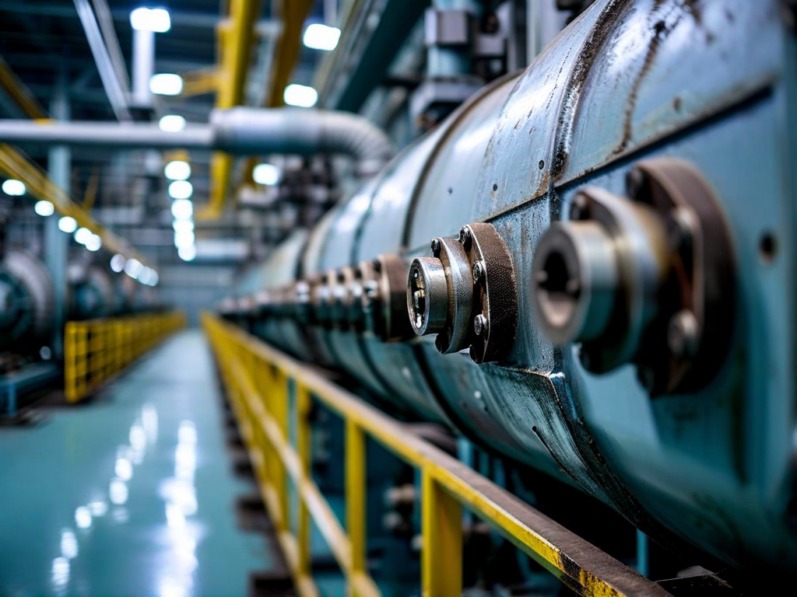
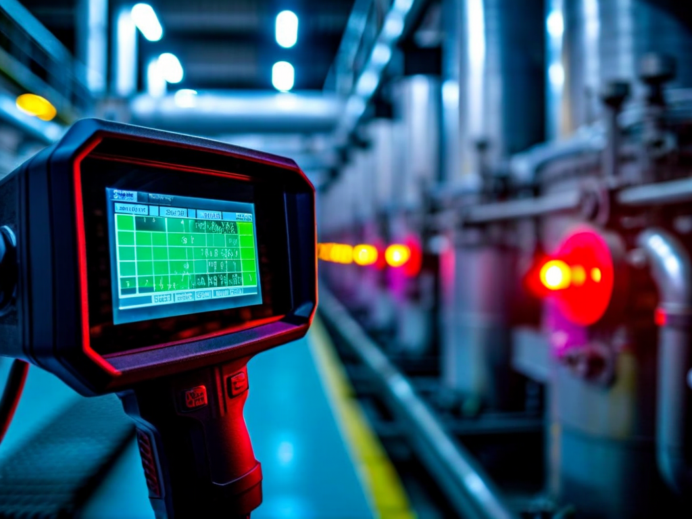
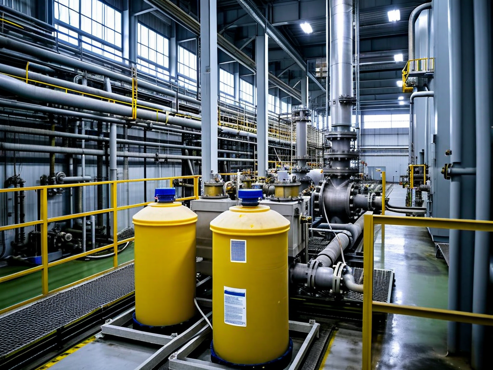

# Field Report: report-rcp-f

**Report ID:** report-rcp-f
**Task ID:** task-20260305-013
**Technician:** Carlos Rodriguez (tech-4109)
**Runbook:** RB-001 v3.2
**Location:** Reactor Building, Primary Circuit Room
**Date:** 2026-03-05

## Timing
- Started: 08:00
- Completed: 12:20
- Duration: 260 minutes (estimated: 240 minutes)

## Status
- Everything OK: Yes
- Had Delays: No (minimal overrun)
- Runbook Rating: 4/5 stars

## Step-Specific Feedback

### Step 1: Pre-Work Verification
- Issue: None - comprehensive pre-check completed successfully
- Time Impact: +8 minutes (thorough verification saved time later)
- Safety Critical: N/A

**What Happened:**
Read all five previous RCP reports before starting (Mike, Sarah, David, Thomas, Marie). Implemented comprehensive pre-work checklist based on lessons learned:

**Tool Verification:**
- Torque wrench TW-0923: calibration valid until 2026-09-12 ✓
- Multimeter Fluke 87V: calibration valid until 2026-07-15 ✓
- Thermal camera FLIR E8: battery 92% ✓
- All hand tools present and serviceable ✓

**LOTO Planning:**
- Reviewed energy sources: electrical, hydraulic, pneumatic, mechanical
- Confirmed sequence with supervisor before starting (per site memo Feb 18)
- LOTO tags prepared and labeled

**Materials Prepared:**
- Hot water available for boric acid deposits (60°C from auxiliary system)
- Citric acid solution 5% mixed and ready (2 liters, per Marie's method)
- Copper shims for puller (learned from previous reports)
- Spray bottles for chemical application

Time investment: 8 minutes verification + preparation. Result: zero mid-job delays for tools, materials, or LOTO confusion.

**This demonstrates mature learning process.** Sixth RCP maintenance shows accumulated knowledge from previous five reports.

### Step 2: Electrical Isolation
- Issue: None - thermal camera worked perfectly (battery pre-checked)
- Time Impact: 0 minutes
- Safety Critical: N/A

### Step 5: Impeller Extraction
- Issue: Boric acid deposits present as expected - used hot water flush + chemical cleaning combination
- Suggestion: Combination approach should be documented as best practice
- Time Impact: +12 minutes (slightly longer than hot water alone, but very thorough)
- Safety Critical: No

**What Happened:**
Expected boric acid deposits based on all previous reports. Used two-stage approach combining techniques from multiple reports:

**Stage 1: Hot water flush (Sarah/Thomas technique)**
- Applied 60°C hot water to impeller area for 10 minutes
- Dissolved surface deposits, loosened crystallized deposits
- Drainage and inspection

**Stage 2: Chemical cleaning (Marie's technique)**
- Applied 5% citric acid solution with spray bottles
- 15 minutes contact time (shorter than Marie's 40 min because hot water pre-loosened deposits)
- Flush with clean water

**Result:** Impeller removed with minimal puller pressure. Surfaces completely clean (no residual deposits). Combination approach faster than chemical alone (27 min total vs. Marie's 60 min) but more thorough than water alone.

**Best Practice Identified:**
Hot water flush + citric acid chemical cleaning = optimal balance of speed and thoroughness. Should be documented in procedure as standard method for boric acid deposits.

### Step 7: Reassembly + Torquing
- Issue: Torque wrench DYN-250 still in use (weak click feedback) but calibration valid
- Suggestion: Despite multiple reports, better wrenches still not procured
- Time Impact: +5 minutes (careful verification due to weak click)
- Safety Critical: Yes

**What Happened:**
Torque wrench calibrated (verified in Step 1) but still DYN-250 model with weak click above 150 Nm. Multiple reports document this issue (Thomas, Marie, others).

Used careful technique: slow torque application + helper observation + audio/visual feedback. Achieved confident 180 Nm torque but required extra attention.

**Tool room still has not procured better torque wrenches.** This is equipment quality issue, not procedure issue. Operations should approve procurement of clear-click model (e.g., CDI brand or equivalent).

## Comments

**Learning Curve Complete - Standard Practice Established:**
This is sixth RCP maintenance report. Clear progression visible:
1. Mike (Jan 15): 345 min, multiple issues discovered
2. Sarah (Jan 22): 320 min, learning from Mike
3. David (Jan 28): 290 min, continuing improvement
4. Thomas (Feb 10): 405 min, complex LOTO issues
5. Marie (Feb 25): 330 min, chemical cleaning development
6. This report: 260 min, standard practice established

**Duration reduced 25% from first report** (345 min → 260 min). Why?
- Pre-work verification prevents mid-job delays
- LOTO sequence understood (site memo + experience)
- Boric acid cleaning methods established (hot water + chemical)
- Tool calibration checked before starting
- Materials prepared in advance

**Knowledge transfer successful.** Field-developed techniques now standard practice through report-based learning.

**Best Practice Summary for RB-001:**

**Pre-Work (adds 8 min, saves 30-60 min):**
- Verify tool calibration before leaving tool crib
- Check thermal camera battery (charge if <50%)
- Prepare hot water source (60°C)
- Mix citric acid solution 5% (2 liters)
- Review LOTO sequence for multiple energy sources

**Impeller Extraction (27 min with combination method):**
- Visual inspection for boric acid deposits
- Hot water flush 60°C for 10 minutes (dissolve surface deposits)
- Citric acid 5% spray application, 15 min contact (thorough cleaning)
- Flush with clean water, proceed with extraction
- Copper shims for puller if needed

**Torquing (requires attention with DYN-250):**
- Slow, steady torque application
- Helper observes wrench head + listens for click
- Visual + audio feedback combination
- Verify multiple times if uncertain

**Remaining Issues Not Yet Resolved:**

**1. Tool Calibration Management (7+ incidents):**
Still no systematic checkout verification at tool room. Must verify manually. Operations has not implemented fix despite multiple reports.

**2. Torque Wrench Quality (weak click):**
DYN-250 model inadequate for safety-critical torquing. Better model needed but not yet procured.

**3. Primary Circuit Chemistry (boric acid deposits):**
Root cause not addressed. Deposits will continue until plant chemistry review completed and corrective actions implemented.

**4. Procedure Not Updated:**
Despite six reports documenting field-proven techniques, procedure still does not include:
- Tool calibration pre-check
- Thermal camera battery check
- Hot water flush technique
- Chemical cleaning method
- LOTO sequence for multiple energy sources

**Positive:**
- Work completed efficiently (20 min over estimate, minimal)
- All techniques applied successfully
- Zero tool/material delays (good preparation)
- Bearing inspection excellent (all within spec)
- Leak test passed first time
- Vibration excellent: 2.1 mm/s

**Results:**
- RCP pump F maintenance completed successfully
- Impeller extraction using combination method (hot water + citric acid)
- All bearings excellent condition
- Surfaces completely clean (no residual deposits)
- Leak test passed
- Vibration: 2.1 mm/s (excellent)
- Flow rate: 349 m³/h (within tolerance)
- Total duration: 260 min (25% improvement vs. first report)

**Recommendations:**
1. **Update procedure to include field-proven techniques** (6 reports worth of lessons learned)
2. **Document combination cleaning method** (hot water + citric acid = best practice)
3. **Add comprehensive pre-work checklist** (tool verification, battery check, material prep)
4. Operations: **implement tool room calibration verification** (still not fixed after 7+ incidents)
5. Operations: **procure better torque wrenches** (replace DYN-250 model)
6. Plant chemistry: **investigate boric acid carryover** (root cause of recurring deposits)
7. **Consider formal pre-job briefing system** (systematize report-based learning)

## Photos

