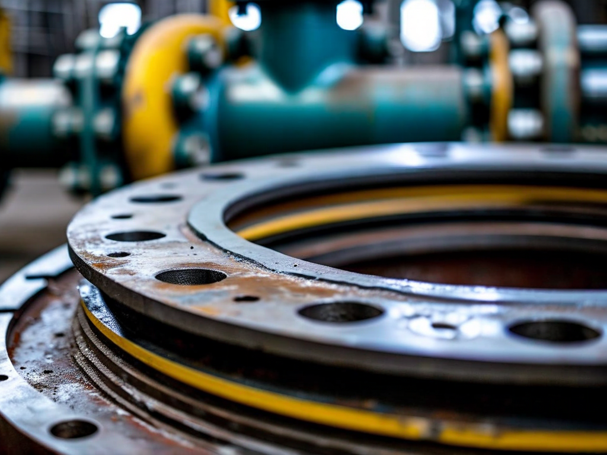
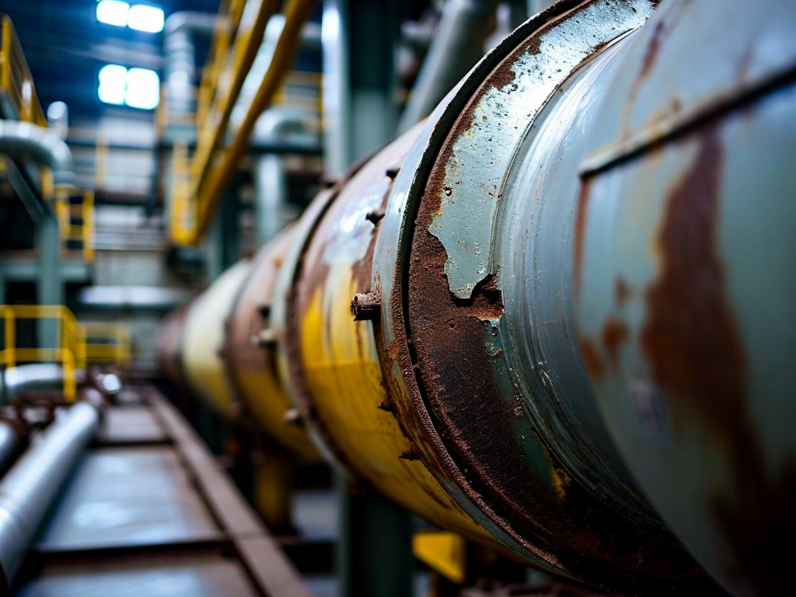

# Field Report: report-hx-002

**Report ID:** report-hx-002
**Task ID:** task-20260307-014
**Technician:** Mateo Jackson (tech-3312)
**Runbook:** RB-THERMAL-001 v2.0
**Location:** Thermal Plant Unit 2, Heat Exchanger HX-202
**Date:** 2026-03-07

## Timing
- Started: 08:00
- Completed: 15:45
- Duration: 465 minutes (estimated: 360 minutes)

## Status
- Everything OK: No
- Had Delays: Yes
- Runbook Rating: 3/5 stars

## Step-Specific Feedback

### Step 1: Isolation and Depressurization
- Issue: None - isolation sequence clear
- Time Impact: 0 minutes
- Safety Critical: N/A

### Step 2: Header Removal
- Issue: Gasket out of stock - had to fabricate onsite
- Suggestion: Stock level management problem (same as Robert's report)
- Time Impact: +95 minutes (fabricating gasket from sheet stock)
- Safety Critical: No

**What Happened:**
Removed header successfully. Ready for gasket replacement. Called warehouse for DN400 gasket (3mm thick, fiber-reinforced). Warehouse response: "Out of stock, need 3-4 days for supplier delivery."

Cannot wait 3-4 days - heat exchanger critical for Unit 2 operation. Unit running at reduced capacity during repair. Escalated to supervisor.

Supervisor approved onsite gasket fabrication. Retrieved gasket sheet stock from maintenance shop (3mm fiber-reinforced material). Used header flange as template:
1. Traced flange outline on sheet material
2. Cut outer diameter with shears
3. Marked and drilled bolt holes (16 holes, M16)
4. Cut inner diameter carefully
5. Final fit check on flange

Fabrication took 95 minutes (vs. 2 minutes to install pre-cut gasket). Quality acceptable but time-consuming.

**This is second heat exchanger report with gasket supply issues:**
- Robert (Feb 10, HX-305): Wrong size delivered, 120 min delay
- This report (Mar 7, HX-202): Out of stock, 95 min delay

**Pattern:** Warehouse inventory management inadequate for heat exchanger gaskets. Common sizes (DN300, DN350, DN400) should be stocked, not special-order items.

**Root Cause:**
1. Inventory planning inadequate (stockout of common size)
2. No safety stock policy for critical consumables
3. Lead time from supplier too long (3-4 days unacceptable for critical equipment)

**Recommendation:** Warehouse manager should conduct inventory review:
- Stock all common HX gasket sizes (DN200-DN600, 3mm fiber-reinforced)
- Minimum 2 units per size (safety stock)
- Automatic reorder at minimum level
- Identify critical consumables requiring immediate availability

### Step 3: Tube Bundle Extraction
- Issue: None - extraction went smoothly
- Time Impact: 0 minutes
- Safety Critical: N/A

### Step 4: Chemical Cleaning
- Issue: Tube fouling moderate (better than Robert's severe fouling)
- Suggestion: 6-month cleaning interval helping (Unit 2 cleaned on schedule)
- Time Impact: 0 minutes (cleaning completed within planned time)
- Safety Critical: N/A

**Note:** Robert's report (Feb 10, HX-305) documented severe fouling after 9-month interval with poor water quality. Recommended return to 6-month interval. Unit 2 maintained 6-month schedule - fouling moderate, cleaning time as planned.

**This demonstrates value of preventive maintenance scheduling.** Following recommended intervals prevents excessive fouling and time overruns.

### Step 5: Tube Bundle Reinstallation
- Issue: Used thermal camera for alignment verification (learned from other reports about thermal camera utility)
- Suggestion: Thermal imaging useful for post-installation verification
- Time Impact: +10 minutes (thermal check added to verify uniform tube contact)
- Safety Critical: No

**What Happened:**
Reinstalling tube bundle. Procedure covers mechanical alignment but doesn't mention thermal verification. Remembered multiple reports mentioning thermal cameras (Mike, Sarah, Thomas on RCP, Ahmed on solar).

After mechanical installation complete, used thermal camera to scan tube bundle (system pressurized for test). Thermal imaging shows uniform heat distribution = good tube-to-tubesheet contact across bundle.

Detected one area with slightly lower temperature (tubes 23-27, lower right quadrant). Investigated - found slight alignment gap. Adjusted installation, rechecked - thermal distribution now uniform.

This thermal verification prevented potential leak or poor heat transfer. Added 10 minutes but improved installation quality.

**Suggestion:** Add thermal imaging verification to procedure: "After installation, use thermal camera to verify uniform temperature distribution across tube bundle. Temperature variation >5°C may indicate poor contact."

### Step 6: Header Reassembly
- Issue: Flange surface inspection revealed minor corrosion (same as Robert's report)
- Suggestion: Flange condition monitoring needed
- Time Impact: +15 minutes (flange surface dressing)
- Safety Critical: Yes

**What Happened:**
Robert's report (Feb 10, HX-305) documented flange corrosion pitting requiring surface dressing. Checked HX-202 flanges before gasket installation - similar corrosion pattern (minor pitting on seating surfaces).

Dressed flange surfaces with hand file (remove corrosion, smooth surface). Verified with straight edge - acceptable flatness. Installed fabricated gasket.

**Flange degradation pattern across multiple heat exchangers.** Cooling water chemistry causing corrosion. Robert noted: "Estimate 2-3 maintenance cycles remaining before flange requires machining or replacement."

HX-202 flanges in similar condition. Need to plan flange refurbishment for multiple units in next major outage.

### Step 7: Pressure Test
- Issue: First pressure test passed (no leaks despite fabricated gasket)
- Time Impact: 0 minutes
- Safety Critical: N/A

**Note:** Fabricated gasket quality acceptable. Pressure test at 20 bar showed zero leaks. Proper fabrication technique can produce serviceable gasket in emergency.

## Comments

**Gasket Supply - Recurring Problem:**
Second heat exchanger report documenting gasket supply issues. Robert (Feb 10) had wrong size delivered, this report (Mar 7) had stockout. Both required workarounds:
- Robert: 120 min waiting for correct size
- This report: 95 min fabricating from sheet stock

**Average delay: 108 minutes per gasket issue.** Two incidents = 215 minutes lost to inventory management failures.

**Pattern established:** Warehouse not managing critical consumables effectively. Common gasket sizes should be stocked items, not subject to stockouts or wrong-size picking errors.

**Solution:**
1. Stock analysis (identify all common HX gasket sizes across plant)
2. Safety stock policy (minimum 2 units per critical size)
3. Picking verification (prevent wrong-size errors)
4. Supplier lead time reduction (expedited delivery for critical items)

**Thermal Camera Utility:**
Multiple reports mention thermal cameras (primarily for battery issues). This report demonstrates additional utility: post-installation verification.

Thermal imaging detected alignment issue not visible mechanically. Prevented potential leak or reduced heat transfer efficiency. Added 10 minutes but improved quality.

**Suggestion:** Expand thermal camera use beyond procedure specifications. Useful for:
- Pre-work temperature verification (safety)
- Installation quality verification (this report)
- Hotspot detection (equipment condition monitoring)

**Preventive Maintenance Value:**
Unit 2 maintained 6-month HX cleaning interval (per Robert's recommendation). Result: moderate fouling, cleaning completed on schedule, no time overrun.

Contrast with Robert's Unit 3 (9-month interval, poor water quality): severe fouling, 45 min time overrun.

**Preventive maintenance scheduling works.** Following recommended intervals prevents excessive degradation and associated delays.

**Positive:**
- Gasket fabrication successful (emergency workaround effective)
- Thermal imaging added value (detected alignment issue)
- Tube bundle cleaning on schedule (6-month interval maintained)
- Pressure test passed (zero leaks)
- Heat exchanger returned to service

**Results:**
- Heat exchanger HX-202 cleaned and reassembled successfully
- Gasket fabricated onsite (95 min vs. 3-4 day wait)
- Tube fouling moderate (6-month interval effective)
- Thermal imaging verified installation quality (alignment issue corrected)
- Flange surfaces dressed (acceptable for continued service)
- Pressure test passed (0 leaks at 20 bar)
- Heat exchanger returned to service

**Recommendations:**
1. **Warehouse: conduct gasket inventory review** (stock common sizes, safety stock policy)
2. **Add thermal imaging verification to procedure** (post-installation quality check)
3. **Plan flange refurbishment** (multiple HX units showing corrosion degradation)
4. **Continue 6-month cleaning intervals** (demonstrates preventive maintenance value)
5. **Train technicians on emergency gasket fabrication** (acceptable temporary solution)
6. **Procurement: reduce supplier lead time** (3-4 days too long for critical consumables)

## Photos

