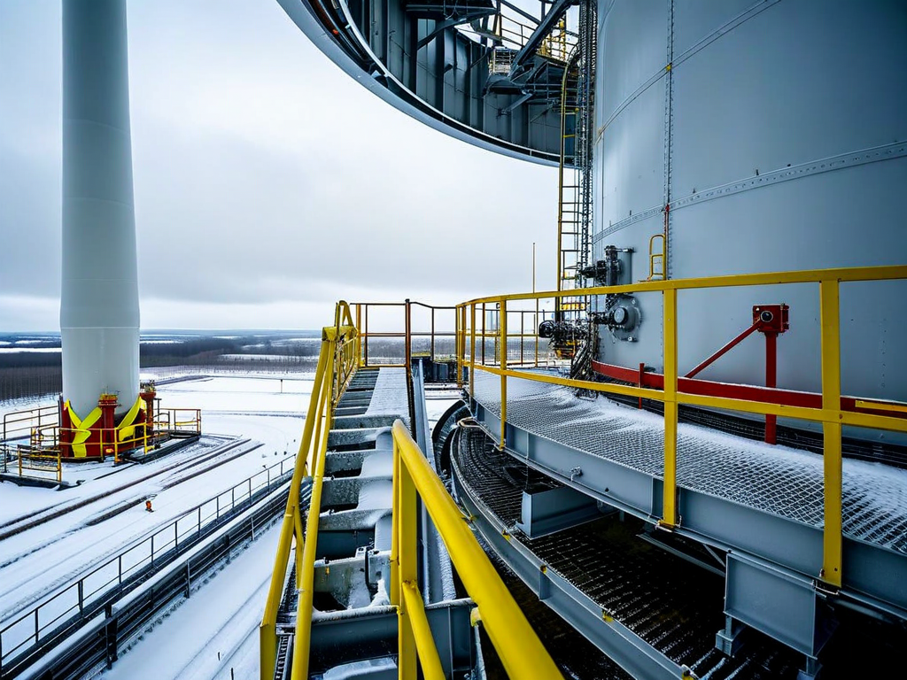
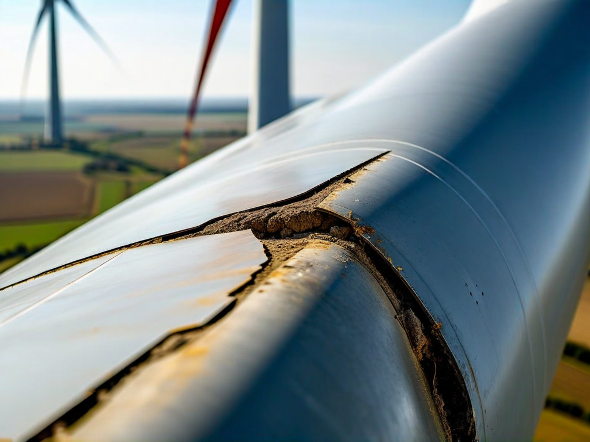
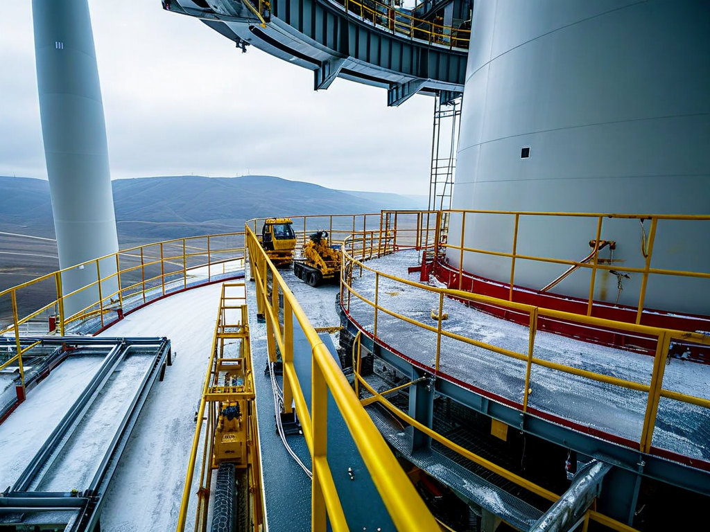

# Field Report: report-wind-blade-003

**Report ID:** report-wind-blade-003
**Task ID:** task-20260308-015
**Technician:** Lisa Kumar (tech-5201)
**Runbook:** RB-WIND-002 v2.3
**Location:** Wind Farm Site 2, Turbine WT-11, Blade C
**Date:** 2026-03-08

## Timing
- Started: 08:00
- Completed: 13:45
- Duration: 345 minutes (estimated: 240 minutes per blade)

## Status
- Everything OK: No
- Had Delays: Yes
- Runbook Rating: 3/5 stars

## Step-Specific Feedback

### Step 1: Blade Positioning
- Issue: None - weather acceptable (wind 5 m/s, no gusts >10 m/s)
- Time Impact: 0 minutes
- Safety Critical: N/A

**Note:** Checked weather conditions before starting (learned from Jennifer's report about wind delays). Conditions stable all day.

### Step 2: Leading Edge Inspection
- Issue: Erosion extent underestimated AGAIN - brought UT gauge to verify (Mark's suggestion)
- Suggestion: UT thickness inspection should be mandatory before repair planning
- Time Impact: +40 minutes (UT inspection + reassessment) but prevented material shortage
- Safety Critical: No

**What Happened:**
This is third blade erosion report. Pattern established from previous reports:
- Mark (Jan 30): 40 cm estimated, 80 cm actual (2x worse)
- Jennifer (Feb 15): 35 cm estimated, 55 cm actual (1.6x worse)

Both reports recommended UT thickness inspection or 2x material safety margin. Decided to test UT inspection approach.

**Ground assessment:** Binocular inspection suggested 45 cm erosion section.

**UT inspection at blade:** Brought Olympus 38DL Plus UT thickness gauge (borrowed from hydro crew). Scanned leading edge systematically (every 5 cm along blade length):
- Visible erosion: 45 cm (matches ground estimate)
- UT shows subsurface delamination extending to 70 cm (hidden damage)
- Additional thinning areas detected at 15 cm and 25 cm from visible erosion (not visible externally)

**Total repair area:** 90 cm (vs. 45 cm ground estimate = 2x worse, same pattern as Mark/Jennifer).

**UT inspection findings:**
- Detected subsurface damage not visible from ground or close inspection
- Identified thinning areas before they became visible erosion
- Allowed accurate material planning (brought 1000g epoxy, used 950g = good margin)

**Time impact:** UT inspection added 40 minutes to Step 2. BUT prevented material shortage (if relied on 45 cm estimate, would have brought 500g, needed 950g = major shortage requiring descent/return).

**Analysis:** 40 min UT inspection investment saved 60+ min material retrieval delay. Net time savings + improved quality (complete repair of all damage including hidden areas).

**Mark's recommendation validated:** UT thickness inspection before repair planning is best practice for blade erosion work.

### Step 3: Surface Preparation
- Issue: None - surface prep straightforward for 90 cm area
- Time Impact: 0 minutes (within planned time, adjusted for larger area)
- Safety Critical: N/A

### Step 4: Epoxy Application
- Issue: Weather stable, temperature acceptable (11°C)
- Suggestion: None - conditions good for epoxy work
- Time Impact: 0 minutes
- Safety Critical: N/A

**Note:** Temperature 11°C acceptable for epoxy cure (above 10°C minimum recommended in Jennifer's report). No weather delays (monitored continuously per Jennifer's suggestion).

### Step 5: Curing Time
- Issue: Extended cure time due to moderate temperature (11°C)
- Suggestion: Temperature-dependent cure time now standard practice (learned from Mark and Jennifer)
- Time Impact: +25 minutes (extended cure at 11°C, applied +30% cure time adjustment)
- Safety Critical: Yes

**What Happened:**
Applied Jennifer's recommendation: temperature-dependent cure time adjustment. At 11°C (vs. optimal 20°C), extended cure time by 30%:
- Standard cure: 60 minutes
- Adjusted cure (11°C): 78 minutes (rounded to 80 minutes)

Verified cure with tap test at 80 minutes - acceptable hardness. Proper cure time critical for repair strength and durability.

### Step 6: Final Inspection
- Issue: None - repair quality excellent
- Time Impact: 0 minutes
- Safety Critical: N/A

## Comments

**UT Inspection - Best Practice Validated:**
Three blade erosion reports establish pattern: ground visual inspection underestimates erosion by 1.6-2x consistently. Mark suggested UT inspection or 2x material margin. This report tested UT approach.

**Results:**
- UT inspection detected hidden damage (subsurface delamination, thinning areas)
- Enabled accurate material planning (brought sufficient epoxy)
- Prevented material shortage delays (60+ min saved)
- Improved repair quality (addressed all damage including hidden areas)
- Time investment: 40 min (acceptable for quality improvement)

**Recommendation:** **Make UT thickness inspection mandatory in Step 2.** Update procedure:
- Bring UT gauge as required equipment
- Scan leading edge systematically (5 cm intervals)
- Record thickness measurements
- Plan repair area based on UT findings, not visual assessment
- Adjust time estimate: add 40 minutes for UT inspection

**Alternative:** If UT gauge not available, use 2x material safety margin based on ground assessment (Jennifer's approach). But UT inspection is superior - detects hidden damage, improves repair quality.

**Weather Monitoring - Effective:**
Jennifer's weather recommendations effective. Monitored wind speed continuously - conditions stable all day. No delays due to weather.

Blade repair weather planning now standard:
- Check forecast before starting
- Monitor wind speed continuously (max 8 m/s sustained, 12 m/s gusts)
- Monitor rain forecast (delay if rain within cure time)
- Adjust cure time for temperature (<15°C requires extension)

**Learning Across Reports - Efficient:**
Read all previous blade reports (Mark, Jennifer) before starting. Applied their lessons:
- UT inspection (Mark's suggestion): saved time, improved quality
- Weather monitoring (Jennifer's lesson): prevented delays
- Temperature-adjusted cure time (Jennifer's method): proper cure achieved
- Material safety margin (both reports): brought adequate epoxy

**Result:** Job completed efficiently despite 90 cm repair (2x ground estimate). Total duration 345 min (105 min over estimate) but appropriate for actual repair scope (90 cm vs. estimated 45 cm).

**Comparison to previous reports:**
- Mark (Jan 30): 80 cm repair, 390 min duration (1.6x estimate)
- Jennifer (Feb 15): 55 cm repair, 525 min duration (2.2x estimate, weather delays)
- This report (Mar 8): 90 cm repair, 345 min duration (1.4x estimate)

**This report most efficient despite largest repair area.** Why? Better planning (UT inspection), good weather, lessons learned from previous reports.

**Positive:**
- UT inspection detected hidden damage (improved quality)
- Material planning accurate (no shortages)
- Weather monitoring prevented delays
- Temperature-adjusted cure time achieved proper cure
- Repair quality excellent
- Blade returned to service

**Results:**
- Leading edge erosion repaired (90 cm section)
- UT inspection identified subsurface delamination (70 cm extent)
- Additional thinning areas repaired preventively (15 cm and 25 cm from main erosion)
- Material planning accurate (1000g brought, 950g used)
- Cure time adjusted for temperature (80 min at 11°C)
- Final profile smooth and aerodynamic
- Blade returned to service successfully

**Recommendations:**
1. **Make UT thickness inspection mandatory in Step 2** (most important recommendation)
2. **Add UT gauge to required equipment list** (Olympus 38DL Plus or equivalent)
3. **Update material planning guidance** (base on UT findings, not visual assessment)
4. **Add Step 2 time estimate** (include 40 min for UT inspection)
5. **Document temperature-dependent cure times** (Jennifer's table should be in procedure)
6. **Weather monitoring requirements** (wind limits, rain contingency, temperature effects)
7. **Consider blade erosion assessment training** (UT technique, interpretation)

## Photos

