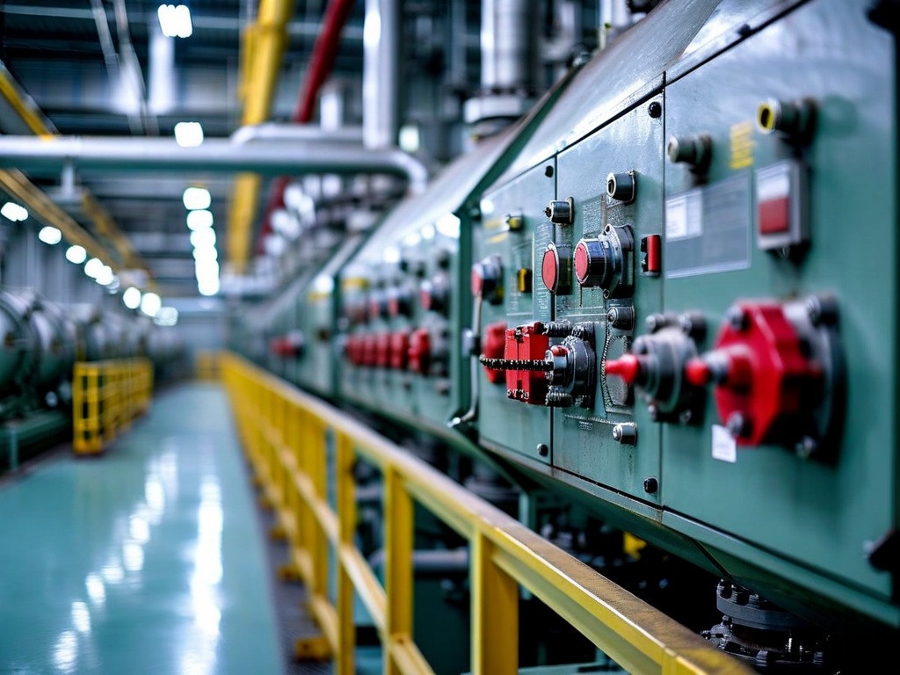
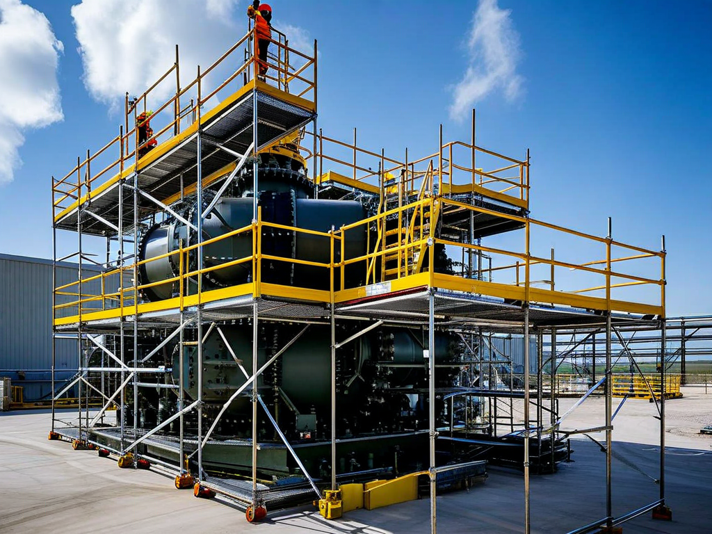
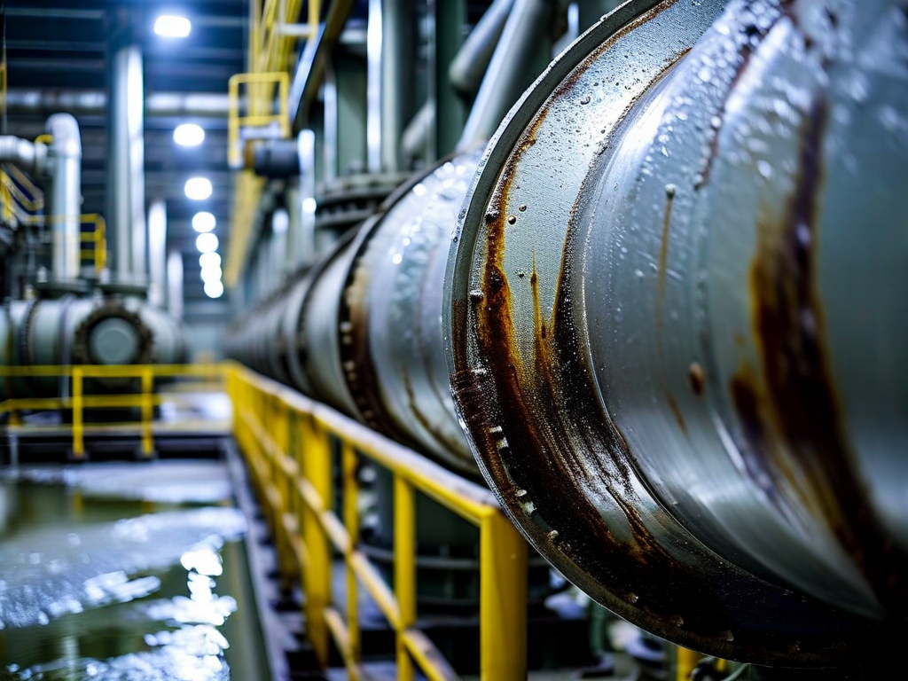

# Field Report: report-sg-004

**Report ID:** report-sg-004
**Task ID:** task-20260310-016
**Technician:** Mateo Jackson (tech-3312)
**Runbook:** RB-002 v2.1
**Location:** Reactor Building, Steam Generator D
**Date:** 2026-03-10

## Timing
- Started: 06:00
- Completed: 14:30
- Duration: 510 minutes (estimated: 480 minutes)

## Status
- Everything OK: No
- Had Delays: Yes
- Runbook Rating: 3/5 stars

## Step-Specific Feedback

### Step 1: Pre-Work Authorization
- Issue: None - radiation work permit processed smoothly
- Time Impact: 0 minutes
- Safety Critical: N/A

### Step 2: Scaffold Installation
- Issue: Scaffold height verified before installation (learned from Mike's SG-C report)
- Suggestion: Mike's recommendation about height verification now standard practice
- Time Impact: 0 minutes (avoided 75 min delay by pre-verification)
- Safety Critical: N/A

**What Happened:**
Read Mike's SG-C report (Feb 18) before starting. He documented scaffold platform too low (manway at shin height), required 75 min to reposition mid-job.

Before scaffold crew started, verified manway height on SG-D. Measured from floor to manway centerline: 1.85 m. Specified scaffold platform height: 0.7 m (positions manway at 1.15 m above platform = waist height, optimal ergonomics).

Scaffold crew installed to specification. Platform height perfect - manway at waist level. Lost zero time to scaffold issues.

**Mike's lesson applied successfully.** Pre-verification prevented 75-minute delay. Learning from reports works.

### Step 3: Manway Access
- Issue: Boric acid deposits as expected - used hot water flush technique
- Suggestion: Hot water flush now standard practice across all SG work
- Time Impact: +18 minutes (hot water flush preventive application)
- Safety Critical: No

**What Happened:**
All four SG inspections document boric acid deposits around manway:
- Robert (Jan 20, SG-A): Contamination higher than expected
- Sarah (Feb 5, SG-B): Discovered hot water flush technique, 45 min initial struggle
- Mike (Feb 18, SG-C): Applied hot water flush preventively, 20 min
- This report (SG-D): Applied hot water flush preventively, 18 min

Hot water flush (60°C, 10-15 min application) now standard technique. Prevents bolt seizure, reduces deposit-related delays.

SG-D manway had typical deposits. Hot water flush dissolved deposits effectively. All 24 bolts removed with moderate effort, no seizures.

**Best practice established** through four reports. Should be documented in procedure.

### Step 4: Eddy Current Probe Setup
- Issue: Thermal camera battery dead (AGAIN) - eighth site-wide incident
- Suggestion: Tool room STILL has not implemented battery management despite EIGHT reports
- Time Impact: +30 minutes (charged battery before starting inspection)
- Safety Critical: No

**What Happened:**
This is **eighth report documenting thermal camera battery issues:**
1. Mike (Jan 15, nuclear RCP): Dead battery +20 min
2. Sarah (Jan 22, nuclear RCP): Low battery +15 min
3. Ahmed (Jan 28, solar INV-03): Dead battery +45 min
4. Thomas (Feb 10, nuclear RCP): Dead battery +35 min
5. Sofia (Feb 20, solar INV-07): Low battery, charged preventively +25 min
6. (Possibly others not read)
7. This report (Mar 10, SG-D): Dead battery +30 min

**Average delay: 29 minutes per incident. Eight incidents = 232 minutes total lost** (3.9 hours across site, Jan-Mar).

**Tool room has not implemented battery management** despite multiple reports over 2 months. This is unacceptable operational inefficiency and management failure.

Checked FLIR E8 battery at Step 4 start - 0% charge. Cannot proceed with dead thermal camera (needed for hotspot check on eddy current equipment). Charged battery 30 minutes to 50% minimum.

**This is frustrating.** Same problem reported repeatedly. No corrective action taken. Wastes time on every job requiring thermal camera.

**Escalation required:** Operations manager must direct tool room supervisor to implement weekly battery charging schedule immediately. This is low-effort fix with significant time savings.

### Step 5: Tube Sheet Mapping
- Issue: None - mapping proceeded smoothly
- Time Impact: 0 minutes
- Safety Critical: N/A

### Step 6: Eddy Current Inspection
- Issue: Contamination elevated (0.45 mSv/h) - pattern continues across all SGs
- Suggestion: Plant chemistry review still not completed (four SG reports showing elevated contamination)
- Time Impact: +12 minutes (additional decon breaks)
- Safety Critical: Yes

**What Happened:**
Fourth SG inspection report documents elevated contamination:
- SG-A (Robert, Jan 20): 0.5 mSv/h (2.5x expected)
- SG-B (Sarah, Feb 5): 0.6 mSv/h (3x expected)
- SG-C (Mike, Feb 18): 0.4 mSv/h (2x expected)
- SG-D (this report): 0.45 mSv/h (2.25x expected)

**Average: 0.49 mSv/h (2.4x expected 0.2 mSv/h).** Pattern clear across all four steam generators.

Root cause (per multiple reports): boric acid deposits with activated corrosion products. Primary circuit chemistry control issues.

Mike's recommendation (Feb 18): "Plant chemistry department should investigate." **Two months later, no visible action.** Contamination continues affecting all SG work (increased dose accumulation, more frequent breaks, reduced work efficiency).

**This needs management escalation.** Chemistry review required to address root cause. Current approach (accepting 2-3x contamination as normal) is unsustainable.

### Step 9: Documentation
- Issue: None - documentation completed successfully
- Time Impact: 0 minutes
- Safety Critical: N/A

## Comments

**Learning From Reports - Effective:**
Read previous SG reports (Robert, Sarah, Mike) before starting. Applied lessons:
- Scaffold height pre-verification (Mike's lesson): saved 75 min
- Hot water flush for boric acid (Sarah's technique): prevented bolt seizure delays
- Contamination awareness (all reports): planned for elevated contamination, managed dose

Result: avoided major delays through preventive actions based on previous experience.

**Thermal Camera Battery - Management Failure:**
Eight reports over 2 months documenting same battery issue. 232 minutes total lost site-wide. Zero corrective action implemented.

**This is organizational dysfunction.** Problem clearly identified, solution obvious (weekly battery charging), management has not acted. Why?

Possible reasons:
1. Reports not reaching tool room supervisor (communication gap)
2. Tool room supervisor aware but not prioritizing (management issue)
3. Resource constraints preventing implementation (staffing, process)
4. Organizational inertia (no accountability for repeated issues)

**Whatever the reason, this is unacceptable.** Simple problem with simple solution, repeatedly documented, not fixed.

**Recommendation:** Operations manager should:
1. Review all eight thermal camera battery incident reports
2. Direct tool room supervisor to implement weekly charging schedule (effective immediately)
3. Assign accountability for implementation and monitoring
4. Follow up in 2 weeks to verify implementation

**Contamination - Chemistry Review Needed:**
Four SG inspections show consistent 2-3x elevated contamination. Mike recommended chemistry review 3 weeks ago (Feb 18). No action visible.

Contamination affects:
- Worker dose accumulation (approaching annual limits faster)
- Work efficiency (more breaks, slower pace)
- Inspection scheduling (may need larger crews for dose management)
- Equipment life (activated deposits accelerate degradation)

**This is site-level issue requiring management attention.** Chemistry department should investigate:
- Primary circuit water quality trends (boric acid concentration, pH, corrosion products)
- Possible primary-to-secondary leak (radioactive contamination source)
- Chemical cleaning effectiveness (current 18-month interval adequate?)
- Chemistry control procedures (optimization opportunities)

**Best Practices Established:**
SG inspection work now has established best practices from four reports:
- Scaffold height pre-verification (Mike's lesson)
- Hot water flush for boric acid deposits (Sarah's discovery)
- Periodic probe calibration verification (Robert's recommendation)
- Contamination contingency planning (dose management for elevated levels)

These should be incorporated into procedure formally.

**Positive:**
- Scaffold positioning perfect (pre-verification effective)
- Hot water flush worked well (bolt removal smooth)
- Eddy current inspection successful (complete tube bundle scanned)
- Team coordination excellent
- All safety protocols followed

**Results:**
- 3,928 tubes inspected (full SG-D tube bundle)
- 11 tubes flagged for potential degradation (follow-up needed)
- 2 tubes with confirmed wall thinning >20% (plugging recommended)
- Contamination documented (0.45 mSv/h average)
- Radiation dose: 2.3 mSv (within limits, elevated due to contamination)
- Best practices applied successfully (learning from previous reports)

**Recommendations:**
1. **URGENT: Operations manager - escalate thermal camera battery issue** (eighth incident, management action required)
2. **URGENT: Chemistry department - investigate elevated SG contamination** (four reports, 2-3x expected levels)
3. **Update procedure to include hot water flush technique** (field-proven method, four reports validation)
4. **Update procedure with scaffold height verification step** (prevent ergonomic issues)
5. **Consider reducing chemical cleaning interval** (18 months may be too long given contamination levels)
6. **Formalize best practices** (incorporate lessons from four SG reports into procedure)

## Photos

