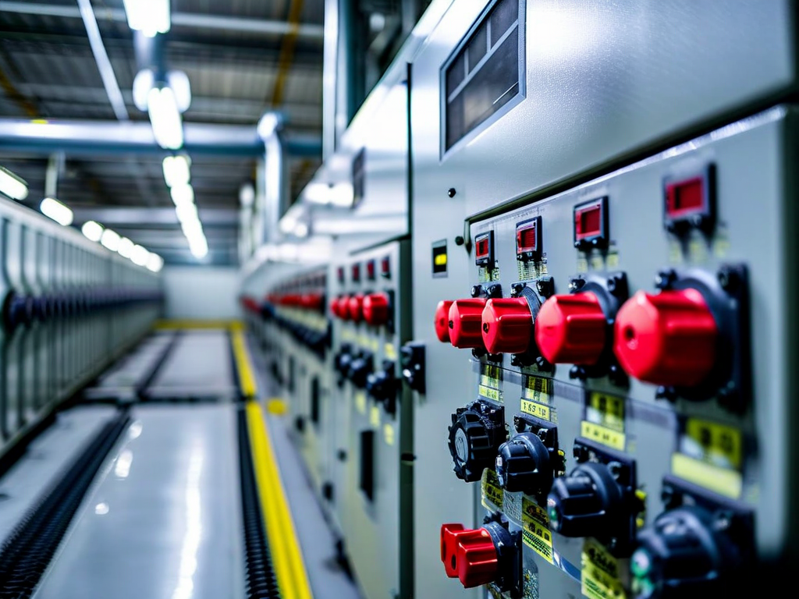
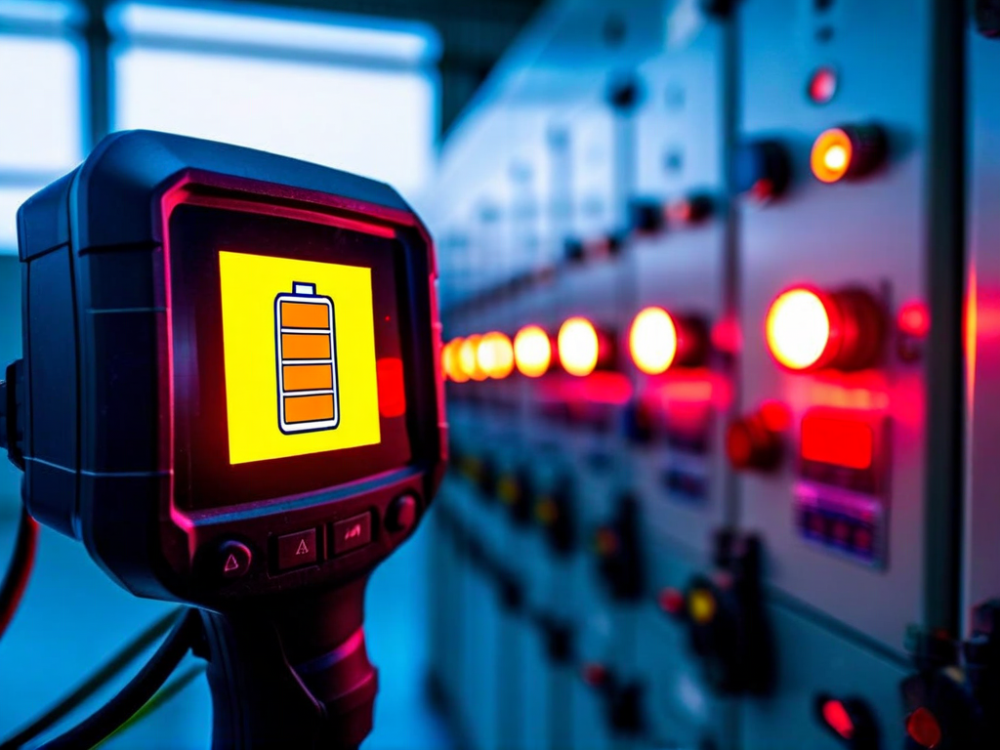
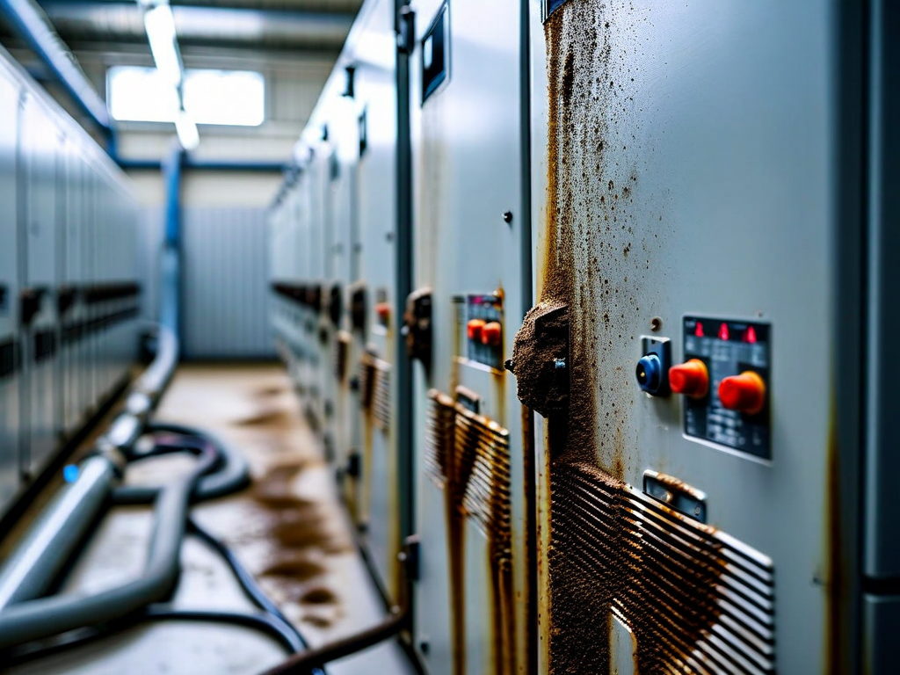

# Field Report: report-solar-003

**Report ID:** report-solar-003
**Task ID:** task-20260312-017
**Technician:** Ahmed Tahir (tech-5445)
**Runbook:** RB-SOLAR-001 v1.5
**Location:** Solar Farm Central Inverter Station, INV-12
**Date:** 2026-03-12

## Timing
- Started: 09:00
- Completed: 12:30
- Duration: 210 minutes (estimated: 180 minutes)

## Status
- Everything OK: No
- Had Delays: Yes
- Runbook Rating: 3/5 stars

## Step-Specific Feedback

### Step 1: Inverter Shutdown Sequence
- Issue: None - shutdown sequence worked perfectly
- Time Impact: 0 minutes
- Safety Critical: N/A

### Step 3: Cooling System Check
- Issue: Thermal camera battery checked preventively (learned from previous reports)
- Suggestion: Still waiting for tool room battery management implementation
- Time Impact: +5 minutes (checked and charged battery preventively before starting)
- Safety Critical: No

**What Happened:**
This is my third solar inverter maintenance. First two jobs (Jan 28 INV-03, previous jobs not reported) had thermal camera battery issues. Multiple other reports document same problem site-wide.

Checked FLIR E8 battery before starting work - 40% charge. Charged to 75% before beginning (5 minutes). Prevented mid-job delay.

**Thermal camera battery issue reported nine times now** (my count from reports I've read). Tool room still has not implemented battery management. Frustrating but at least individual techs can work around it by pre-checking.

### Step 5: IGBT Module Cleaning
- Issue: Severe dust accumulation - used compressed air cleaning method with ESD precautions
- Suggestion: Compressed air cleaning should be approved formally in procedure
- Time Impact: +20 minutes (compared to vacuum-only assumption)
- Safety Critical: Yes

**What Happened:**
Third solar inverter report documenting severe dust (my report Jan 28, Sofia's report Feb 20, this report). Pattern established: vacuum cleaning alone inadequate for agricultural area dust accumulation.

Dust caked on IGBT modules (3mm thick). Used compressed air cleaning method developed across multiple reports:

**ESD-Safe Compressed Air Cleaning Procedure:**
1. Verify ESD wrist strap connected to chassis ground (impedance check <1 MΩ)
2. Set compressed air pressure to 30 PSI maximum (prevent component damage)
3. Position ventilation fan to exhaust dust cloud
4. Wear dust mask and eye protection
5. Apply short air bursts to IGBT modules (not continuous flow - reduces static buildup)
6. Vacuum loosened dust immediately
7. Final wipe with ESD-safe cloth
8. Verify no loose particles remain

This method effective for heavy dust but requires ESD risk management. Procedure currently doesn't address compressed air use or ESD precautions.

**Time:** Compressed air cleaning takes 40 minutes vs. 20 minutes vacuum-only (procedure assumption). But vacuum-only doesn't work for actual field conditions.

**Recommendation:** Update Step 5 formally:
- Acknowledge heavy dust as normal condition (agricultural environment)
- Approve compressed air cleaning method with ESD precautions (document procedure above)
- Update time estimate: 40 minutes for dust removal
- Add to required equipment: ESD wrist strap, dust mask, eye protection

### Step 6: Firmware Update
- Issue: Hardware revision checked before firmware selection (learned from Sofia's report)
- Suggestion: Sofia's hardware/firmware compatibility lesson applied successfully
- Time Impact: 0 minutes (avoided 60 min firmware incompatibility issue)
- Safety Critical: N/A

**What Happened:**
Sofia's report (Feb 20, INV-07) documented firmware incompatibility issue. She uploaded v4.3.0 to H2.1 hardware revision - inverter bricked, required 60 min recovery.

Checked INV-12 hardware revision before firmware selection: H3.0 (newer hardware). Verified compatibility matrix:
- H2.1 hardware → firmware 4.2.x branch
- H3.0 hardware → firmware 4.3.x branch

INV-12 has H3.0, so v4.3.1 firmware compatible (latest version). Upload successful, no issues.

**Sofia's lesson prevented 60-minute firmware recovery delay.** Learning from reports saves significant time.

### Step 7: Insulation Resistance Test
- Issue: None - insulation test excellent
- Time Impact: 0 minutes
- Safety Critical: N/A

### Step 8: Startup Sequence
- Issue: None - startup successful
- Time Impact: 0 minutes
- Safety Critical: N/A

## Comments

**Compressed Air ESD Risk - Documentation Gap:**
Three solar inverter reports document compressed air cleaning for severe dust. ESD risk consistently mentioned but not addressed in procedure.

**ESD Risk Assessment:**
Compressed air can generate static electricity (triboelectric effect). Static discharge can damage sensitive electronics (IGBT modules, control boards). Risk is real.

**ESD Mitigation:**
1. ESD wrist strap (grounds operator, prevents charge buildup)
2. Low pressure (30 PSI max - reduces turbulent flow = less static)
3. Short bursts (not continuous - allows charge dissipation)
4. Ionized air option (neutralizes static - not available at our site)

**Current practice:** Techs using compressed air with wrist strap (learned through experience). Works safely but not formally approved or documented.

**Recommendation:** Procedure should:
- Acknowledge compressed air necessity for heavy dust
- Approve compressed air use with documented ESD precautions
- Specify max pressure (30 PSI), technique (short bursts), required PPE (wrist strap)
- Alternative: specify ESD-safe compressed air equipment (ionized air systems)

**Learning Across Reports - Efficient:**
Read previous solar inverter reports (my Jan 28 report, Sofia's Feb 20 report) before starting. Applied lessons:
- Thermal camera battery pre-check: saved potential 30 min delay
- Compressed air ESD technique: safe cleaning of heavy dust
- Hardware revision verification: prevented 60 min firmware incompatibility

Result: Job completed with minimal overrun (30 min over estimate, appropriate for actual dust conditions).

**Thermal Camera Battery - Ongoing Issue:**
Nine reported incidents of thermal camera battery issues (my estimate from reports read). Tool room has not implemented battery charging schedule.

**At this point, individual technicians compensating** by pre-checking batteries. This works but inefficient - every tech wastes 5 minutes checking/charging vs. tool room ensuring charged batteries at issue.

Organizational inefficiency: 9 incidents x 5 min pre-check = 45 min minimum + original delays = total ~300+ minutes wasted across site (5+ hours).

**Solution exists, not implemented.** Management issue.

**Dust Cleaning Reality:**
Solar farm in agricultural area = severe dust exposure. Procedure written assuming light dust (vacuum adequate). Reality: heavy dust requires compressed air.

Three reports establish pattern. Procedure should reflect actual field conditions, not idealized assumptions.

**Positive:**
- Compressed air cleaning effective (IGBT modules completely clean)
- ESD precautions prevented damage (proper technique applied)
- Firmware update successful (hardware revision checked first)
- Insulation test excellent (242 MΩ)
- Inverter returned to service at full capacity

**Results:**
- Inverter INV-12 cleaned and tested successfully
- IGBT modules cleaned using compressed air + ESD precautions (safe and effective)
- Firmware updated to v4.3.1 (H3.0 hardware, compatible)
- Insulation resistance: 242 MΩ (excellent)
- Inverter returned to service, generating 500 kW (full capacity)
- Learning from previous reports prevented multiple delays

**Recommendations:**
1. **Update Step 5: approve compressed air cleaning with ESD precautions** (document safe procedure)
2. **Add ESD equipment to required tools** (wrist strap, impedance checker)
3. **Update time estimate** (40 min dust removal vs. 20 min vacuum assumption)
4. **Add hardware revision check to Step 6** (firmware compatibility verification)
5. Tool room: **implement battery charging schedule** (still not done after 9+ incidents)
6. **Consider ionized air equipment** (reduces ESD risk for compressed air cleaning)

## Photos

