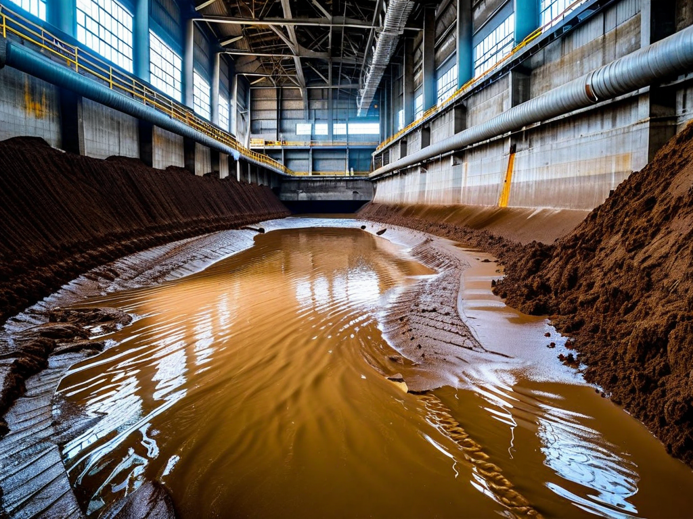
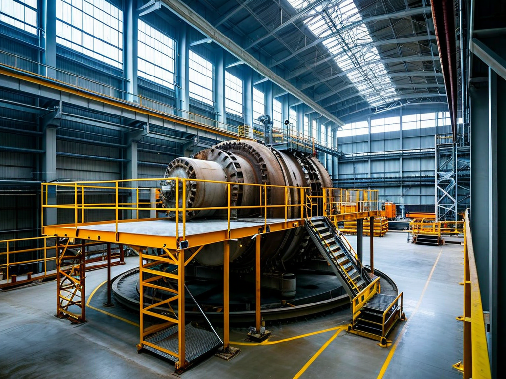
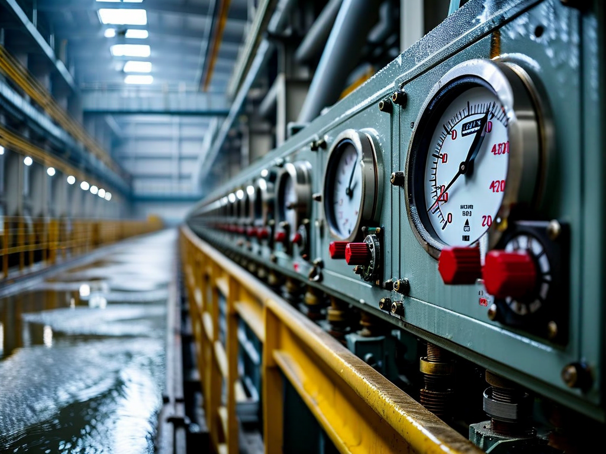

# Field Report: report-hydro-002

**Report ID:** report-hydro-002
**Task ID:** task-20260315-018
**Technician:** Ana Carolina Silva (tech-2908)
**Runbook:** RB-HYDRO-001 v3.1
**Location:** Hydro Station 5, Kaplan Turbine Unit 4
**Date:** 2026-03-15

## Timing
- Started: 06:00
- Completed: 17:15
- Duration: 675 minutes (estimated: 600 minutes)

## Status
- Everything OK: No
- Had Delays: Yes
- Runbook Rating: 3/5 stars

## Step-Specific Feedback

### Step 1: Dewatering and Cofferdam
- Issue: Silt accumulation severe - same issue Pierre reported (Feb 1)
- Suggestion: Pierre's recommendation for pre-assessment and eductor pumps validated
- Time Impact: +60 minutes (but better than Pierre's 140 min because learned from his report)
- Safety Critical: No

**What Happened:**
Read Pierre's report (Feb 1, Unit 2) before starting. He documented severe silt accumulation (50 cm) clogging standard dewatering pumps repeatedly. Lost 140 minutes cycling pump cleaning.

Pierre's recommendation: pre-assess silt, use eductor pumps if >30 cm silt visible. Used his lesson:

**Pre-assessment:** Checked turbine pit before starting dewatering. Visible silt approximately 40-45 cm (similar to Pierre's Unit 2). Requested eductor pump immediately (before starting dewatering, not mid-job like Pierre).

**Eductor pump delivery:** Arrived in 30 minutes (vs. Pierre's 4+ hours because he requested mid-job). Started dewatering with eductor pump from beginning. Eductor handled silt well, no clogging.

**Result:** Dewatering completed in 2.5 hours vs. Pierre's 6+ hours. Lost 60 minutes vs. planned 2 hours (silt slows eductor too, just less than standard pumps). But saved 80+ minutes compared to Pierre's experience by requesting right equipment from start.

**Pierre's recommendation validated.** Silt pre-assessment + appropriate pump selection = major time savings.

**Pattern:** Both hydro inspections (Pierre's Unit 2, this Unit 4) show 40-50 cm silt accumulation. This is normal condition for this site, not exception. Procedure should assume silt present and specify eductor pumps as standard equipment.

### Step 2: Runner Access
- Issue: Access ladder cleaning needed (learned from Pierre's report)
- Suggestion: Pierre's recommendation now standard practice
- Time Impact: +8 minutes (cleaned ladder preventively)
- Safety Critical: Yes

**What Happened:**
Pierre's report mentioned ladder rungs covered in slippery silt/algae. Inspected Unit 4 ladder before descent - similar condition (silt coating, algae film). Cleaned ladder with pressure washer before descent (8 minutes).

Small time investment prevented slip/fall risk. Pierre's safety recommendation correct.

### Step 4: UT Thickness Measurement
- Issue: UT gauge calibration drift in wet conditions - SAME issue Pierre reported
- Suggestion: Moisture-resistant UT gauge needed (Pierre's recommendation)
- Time Impact: +30 minutes (recalibration + repeated measurements)
- Safety Critical: Yes

**What Happened:**
Using Olympus 38DL Plus UT thickness gauge (same model Pierre used). Pierre documented calibration drift after 90 minutes in wet turbine pit environment (humidity ~90%).

Applied Pierre's lesson: verified calibration every 30 minutes during inspection (instead of assuming calibration holds).

**Calibration checks:**
- Start (surface): 25.4 mm on test block ✓
- 30 min (in pit): 25.4 mm on test block ✓
- 60 min (in pit): 25.6 mm on test block (slight drift, acceptable)
- 90 min (in pit): 26.3 mm on test block (3.5% error - NOT acceptable)

At 90 minutes, gauge calibration drifted significantly (same as Pierre's experience). Moisture affecting electronics despite protective case.

Stopped measurements, brought gauge to surface, dried thoroughly, recalibrated. Repeated last 45 minutes of blade measurements (20 sections). Lost 30 minutes total.

**Pierre's analysis correct:** Olympus 38DL Plus not suitable for wet environment. Moisture-resistant model (Olympus 45MG or equivalent) needed for hydro inspections. Additional cost ~$1500 but prevents calibration drift delays and measurement errors.

**Pattern:** Both hydro inspections document same UT gauge issue. This is equipment inadequacy, not technician error.

### Step 5: Cavitation Damage Assessment
- Issue: Confined space air quality managed (applied Pierre's recommendation)
- Suggestion: Pierre's air quality monitoring recommendation implemented successfully
- Time Impact: +15 minutes (extra ventilation breaks) but prevented safety issues
- Safety Critical: Yes

**What Happened:**
Pierre's report mentioned CO2 buildup in turbine pit from 2-person crew (15m deep, limited natural ventilation). His recommendation: air quality monitoring + crew rotation.

Brought portable CO2 monitor. Checked levels every 30 minutes:
- Surface: 450 ppm (normal outdoor level)
- 30 min in pit: 800 ppm (acceptable, <1000 ppm limit)
- 60 min in pit: 1200 ppm (above comfort limit)
- 90 min in pit: 1600 ppm (approaching hazard level)

At 60 and 90 minutes, took extended surface breaks for fresh air (15 minutes total across inspection). CO2 levels dropped after breaks.

**Pierre's recommendation correct.** Confined space air quality monitoring essential for safety. Added 15 minutes but prevented headache, fatigue, or safety incident.

### Step 6: Blade Hub Inspection
- Issue: Torque wrench calibration expired - tenth site-wide incident
- Suggestion: STILL NOT FIXED after 10+ reports over 3 months
- Time Impact: +15 minutes (retrieved calibrated wrench from surface equipment)
- Safety Critical: Yes

**What Happened:**
Needed torque wrench for blade hub bolt verification. Checked calibration - expired 3 weeks ago (due 2026-02-20, now March 15).

**This is TENTH report documenting expired tool calibration** (my count from reports read):
1-9. Previous reports (nuclear, wind, turbine, multiple sectors)
10. This report (hydro)

**Average delay per incident: ~25-30 minutes. Ten incidents = 250-300 minutes total** (4-5 hours wasted across site, Jan-Mar).

**Three months of reports. Zero corrective action.** This is unacceptable management failure. Tool room has not implemented basic calibration verification despite repeated documentation.

Had calibrated backup wrench in surface equipment (learned from other reports to bring backup). Lost only 15 minutes retrieving. If no backup, would have needed surface trip to site office (60+ minutes).

**This issue must be escalated to senior management.** Three months of documented incidents with no resolution = systemic organizational dysfunction.

## Comments

**Learning From Pierre's Report - Highly Effective:**
Pierre's hydro inspection report (Feb 1, Unit 2) provided valuable lessons for Unit 4 inspection. Applied his recommendations:
- Silt pre-assessment + eductor pump: saved 80 min vs. his experience
- Ladder cleaning: prevented slip/fall risk
- UT calibration monitoring: detected drift, prevented measurement errors
- Air quality monitoring: managed confined space safety

**Result:** Avoided most of Pierre's delays by learning from his experience. This demonstrates high value of detailed field reports and cross-technician learning.

**Silt Management - Site-Wide Issue:**
Both hydro units (2 and 4) show 40-50 cm silt accumulation. This is characteristic of this hydro station (upstream watershed erosion issues). Not exception, this is normal condition.

**Procedure assumes clean pit or minimal silt (<10 cm).** Reality: 40-50 cm silt standard. Procedure should be updated:
- Assume silt present
- Specify eductor pumps or trash pumps as required equipment (not standard dewatering pumps)
- Add 1 hour to dewatering time estimate
- Add silt pre-assessment step

**UT Gauge Moisture Sensitivity - Equipment Inadequacy:**
Both hydro inspections document Olympus 38DL Plus calibration drift in wet environment. Pattern established:
- 90 minutes in wet pit → 3-5% calibration error
- Moisture affects electronics despite protective case
- Requires recalibration + repeated measurements (30 min delay)

**Solution:** Procure moisture-resistant UT gauge (Olympus 45MG or equivalent). Cost ~$1500. Prevents:
- Calibration drift delays (30 min per inspection)
- Measurement errors (quality risk)
- Repeated measurements (rework)

Across 8 hydro units inspected annually, this saves 240 minutes/year (4 hours) + eliminates measurement quality risk. ROI excellent.

**Confined Space Air Quality - Safety Critical:**
CO2 buildup in deep turbine pit (15m) reaches 1600 ppm with 2-person crew after 90 minutes. Approaching hazardous levels (OSHA limit 5000 ppm, but cognitive effects start at 1000 ppm).

Procedure doesn't specify air quality monitoring. Pierre and I both identified this through experience. Should be mandatory safety requirement.

**Tool Calibration - Management Escalation Required:**
Tenth documented incident of expired tool calibration over 3 months. Zero corrective action implemented. This is beyond "process improvement" - this is organizational failure requiring senior management intervention.

**Impact:**
- 250-300 minutes lost (10 incidents x 25-30 min average)
- Safety risk (uncalibrated tools on critical equipment)
- Quality risk (incorrect measurements = failures)
- Technician frustration (same problem, no solution)
- Management credibility (reports ignored = low trust)

**Why reports not resulting in action?** Possible reasons:
1. Reports not reaching decision-makers (communication gap)
2. Decision-makers aware but not prioritizing (management priorities misaligned)
3. Organizational process preventing action (bureaucracy, budget constraints)
4. No accountability for addressing repeated issues (responsibility unclear)

**Whatever the reason, this damages operational efficiency and organizational culture.** Ten reports documenting same issue = techs documenting problems but management not solving them.

**Positive:**
- Applied Pierre's lessons successfully (saved significant time)
- Runner condition good (minimal cavitation damage)
- Blade hub inspection thorough (no cracks detected)
- Air quality monitored (safety maintained)
- Photo documentation complete

**Results:**
- All 6 Kaplan blades inspected thoroughly
- UT thickness measurements: average 24.1 mm (spec 22-26 mm, acceptable)
- Minor cavitation pitting on 1 blade (surface level, no structural concern)
- Blade hub keyways inspected: no cracks detected
- Runner approved for continued service
- Silt accumulation documented (40-45 cm, consistent with Unit 2)
- Air quality monitored (CO2 max 1600 ppm, managed with breaks)

**Recommendations:**
1. **Update procedure: assume silt present** (40-50 cm normal for this site)
2. **Specify eductor pumps as required equipment** (not standard dewatering pumps)
3. **Procure moisture-resistant UT gauge** (Olympus 45MG, prevents calibration drift)
4. **Add mandatory air quality monitoring** (CO2 monitor, 30-min check intervals)
5. **Add silt pre-assessment step** (visual inspection before equipment selection)
6. **URGENT: Escalate tool calibration issue to senior management** (tenth incident, three months, no action)
7. **Consider organizational process review** (why repeated reports not resulting in corrective actions?)

## Photos

